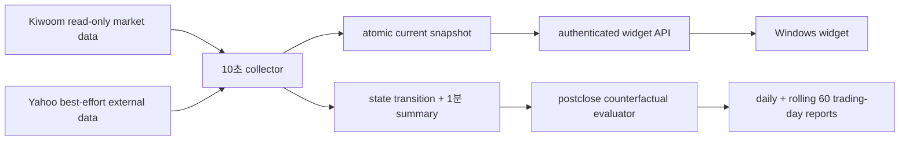

# 삼성전자 전 세션 진입 조언 위젯 외부 감리 설명서

## 1. 문서 목적과 감리 범위

이 문서는 삼성전자(`005930`) Windows 가격 위젯에 추가한 당일 단기매매
진입 조언 로직을 외부 전문가가 독립적으로 검토할 수 있도록 구현 계약,
판정 순서, 데이터 provenance, 안전 경계, 검증 상태와 한계를 정리한다.

- 작성일: 2026-08-02 KST
- 저장소 기준 SHA: `d60c4b0617b0d1bf65da586c42de05e284fa0009`
- 감리 대상: 위 SHA 위의 현재 Samsung widget advisory working-tree diff
- 판단 권한: `widget_advisory_only`
- runtime 영향: `runtime_effect=false`
- 명시적 금지: 주문·계좌·수량·토큰 발급/갱신·매매 봇 제어·AI 점수/하드게이트
- 감리 제외: 매도 신호, 손절 주문, 주문 수량, 자동 매매 성과

이 로직은 투자자에게 상태와 가격 범위를 보여주는 읽기 전용 보조 도구다.
실주문 SCALPING runtime이나 기존 전략의 진입·청산 판단에는 연결되지 않는다.

## 2. 구성과 데이터 흐름



구현 소유 경계는 다음과 같다.

| 역할 | 파일 |
|---|---|
| 세션·권한·snapshot 계약 | `src/engine/monitoring/samsung_widget_contract.py` |
| 읽기 전용 수집·feature·상태기계 | `src/engine/monitoring/samsung_widget_advisory.py` |
| MFE/MAE·first-hit 관측 | `src/engine/monitoring/samsung_widget_advisory_evaluation.py` |
| 인증 API·안전 fallback | `src/web/samsung_price_widget_routes.py` |
| Windows 표시·계약 검증 | `tools/windows/samsung_price_widget.py` |
| 배포 정의 | `deploy/systemd/korstockscan-samsung-widget-*` |

## 3. 권한 격리와 fail-closed 계약

수집기는 AWS에 이미 생성된 Kiwoom bearer token cache만 읽는다. 토큰이 없으면
`shared_token_unavailable`로 실패하며 발급, 갱신, 취소 또는 외부 전송을 하지
않는다. Kiwoom 호출은 코드의 `READ_ONLY_KIWOOM_REQUESTS` allowlist에 있는 시장
데이터 TR만 허용하며 allowlist 밖 요청은 네트워크 호출 전에 거부한다.

모든 조언 payload에는 아래 네 필드가 고정된다.

```json
{
  "authority": "widget_advisory_only",
  "runtime_effect": false,
  "actual_order_submitted": false,
  "broker_order_forbidden": true
}
```

API는 fresh collector snapshot에 이 계약이 없거나 값이 다르면 snapshot을
폐기한다. Windows client도 같은 계약을 재검증한다. 이중 검증을 통과하지 못한
조언은 화면에 진입 상태로 표시하지 않는다.

## 4. 세션 계약

| 세션 | KST 시간 | venue/cohort | 종목코드 | 최소 확정 1분봉 |
|---|---:|---|---|---:|
| `NXT_PREMARKET` | 08:00~08:50 | NXT / `PREMARKET_KRX_LIKE` | `005930_NX` | 10 |
| `SESSION_TRANSITION` | 08:50~09:00 | 비활성 | - | - |
| `KRX_REGULAR` | 09:00~15:30 | KRX / KRX | `005930` | 3 |
| `SESSION_TRANSITION` | 15:30~15:40 | 비활성 | - | - |
| `NXT_AFTERMARKET` | 15:40~20:00 | NXT / NXT | `005930_NX` | 5 |

주말과 한국 휴장일, 전환 구간, 20:00 이후에는 조언을 생성하지 않는다. 최소
관측 구간 전에는 현재가만 유지하고 상태는 `DATA_WAIT`다. 승격 확인 streak는
`거래일+세션`별로 초기화되어 KRX 확인 이력이 NXT나 다음 거래일로 이월되지
않는다.

프리마켓 context는 정규장 09:30 전까지만 약세 여부를 확인하는 보조 근거다.
정규장 신호를 새로 만들 수 없고 `ENTRY_READY`를 `ENTRY_CAUTION`으로만 낮출 수
있다. 애프터마켓 외국인·프로그램 값은 마지막 KRX 값을
`FROZEN_REGULAR_SESSION`, `live_for_current_session=false`로 표시한다.

## 5. 입력 원천과 호출 주기

| 주기 | 원천 | 용도 | 실패 처리 |
|---:|---|---|---|
| 10초 | `ka10001` | 삼성 현재가·당일 저가 | 필수, cycle 실패 |
| 10초 | `ka10004` | 최우선 bid/ask·잔량 | 필수, `DATA_WAIT` |
| 10초 | `ka10003` | 최신 3체결 하락 veto | 선택, 개별 gap |
| 확정 분 변경 | `ka10080` | 세션 1분 OHLCV | 필수, cache 후 stale 판정 |
| 30초 | `ka10001`, `ka20001` | SK하이닉스·KOSPI 상대강도 | 선택, 조건 미충족/제한 |
| 60초 | `ka10064`, `ka90008` | 외국인·프로그램 비악화 여부 | 선택, 최대 caution |
| 일 1회 성공 시 | `ka10081` | 전일 OHLC anchor | 필수, `DATA_WAIT` |
| 60초 | Yahoo `NQ=F`, `MU`, `KRW=X` | 외부 위험 | 선택, 최대 caution |

Yahoo 세 원천은 각각 최대 5초 timeout을 두고 병렬 격리한다. 한 원천의 예외는
그 원천만 `UNAVAILABLE`로 만들며 다른 원천을 폐기하지 않는다. Yahoo 값은 항상
`yahoo_best_effort`와 `BEST_EFFORT_DELAYED`로 표시하고 라이선스 실시간 시세로
표현하지 않는다.

공식 Kiwoom reference gate는 2026-08-02T22:53:30+09:00에 upstream commit
`69642586f7d84ba9fd8a6faf1f1537c7fda6568b`를 기준으로 확인했다. 확인 경로는
`kiwoom_docs/종목정보.md`, `시세.md`, `차트.md`, `업종.md`,
`kiwoom/_data/kiwoom_api_spec.json`, `kiwoom/specs.py`,
`kiwoom/core/client.py`, Postman collection 및 로컬
`docs/kiwoom-api-data-contract.md`다.

## 6. freshness와 source quality

필수 입력의 판정은 단순 WS/REST stale 플래그가 아니라 다음 receive-time
envelope를 사용한다.

- quote: REST 응답 수신 후 20초 이내
- BBO: REST 응답 수신 후 20초 이내
- 확정 1분봉: KRX 120초, NXT 세션 180초 이내
- 전일 OHLC: 현재 거래일에 성공적으로 갱신한 daily 응답 안에서 당일보다 이전인
  가장 최신 유효 행
- API snapshot: timezone이 명시된 `observed_at_kst`, 25초 이내
- 외부시장: 원시 관측시각 기준 300초 초과 시 `STALE`
- KRX 외국인·프로그램: 둘 다 존재하고 최신 원시 시각이 300초 이내일 때만
  `OBSERVED`; 그 외 `PARTIAL|STALE|UNAVAILABLE`

`ka10004.bid_req_base_tm`은 의미가 불충분하므로 freshness authority로 쓰지 않고
raw provenance로만 보존한다. 필수 quote/BBO/분봉/전일 anchor 결손은
`source_quality.status=BLOCKED`와 `DATA_WAIT`를 만든다. 상대강도·수급·외부시장
같은 보조 입력 결손은 국내 조건을 우회하지 않으며 최대 `ENTRY_CAUTION`까지만
허용한다.

collector snapshot이 없거나 stale이면 API는 `ka10001` 한 번만 호출해 현재가를
보여주고 중첩 조언을 canonical 세션의 `DATA_WAIT`로 반환한다. 부분 데이터로
`ENTRY_READY`를 합성하지 않는다.

## 7. 동적 feature와 계산식

고정 가격대는 사용하지 않는다. 매일과 매 세션 아래 값을 다시 계산한다.

### 7.1 가격 구조

- 세션 VWAP: 거래량이 있는 확정봉의 `sum(close*volume)/sum(volume)`
- 거래량이 전부 0이면 확정 종가 단순평균을 제한적 fallback으로 사용
- opening range: 세션 최소 관측 봉 구간의 고가·저가(현재는 provenance/표시)
- pivot support: 최근 12봉에서 양 옆보다 낮거나 같은 확정 저점
- 상승 구조: 이전 3봉 대비 최근 3봉의 저점이 높거나 같고 고점이 더 높음
- 재시험 유지: 두 번째 pivot 저점이 첫 저점의 0.1% 또는 1틱 허용 범위 안에서
  무너지지 않고 최신 확정 종가가 두 번째 저점 위에 있음
- 최근 저항: 최신 2봉을 제외한 최근 구간의 최고가

진입 구조는 `저점 재시험 유지 OR 고점·저점 동반 상승` 중 하나를 요구한다.
단순 higher-low 하나만으로는 통과시키지 않는다.

### 7.2 거래량·추세·상대강도

- 최근 8봉 상승봉 평균 거래량이 하락봉 평균 이상이어야 한다.
- 두 pivot 재시험이 있으면 두 번째 저점 봉 거래량이 첫 번째 이하이어야 한다.
- 3분·5분 추세는 각각 연속 확정봉의 종가 변화와 선형 방향이 `down`이 아니어야
  한다. 5bp 이내 변화는 `flat`이다.
- KRX에서는 삼성전자·SK하이닉스·KOSPI 세 값이 모두 필요하고, 삼성전자가 두
  비교대상 중 하나보다 0.5%p 이상 약하면 통과하지 않는다. NXT에서는 KOSPI를
  실시간처럼 사용하지 않고 삼성전자와 NXT SK하이닉스만 비교한다.
- KRX 외국인 2시점과 프로그램 값이 모두 있어야 수급을 `OBSERVED`로 표시한다.
  두 흐름이 동시에 비악화가 아니면 readiness를 caution으로 낮추며, 한쪽만 있는
  `PARTIAL`이나 전체 결측도 caution이다.
- 최신 3체결이 newest-first 기준 연속 하락이면 positive authority를 만들지 않고
  `WATCH`로 낮춘다.

### 7.3 support, trigger, 추천가격

현재가 이하에서 확인 가능한 `최근 확정 support`, `세션 VWAP`, `전일 저가` 중
가장 높은 값을 거래소 tick으로 내림 정규화해 support로 사용한다.

```text
support = tick_floor(max(valid pivot support, session VWAP, prior low))
invalidation = support - 1 exchange tick
trigger = tick_floor(max(reclaimed VWAP, recent resistance, prior close))
entry_low = max(support, best_bid)
entry_high = min(best_ask, support + 2 exchange ticks)
```

가격대 경계에서 tick size가 바뀌는 경우에도 `move_price_by_ticks`로 실제 tick을
하나씩 계산한다. `current_price-support > 0.3%`이면 `NO_CHASE`다. 추천 범위가
역전되면 역시 `NO_CHASE`다. 권장가격은 자동 주문가격이 아니다.

## 8. 외부시장 risk adapter

원시 시각 기준으로 실제 15분 이전 관측값이 있을 때만 변화율을 계산한다. 15분
이력이 없으면 행 개수로 대체하지 않고 `UNAVAILABLE`이다. 초기 기준은 NQ
`-0.40%`, MU `-0.80%`, USD/KRW `+0.25%`다.

- 한 원천 악화: `CAUTION`
- 한 원천이 기준의 2배 이상 악화 또는 두 원천 동시 악화: `HOLD`
- 5분 초과 지연·결측: `DATA_LIMITED`
- MU extended market 시간 밖, 주말 또는 NYSE 휴장일: `MARKET_CLOSED`,
  stale/adverse에서 제외

`HOLD`는 국내 core가 통과해도 가격 범위를 제거하고 `WATCH`로 낮춘다. 외부시장
호조는 어떤 경우에도 국내 core 실패를 통과시키거나 `ENTRY_READY`를 생성하지
않는다.

## 9. 상태기계와 전이 우선순위

| 우선순위 | 조건 | 결과 |
|---:|---|---|
| 1 | 필수 source-quality 차단 | `DATA_WAIT` |
| 2 | support 미생성 | `DATA_WAIT` |
| 3 | confirmed support 하향 이탈 | `AVOID` |
| 4 | support 대비 0.3% 초과 추격 | `NO_CHASE` |
| 5 | spread 2틱 초과 또는 최신 체결 하락 veto | `WATCH` |
| 6 | 국내 6개 core 중 하나 실패 | `WATCH` |
| 7 | 국내 core 통과 + 외부 `HOLD` | `WATCH`, 가격범위 제거 |
| 8 | 국내 core 통과 + 보조 risk/gap | `ENTRY_CAUTION` |
| 9 | 국내 core 통과 + 보조 위험 없음 | `ENTRY_READY` |

국내 6개 core는 구조, VWAP/저항 회복, 거래량, 3·5분 추세, 상대강도, 2틱 이내
spread다. `ENTRY_CAUTION`과 `ENTRY_READY`로의 상향 전이는 같은 거래일·세션의
연속 10초 관측 2회가 필요하다. stale, support 이탈, spread 악화와 다른 강등은
즉시 적용한다.

모든 조언은 60초, 현재 세션 종료, 당일 20:00 중 가장 이른 시각에 만료된다.

## 10. API·화면 계약

기존 top-level 현재가·당일저가·1/3/5분 추세·20분 chart 필드는 유지한다. 새
중첩 `advisory`에는 다음을 추가한다.

- `state`, `raw_state`, canonical `session`
- `entry_price_low/high`, `trigger_price`, `invalidation_price`
- `reasons`, `unmet_conditions`, `valid_until`
- `source_quality`, `external_risk`, `external_points`, `provenance`
- `derived`, `flow`, authority 안전 필드, `metric_contract`

Windows 창은 팝업·소리 없이 `상태 · 권장가격`, 핵심 근거, 외부 위험/지연을
압축 표시한다. 음수나 0인 권장가격, 미등록 상태값, authority 위반 payload는
client parser가 거부한다.

## 11. 관측·평가 계약

10초 raw payload 전부를 저장하지 않는다. 상태 전환과 분당 한 요약만 JSONL에
기록하고 30일이 지난 JSONL은 삭제한다. 상태 전환 시점의 추천가격을 entry
reference로 두고 동일 세션·동일 venue의 미래 확정봉만 사용해
1·3·5·10·20·30·60분 MFE/MAE를 계산한다. entry reference는 추천 범위 상단을
우선 사용하고, 상단이 없으면 하단, 그것도 없으면 관측 현재가를 사용한다.

- target: entry reference +0.5%, tick 올림
- adverse: 동적 invalidation, 없으면 -0.3% tick 내림
- 같은 확정봉에서 target/adverse가 모두 닿으면
  `same_observation_ambiguous`
- 신호가 생성된 미완성 분봉은 미래 성과에 재사용하지 않음
- 실현손익과 합산하지 않음
- 60거래일 전에는 threshold 품질 판정이나 자동 승격에 사용하지 않음

기존 real/sim 로그는 같은 세션의 확정 OHLCV, BBO, venue, exact advisory payload를
동시에 복원할 수 없으므로 이 상태기계의 historical replay에 억지로 정규화하지
않는다. 현재 구현 이후의 compact observation이 평가 기준 원천이다.

## 12. 이번 코드리뷰에서 발견·보완한 결함

| 결함 | 위험 | 보완 |
|---|---|---|
| tick band 경계에서 단일 tick spread를 0으로 계산 | spread guard 오판 | 실제 가격 tick을 순회해 계산 |
| higher-low만으로 구조 통과 가능 | 요구보다 느슨한 진입 상태 | 고점·저점 동반 상승 또는 retest 유지로 제한 |
| promotion streak가 세션/일자를 횡단 | 새 세션 첫 관측 즉시 승격 | 거래일+세션 scope로 초기화 |
| 프리마켓/장후 수급 복구 일시 실패 후 당일 재시도 없음 | 하루 종일 보조 provenance 결손 | 성공 전 60초 bounded retry |
| Yahoo 3원천 순차 timeout | 10초 갱신 budget 지연 | 3 worker 병렬·원천별 예외 격리 |
| fallback 중첩 세션이 legacy 명칭 | API consumer 계약 불일치 | canonical 세션으로 통일 |
| timezone 없는 snapshot 시각 허용 | host timezone 의존 freshness | timezone 명시 없으면 폐기 |
| 음수 권장가격을 client에서 절댓값 변환 | server 결함 은폐 | 명시적 계약 오류로 거부 |
| KRX 신호의 장기 horizon에 NXT 가격 혼입 가능 | venue별 성과 왜곡 | 미래 window·성숙도를 동일 session+venue로 제한 |
| 전일 daily cache를 다음 날 재사용 가능 | 불완전 장중봉을 전일 anchor로 오인 | 현재 거래일 갱신 cache만 허용 |
| 전일 KRX 수급 cache가 장후까지 남을 가능성 | NXT에서 전일 수급을 당일 frozen 값으로 오인 | 관측일 불일치 cache 즉시 폐기 |
| collector 재기동이 확인 streak·상태기록을 초기화 | 일시 강등과 중복 actionable 표본 | fresh 동일 세션 snapshot과 당일 마지막 compact 상태만 복원 |
| `WATCH` 화면이 blocker보다 통과 사유를 먼저 표시 | 사용자가 차단 원인을 오해 | 대기/관찰 상태는 unmet condition을 우선 표시 |

## 13. 검증 증거

현재 대상 테스트 78건이 통과했다.

```text
PYTHONPATH=. .venv/bin/pytest -q \
  src/tests/test_samsung_widget_advisory.py \
  src/tests/test_samsung_widget_advisory_evaluation.py \
  src/tests/test_samsung_price_widget_routes.py \
  src/tests/test_samsung_price_widget_client.py

78 passed
```

검증 범위에는 세션 전환, 확정봉 격리, 추세·구조, 2회 확인, 세션 scope reset,
동적 가격·추격 방지, price-band tick, BBO/quote stale, 외부 위험/휴장/결측,
premarket auxiliary, frozen flow, cached-token-only, read-only allowlist, API fallback,
Windows authority validation, 평가 anti-lookahead와 rolling 60일 floor가 포함된다.

## 14. 알려진 한계와 외부 감리 요청사항

다음은 결함으로 은폐하지 않고 감리 판단을 요청하는 초기 가정이다.

1. 국내 데이터도 전용 WS가 아닌 REST polling이므로 10초 갱신이며 초단위 체결
   전체를 재구성하지 않는다.
2. Yahoo는 공식 실시간 feed가 아니다. 공급자 교체 전에는 NQ/MU/FX 지연 품질을
   매매용 실시간 risk로 간주할 수 없다.
3. VWAP는 typical price가 아닌 확정 종가를 사용한다. 삼성전자 당일 조언 목적에
   이 선택이 적절한지 검토가 필요하다.
4. opening range와 전일 고가는 provenance로 산출되지만 현재 hard core gate는
   아니다. 추가 gate 필요 여부는 60일 관측 전 자동 변경하지 않는다.
5. 상대강도 0.5%p, chase 0.3%, 외부 15분 threshold, target 0.5%는 초기 bounded
   가정이다. 현 시점에 통계적 우월성이 입증된 calibration 값이 아니다.
6. 외국인·프로그램 장중 집계의 수정·지연 가능성이 있어 가격반응과 분리된
   positive authority로 사용하지 않는다.
7. 추천가격은 체결 가능성, 슬리피지, 주문 latency, 수수료·세금을 최적화하지
   않는다. 이번 범위는 advisory이며 execution engine이 아니다.
8. 구현 이후 60거래일 표본이 아직 누적되지 않았다. 현재 판정은 로직·계약
   검증이지 수익성 검증이 아니다.

외부 감리자는 특히 아래를 독립 검토해야 한다.

- Kiwoom NXT/KRX request code와 각 TR 필드의 venue 의미가 실제 응답과 일치하는가?
- REST receive-time freshness envelope 20초와 분봉 120/180초가 보수적으로 충분한가?
- support 후보의 `max` 선택이 하락장에서 잘못된 가까운 support를 만들지 않는가?
- retest tolerance `max(1틱, 0.1%)`와 3+3봉 구조가 삼성전자 변동성에 적합한가?
- 외부 위험 threshold와 MU extended-hours calendar/휴장 처리가 충분한가?
- 60일 관측 보고서가 state/session/venue별 표본 수와 first-hit ambiguity를 올바르게
  분리하는가?
- 화면 표현이 투자 조언의 확실성을 과장하지 않고 `관측 전용`임을 충분히
  전달하는가?

## 15. 배포·rollback 경계

이 문서 작성 및 리뷰 과정에서는 trading bot을 재기동하지 않았다. collector와
evaluator systemd 설치, Gunicorn의 새 API 코드 반영 여부는 별도의 운영 확인
대상이다.

rollback은 Samsung widget collector/timer만 중지하고 API가 quote-only
`DATA_WAIT` fallback을 사용하게 하는 방식이다. 실매매 봇, provider route,
threshold, 주문·계좌 상태를 변경할 필요가 없다.
