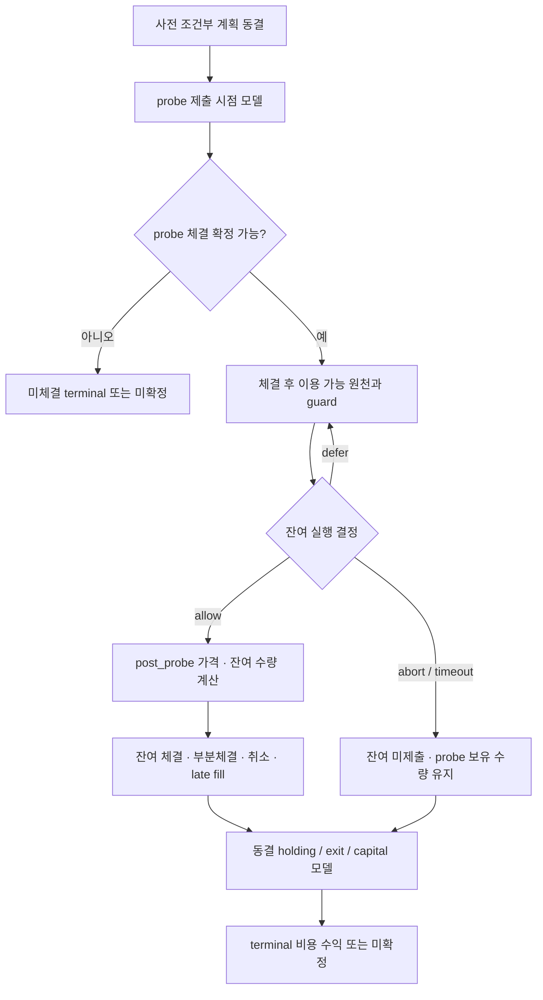

# Probe 체결 조건부 잔여 주문 경제성 재생 상세보완계획

## 1. 목적과 현재 결정

probe 체결 전에는 확정할 수 없는 잔여 주문가격을 억지로 채우지 않고, **관측 당시 조건부 계획을 동결한 뒤 체결·후속 원천의 시간 순서에 따라 가격과 실행 상태를 계산**하도록 장후 재생기를 보완한다.

- 2026-10-06 사용자가 결함 보완·반복 리뷰·배포·재기동을 승인했다. 원 계획·stop·capital 보존, typed 조건부 계획, native 체결/잔여 결정 관측과 장후 소비 계약을 구현한다. 실제 체결 모델과 CF 경제성 수용은 원본 원천이 충족되는 범위로 제한한다.
- 실행 owner는 [현재 체크리스트](../checklists/2026-10-06-stage2-todo-checklist.md)의 `DirectFamilySourceRepairEntrySplit`을 재사용한다. 기존 원천·경제성 완료 기준과 미완료 상태를 유지한다.
- 주문 제출, live bundle 예약, 계좌/API 추가 조회, AI provider 호출, 수량·probe timeout·가격·threshold·hard safety 변경을 연구 재생기에 부여하지 않는다.
- Widget은 제거 상태를 유지한다. 이 계획은 Main SCALPING의 probe continuation에 한정한다. Episode와 별도 sequential continuation은 해당 owner의 범위로 남긴다.
- 기술적 완료, 자연 원천 관측, 경제성 비교 수용, 정책 선택, 배포 및 PID 소비를 각각 판정한다. 재생 지원 완료가 정책 교체나 수익 개선을 뜻하지 않는다.

기준: [Plan Rebase §1–§8](../plan-korStockScanPerformanceOptimization.rebase.md), [018880 원천·제출 경로 점검](../audits/main-entry-pre-ai-probe-clock-and-018880-lineage-audit-2026-10-06.md), [원천 보완 배포 리뷰](../audits/main-machine-source-remediation-deployment-review-2026-10-06.md).

## 2. 확인된 원인과 보완 범위

| 구간 | 현재 동작과 결손 | 필요한 보완 | 완료 증거 |
|---|---|---|---|
| 사전 경제성 관측 | 관측 전용 allocator가 목표 수량·probe 1주·조건부 잔여 수량과 continuation을 남긴다. 미래 체결가격은 없다. | 미확정 가격을 유지하는 별도 조건부 seed 생성 | 제출·예약 없이 유효한 조건부 계약과 원천 receipt |
| 실행 가격 | 실제 잔여 주문가격은 probe fill과 그 이후 호가·현재가, continuation action, leg index로 계산된다. | 동일 가격 커널을 시간 순서에 따라 재사용 | 같은 입력의 native 계산과 재생 계산이 일치 |
| 재생기 | 기존 `freeze_entry_opportunity`는 `deferred_probe_residual_qty != 0` 및 `execution_phase != immediate`를 거부한다. | static 계약을 유지하면서 typed conditional dispatch 추가 | static 회귀 통과, conditional 경로만 별도 validator 통과 |
| 운영 context | 현재 probe 관측에는 `operating_context_sha256`만 들어간다. 본문 또는 immutable 참조가 없는 경우 해시만으로 입력을 복원할 수 없다. 또한 route·watch·TTL 장식은 빈 orders 예외 뒤에 있어 probe 분기에서 완성되지 않는다. | 조건부 계획용 context를 예외 전에 완성·동결하고 원천 본문과 결속 | hash 검증 및 route·시계·TTL·비용·정책·자금 출처 검증 |
| 후속 source | probe fill 이후 시점의 호가·방향·계좌·guard·취소/late fill 자료가 필요하다. | 기존 자료에서 exact identity/clock으로 연결하고 결손을 단계별 분리 | 전수 분모와 연결/결손 census, 재생 지원 범위 명시 |
| 실제 경제성 receipt | `entry_split_actual_economic_receipt`도 static `_entry_seed_valid`를 요구한다. 조건부 실행은 가격 재생만 추가해도 이 생산자에서 빠질 수 있다. | 실제 제출 시점 seed와 COMPLETED receipt의 typed lineage 연결 | probe·잔여 실제 수량과 비용·terminal을 원본 실행에 결속 |
| 결과 소비 | 현재 보조판정 원천 계약은 조건부 계획을 `conditional_on_unknown_fill`, non-executable로 분류한다. | 검증된 재생 receipt만 별도 소비하되 실제 실행과 구분 | 행 단위 typed 검증, 실제 주문·수익 오인 없음 |

`unsupported_unknown_fill_anchored_prices`는 사전 시점에 미래 가격이 없다는 사실과 현재 재생기의 지원 범위를 나타낸다. 이 상태만으로 broker 실패, 자금 부족, 기계판정 오류 또는 전체 원천 손실을 판정하지 않는다. 앞선 optional clock 예외 수정과 이번 동적 재생 지원은 다른 작업이다.

## 3. 위치·생산자·소비자 경계

| 책임 | 기존 파일 | 변경 원칙 |
|---|---|---|
| 조건부 계획 동결 | [entry_split_order_plan.py](../../src/engine/scalping/entry_split_order_plan.py) | observation-only 계약 확장. live 예약·주문 분기에 영향이 없는 순수 builder 우선 |
| 실제/조건부 수량 계약 | [entry_execution_sizing_plan.py](../../src/engine/scalping/entry_execution_sizing_plan.py) | 즉시 제출 계획 1주 + 조건부 잔여 수량의 보존. 기존 atomic 계약을 가짜 정적 계획으로 바꾸지 않음 |
| 사전 원천 결속 | [sniper_state_handlers.py](../../src/engine/sniper_state_handlers.py) | `_observe_entry_economics_before_ai`에서 clone 기반 freeze·append. 관측 실패가 기계/AI/주문 권한에 영향 없음 |
| 잔여 가격 계산 | [sniper_entry_latency.py](../../src/engine/sniper_entry_latency.py) | `resolve_scalping_entry_price`의 `post_probe` 의미를 유지. 현재 사용하지 않는 legacy offset 가격 경로를 재활성화하지 않음 |
| 재생·운영 및 실제 경제성 | [strategy_owner_replay.py](../../src/engine/scalping/strategy_owner_replay.py) | 기존 static v1 유지, 새 seed dispatch 및 기존 holding/cancel/capital 모델 연결. 실제 COMPLETED receipt도 typed validator 연결 |
| 보조판정 원천 분류 | [auxiliary_source_contract.py](../../src/engine/scalping/auxiliary_source_contract.py) | 계획 유효성과 replay 유효성, stop 증빙, 실제 실행을 독립 판정 |
| paired consumer | [compact_auxiliary_paired_replay.py](../../src/engine/scalping/compact_auxiliary_paired_replay.py) | exact source·writer·plan·replay SHA가 결속된 지원 행만 비교에 포함 |
| trace / 보고서 | [ai_decision_trace.py](../../src/engine/scalping/ai_decision_trace.py), [strategy_owner_components.py](../../src/engine/scalping/strategy_owner_components.py), [submission_bottleneck_monitor.py](../../src/engine/monitoring/submission_bottleneck_monitor.py) | 모델 미지원과 실제 주문 실패 분리. 기존 생산자의 하위 section과 native handoff에 연결 |

동적 상태 재생이 기존 파일을 과도하게 키우면 **제안 위치** `src/engine/scalping/entry_probe_conditional_replay.py`에 순수 계산기를 둔다. 책임은 SCALPING owner 계약의 오프라인 재생이며 order client, provider, 예약소 또는 런타임 stock을 소유하지 않는다. 신규 독립 collector·daemon·cron·engine-root module은 만들지 않는다. 테스트는 `src/tests/test_entry_probe_conditional_replay.py`가 제안 위치다. 구현 시 위치 gate를 다시 확인한다.

## 4. P0 — 기존 원천 전수 분모와 복원 가능성 확정

### 4.1 서로 다른 두 모집단

1. **사전 관측 모집단:** probe 조건부 계약이 발행된 ENTER_NOW / BLOCK / RECHECK 관측 전부. action·삼성전자 `005930`/비삼성·venue/session·정책 버전별 수량을 별도 표기한다. 관측 계획은 실제 진입 승인을 뜻하지 않는다.
2. **실제 실행 모집단:** probe 주문 제출이 직접 증명된 parent attempt 전부. filled / unfilled / rejected / canceled / unresolved를 포함하고 잔여 미제출도 분모에서 제외하지 않는다.

기본 키는 attempt, promotion, machine observation revision, owner bundle, symbol, venue/session이며 child leg·retry·회복 receipt를 독립 기회로 중복 계산하지 않는다. 원천 연결 실패도 원래 분모에 남긴다. 앞서 조사한 `018880 / aims-51219f75460d41308211`은 주문 미제출 사건이므로 실제 probe 체결 일치검증 표본으로 쓰지 않는다.

### 4.2 조사 순서와 산출물

- 기존 날짜별 요약·파일 manifest·index에서 시작해 해당 attempt의 원천 경로, offset, SHA, capture sequence를 확인한다. tail 조회만으로 전수 완료를 주장하지 않는다.
- 첫 census는 결함이 확인된 2026-10-06 자료와 기존 submitted-order census 범위를 사용한다. 더 오래된 자료는 필요한 정책/커널의 복원 가능성을 확인한 뒤 날짜별로 확장한다. clean baseline과 family의 더 엄격한 날짜 제한을 모두 적용하며 2026-06-05 이전 자료는 튜닝에 쓰지 않는다.
- immutable 파일은 고정 hash, append 중인 파일은 run 시작 시의 byte length와 prefix hash로 snapshot을 고정한다. bounded chunk/index 조회로 전체 대상 키의 coverage를 증명한다. 대용량 파일의 무조건 반복 스캔을 피한다.
- 제출·체결·잔여 가격·후속 호가·guard·계좌·취소 terminal·holding terminal·비용 자료의 존재, identity, 시계, 원본 참조를 단계별로 적는다.
- 과거 커널 본문이나 exact context가 없는 행을 현재 코드/정책으로 소급 채우지 않는다. 복원 불가 사유와 범위를 남긴다.

산출물은 기존 `entry_split_order_plan` 보고서의 `conditional_probe_source_census` section과 fingerprint manifest다. `source_date`와 report publication/target date를 분리하고, 증거를 원본 수정 없이 참조한다.

**P0 종료:** 두 모집단의 총수·연결수·제외/결손 사유가 합계 일치하고, 사용할 수 있는 원천·복원 불가 원천·새 자연 표본 대기 범위가 확정된다. 여기서 양의 EV나 실제 체결 건수 하한을 기술적 완료 조건으로 추가하지 않는다.

## 5. P1 — 조건부 계획과 시점별 receipt 계약

새 명칭은 구현 전 검토할 제안 schema다: `entry_probe_conditional_plan_v1`, `entry_probe_conditional_replay_v1`. 기존 `entry_pre_ai_conditional_probe_observation_v1`과 static replay v1은 지원 범위와 validator를 유지한다.

| 그룹 | 필수 내용과 불변식 |
|---|---|
| identity | attempt/promotion/watch origin·admission·generation, machine observation/revision parent, owner, symbol, account scope hash, policy bundle hash |
| source / route | effective venue/session, broker route, transport item/suffix, subscription/connection epoch, capture sequence와 source generation, 원본 참조·SHA |
| 시간 | 관측 KST clock, event time, local receive time, available-at time. 순서가 불명확한 동시 사건은 sequence로 증명하거나 unresolved 처리 |
| 수량 | `requested_qty`, `planned_probe_qty=1`, `residual_conditional_qty`, residual leg 수량. 합계 보존·양의 정수·original budget/cap 상한. 실제 committed/submitted/filled 수량은 후속 실행 증빙에만 기록 |
| 가격 | probe order type, quote reference, future fill anchor 분리. 잔여 `numeric_price=null`, phase=`after_verified_probe_fill`; null을 0/현재 호가로 치환하지 않음 |
| 조건 | 활성 probe config, continuation, direction/guard/pricer version과 immutable code SHA, 동일한 timeout/slippage/TTL 및 clock 기준 |
| 운영 입력 | 동결 holding/exit/stop·초기 state·watch lifetime·order TTL owner·cancel 정책·capital source·cost version/provenance·model identity의 본문 또는 immutable 참조와 SHA |
| 관측 권한 | `reservation_performed=false`, `runtime_effect=false`, `order_authority_forbidden=true`, `actual_order_submitted=false` |
| 결과 | 조건부 계획 valid, 각 단계 source status, owner replay support/valid status, actual execution 여부를 별도 필드로 보존 |

사전 context builder를 조건부 분기 전에 수행한다. probe 체결 대기, 체결 후 잔여 재검증, 각 주문 취소 TTL의 시계 시작점을 각각 native owner에서 가져오며 서로 같은 timeout으로 대체하지 않는다. context에 계좌 비밀이나 전체 mutable stock을 저장하지 않는다.

observer의 기존 bounded exact `kt00011` 증빙 경로를 유지한다. 새 조건부 helper가 추가 조회를 만들지 않으며 BLOCK/RECHECK의 `reuse_only`도 그대로 유지한다. 오프라인 재생에는 원본 receipt만 주입한다.

조건부 계획 SHA와 실제 제출 atomic plan SHA는 서로 다른 artifact다. writer/trace 양쪽에 **동일 typed 계획 SHA**를 남기고, 실제 제출이 관측됐을 때만 별도 execution-plan/parent receipt 참조를 연결한다. 보조 consumer의 static writer-plan equality를 무조건 완화하지 않는다.

실제 실행 경제성용 seed는 native 제출 시점의 최종 atomic plan·실제 guard·정책·자금 context에서 별도로 동결한다. 사전 관측 seed가 같다고 추정해 그대로 연결하지 않는다. 사전/제출 계획이 달라졌다면 두 hash와 변경 이유를 보존하고, 실제 원본에 맞는 seed만 실제 COMPLETED lineage에 사용한다.

fill·후속 호가·결정·취소·청산 receipt는 발생 후에 독립 append한다. 사전 seed를 나중에 수정하거나 후속 자료의 관측 시각을 앞당기지 않는다. 과거 context 본문이 정확히 복원되면 원본 관측과 구분되는 `recovered_context` 참조·근거를 남기고, 그렇지 않으면 replay 불가로 유지한다.

## 6. P2 — 순수 커널과 실제 실행 경로의 일치

- native 잔여 경로 `submit_entry_split_probe_residual_after_fill`의 **결정적 계산 부분**만 확인·공유한다. 주문 제출 handler 자체를 재생에서 호출하지 않는다.
- `resolve_scalping_entry_price(phase="post_probe", probe_fill_price, best_bid, best_ask, fresh_mark_price, continuation_action, residual_leg_index)`를 같은 입력·정책 버전으로 실행한다.
- `build_probe_residual_orders(..., resolved_leg_prices=...)`는 P1 계산가격을 보존하고 수량을 나누는 역할을 유지한다.
- 현재 pure 함수로 표현할 수 없는 방향·guard 상태는 immutable 입력 adapter와 결정 receipt로 분리한다. 환경변수, 실제 stock, reserve ledger, provider 또는 account client에 기대는 숨은 입력이 없어야 한다.
- pure helper 추출 시 live 경로가 같은 입력에서 동일 allowed/defer/abort, leg 수량·가격·타임아웃 경계를 내는지 differential 회귀로 확인한다. helper 추출로 guard를 생략하거나 새 권한을 만들지 않는다.
- 과거 replay는 해당 당시 커널·정책을 검증할 수 있는 버전에 한정한다. 현재 코드 hash와 과거 plan hash가 다른데도 동일 모델로 보고하지 않는다.

**P2 종료:** 순수 계산에 주입한 모든 입력과 코드/정책 hash를 열거할 수 있고 동일 입력의 native/replay 결과 차이가 없다. 미표현 guard는 정확한 `unsupported_guard_scope`로 남는다.

## 7. P3 — 실제 probe 실행 복원 및 모델 검증

먼저 실제 제출된 동일 주문계획을 복원한다. 전략 후보를 바꾸면서 모델을 동시에 맞추지 않는다.

1. broker order ID, parent bundle, probe cumulative fill/수정 receipt를 연결한다. 체결가격 정의와 평균가격 계산은 native receipt 의미를 사용한다.
2. probe fill이 없으면 잔여 주문을 생성하지 않는다. terminal receipt가 없으면 no-fill 확정 대신 unresolved/censored를 유지한다.
3. 체결 후 각 decision 시점에 이용 가능했던 exact-route 호가·체결·방향·guard·자금/수량 원천을 선택한다. 미래 자료 또는 다른 route epoch를 섞지 않는다.
4. 계산된 잔여 leg 가격·수량과 실제 제출 receipt를 대조한다. 미제출이면 defer/abort 이유와 held probe 수량을 비교한다.
5. residual full/partial/no-fill, cancel request/ack, late fill, 실제 보유 수량·청산 terminal까지 연결한다. aborted residual을 flat position으로 처리하지 않는다.
6. 실제 COMPLETED + valid profit_rate의 비용 수익을 실제 증빙 section에 집계한다. 없는 비용·손익은 null로 남긴다.

정확한 입력을 쓰는 결정적 가격/수량/guard 계산은 일치해야 한다. 시장 체결 추정은 실제 큐·전송 지연 때문에 완전 일치 조건과 구분한다. 기존 모델 tolerance 계약이 있는지 먼저 확인하고, 없으면 calibration 구간의 원천 해상도·clock/지연 근거로 **holdout 전에** 허용 범위와 오류 지표를 고정한다. 임의 1틱/1초 기준이나 holdout 결과에 맞춘 오차 확대를 쓰지 않는다.

산출물: source census에 연결된 `conditional_probe_actual_reconstruction` 및 `conditional_probe_model_validation`. 가격·수량·상태 불일치와 체결 모델 오차를 분리한다. 실제 표본이 없으면 `not_observed`이며 fixture 검증을 실제 모델 수용으로 대신하지 않는다.

## 8. P4 — 인과적 조건부 반사실 재생

실제 execution reconstruction과 후보 CF는 서로 다른 receipt다. 후보는 자신의 simulated probe fill과 시점별 source로 잔여 주문을 계산한다. 실제 주문의 fill 가격이나 SELL 결과를 후보 결과로 복사하지 않는다.

- 이벤트·receive/available-at 시계, observation revision과 route epoch를 검증한다. TTL·guard를 판정한 뒤 미래 호가를 끌어오지 않는다. 같은 timestamp 사건의 순서 증빙이 없으면 결과를 확정하지 않는다.
- defer는 native timeout 안에서 다음 이용 가능 이벤트로만 전진한다. 시계를 멈춘 반복 계산이나 원래 timeout 연장은 허용하지 않는다.
- actual reconstruction은 실제 fill을 사실 라벨로 쓸 수 있다. CF 체결은 기존 full-depth marketable 모델의 지원 범위를 적용하며, 수동적 touch를 확정 fill로 만들지 않는다. 자료 공백 속 no-fill도 확정하지 않는다.
- 모델의 전송/확인 지연은 실제 근거와 calibration으로 고정하고 holdout에서 바꾸지 않는다. 서로 겹치는 후보 주문이 같은 표시 유동성을 중복 소비하지 않도록 existing depth 소비 규칙을 확인한다.
- 방향·AI·broker/account·quantity·cooldown·hard guard가 재현되지 않으면 그 이후를 실행 가능 CF로 승인하지 않는다. 실제 receipt는 동일 입력/시점/수량 계약을 증명하는 control에만 쓴다.
- 특히 가상 state가 달라진 후보에 실제 후속 AI 판정을 그대로 복사하지 않는다. 추가 provider 호출로 채우지 않는다. 필요한 비결정적 계약이 없으면 `unsupported_counterfactual_guard`로 남긴다.
- 사전 BLOCK/RECHECK 관측에 probe 계획이 있다는 이유로 진입 승인까지 있었다고 간주하지 않는다. 허용을 조건으로 한 체결 연구는 `conditional_execution_model`로 표기하고 운영 비교와 분리한다.
- 계좌 용량의 짧은 TTL이 잔여 시점에 만료되면 당시 유효한 frozen successor receipt가 필요하다. 새로운 broker 조회나 만료 증빙 재사용으로 연구 결과를 만들지 않는다.
- 시장 호가/체결 원천과 실제 주문 때문에 생성된 계좌·예약·broker 원천을 구분한다. changed CF에 실제 주문의 자금 상태를 복사하지 않는다. 같은 control 상태임을 증명하거나 동결 ledger로 재계산할 수 없으면 해당 단계는 미지원이다. 후보들 사이의 시장 영향·공동 유동성 경합이 재현 범위를 넘으면 그 scope도 분리한다.
- probe continuation과 `initial_quantity_sequential_continuation`의 clock/가격/owner는 다르다. 동시 존재는 기존 `competing_deferred_entry_owners`로 거부한다. 후자는 이번 새 validator에서도 `unsupported_sequential_owner_scope`로 남긴다.

**P4 종료:** 지원 scope에서 모든 단계의 source·model·clock·state·authority가 결속된 typed CF receipt가 생성된다. 지원 불가 scope를 일반 성공 receipt로 바꾸지 않는다.

## 9. P5 — 운영 경제성 연결과 consumer 보완

### 9.1 경제성 구분

| 결과 | 원천 및 청산 의미 | 소비 경계 |
|---|---|---|
| 실제 실행 성과 | 실제 submit/fill/terminal과 유효 비용 수익 | actual COMPLETED 자료만 실제 PnL 집계 |
| 연구용 가격 재생 | 기존 static replay의 180초·고정 TP/SL·가정 비용 모델 등 | 가격/체결 연구. 실제 holding 전략 수익으로 표기하지 않음 |
| 운영 CF 경제성 | 동결 holding/exit/stop·cancel·capital·비용 및 native 모델 identity | exact 모델 검증·paired 계약을 통과한 scope만 운영 비교 |

운영 CF는 기존 `replay_operating_entry_arm`의 격리 holding interpreter와 capital/cancel 모델을 재사용한다. 실제 SELL을 후보 청산으로 주입하지 않는다. 설정에서 동결한 거래 비용은 broker settlement 증빙과 구분해 provenance를 표시한다. 비용 스트레스도 해당 family 계약의 기존 값으로 고정한다.

첫 비교는 **동일 목표 수량·원래 자금·기회 분모·정책 snapshot**으로 유지한다. 이 단계에서 수량·가격·시간 정책을 동시에 탐색하지 않는다. partial fill, 미제출 잔여 예약 해제, cancel ack 이전 자금 점유, late fill 이후 inventory를 각 시점에 보존한다. stop/holding/취소/자금 원천 결손은 probe 가격 재생 지원으로 자동 해소되지 않는다.

삼성전자와 비삼성, venue/session, actual/probe/CF, calibration/holdout을 분리한다. 기존 family의 independent model validation 이후 candidate paired 비교 계약을 따른다. 기계·보조판정에서 사용자 지시에 따라 제거한 **기존 성공 100% 또는 80% 보존 veto를 다시 도입하지 않는다.** 원천 coverage 검증과 성공 거래 보존 조건은 다르다. 기술 수리의 완료 조건에 새 양의 EV/표본 수 하한을 추가하지 않는다.

### 9.2 소비 변경

1. `strategy_owner_replay`는 schema별로 static/conditional validator를 dispatch한다. 기존 v1의 deferred 거부 조건을 삭제하지 않는다.
2. observer와 trace는 append 성공, 원천 capsule, typed plan SHA, context SHA를 함께 남긴다. economic append 실패가 machine/auxiliary 원천 capsule을 지우거나 실제 결정/주문을 차단하지 않아야 한다.
3. native actual economic receipt 생산자는 별도 실제 제출 seed의 typed validator를 dispatch한다. COMPLETED·cost·quantity·decision/PID·정책·parent lineage의 기존 엄격한 검증을 유지하고 static 검증을 통째로 우회하지 않는다. probe 1주만 체결된 결과를 목표 전체 수량 성과로 확대하지 않는다.
4. `auxiliary_source_contract`는 조건부 계획만 있을 때 non-executable과 독립 stop 결손을 유지한다. 검증된 replay receipt가 추가된 뒤에도 actual order/fill로 변환하지 않는다.
5. `compact_auxiliary_paired_replay`는 typed writer-plan/trace-plan/replay/source 결속을 행별로 확인한다. 일부 복원 행 때문에 전체 미지원 행까지 적격으로 바꾸지 않는다.
6. 기계판정의 ENTER_NOW/BLOCK/RECHECK 및 가격 결과 라벨은 경제성 지원 여부와 별도 분모로 유지한다. 경제성 미지원만으로 모든 기계 학습 원천을 통째로 제외하지 않는다.
7. 모니터는 `awaiting_future_fill`, `unsupported_model_scope`, `source_gap`, `censored`, `validated_model_ready`를 구분한다. 첫 상태는 해당 재생 단계의 상태이며 실제 비동기 주문 대기를 뜻하는지 별도 표기한다. 모델 미지원에 broker 주문 실패 건수를 붙이지 않는다.
8. 기존 보고서에 source/reconstruction/model/CF/economics section을 추가한다. 기존 native producer·summary handoff·strict consumer의 hash/날짜 contract를 보완하고, 전역 PASS를 재사용하지 않는다. 실제 보고서 재생성은 코드 리뷰 종료 후 별도 실행 범위에서 수행한다.

## 10. 단계별 실행·완료·중단 기준

단계 번호는 상세계획의 내부 순서이며 새 checklist stable ID가 아니다.

| 단계 | 선행 / 주요 작업 | 완료 artifact와 test | 미완료 시 다음 행동 |
|---|---|---|---|
| P0 | 현재 source census 및 exact chain 조사 | 분모 합계·manifest·복원 가능 scope | 원본 결손을 단계별 표시. 복원 불가 범위의 반복 재생 중단 |
| P1 | P0 / typed plan·context·receipt 규약 | schema/hash/clock/qty/authority fixture | 모호한 source 의미는 contract gap으로 남김 |
| P2 | P1 / 순수 helper와 observer 결속 | native differential·무예약/무주문·append 회귀 | 숨은 상태를 분리. 필요한 runtime 변경은 별도 범위로 보고 |
| P3 | P2 / 실제 submitted chain 복원 | 실제 가격·수량·guard parity, 고정 tolerance의 model holdout | sample 없음은 not_observed. technical fixture와 분리 |
| P4 | P2·P3 / causal dynamic replay | clock/partial/cancel/late fill·후보 독립 체결 검증 | source/model 한계를 해당 scope에 제한 |
| P5 | P4 / 운영 경제성·consumer | same frozen scope와 typed paired 검증 | 경제성 결손 유지. policy 선택을 자동 실행하지 않음 |
| P6 | 구현 전체 / review→fix→re-review→회귀 | 미해결 범위 내 코드 결함 0, targeted tests·compile·diff, 증분 보고서 비교 | 새 결함 수정 후 해당 위험만 재검증 |
| P7 | 별도 승인된 운영 반영 및 자연 관측 | 새 attempt의 source·typed contract·후속 receipt·consumer 연결 | 기존 natural acceptance owner OPEN 유지 |

P3에서 usable actual sample이 없거나 과거 kernel/source가 소실된 경우 관측 생산자·오프라인 커널의 fixture 검증까지는 닫을 수 있다. 모델 수용과 운영 경제성은 `not_observed`/`source_gap`으로 남긴다. 동일 fingerprint를 무한 재계산하거나 결손을 가정 체결로 채우지 않는다. 자연 source가 추가됐을 때만 영향 parent를 재평가한다.

P6 종료 후에도 `DirectFamilySourceRepairEntrySplit` 전체 완료는 기존 independent model/paired 경제성 계약 충족 여부로 판단한다. 문서 작성이나 technical gate만 통과해 해당 owner를 체크하지 않는다. 정책 값 변경 및 runtime 반영은 별도 구체적 결과와 권한에 따라 수행한다.

## 11. 회귀·리뷰 검증표

| 위험 | 필수 검증 |
|---|---|
| 실행·조회 유출 | 오프라인 계산기와 새 조건부 helper의 reserve/order/provider/account 호출 0. observer의 기존 bounded capacity 조회/재사용 범위는 보존하고 추가 호출 0 확인. stock/env/policy/ledger 불변 |
| 미확정 가격 위조 | fill 없음·null·음수·비정상 fill을 유효 잔여 가격으로 변환하지 않음. quote reference와 fill 분리 |
| 수량/owner 혼동 | 목표/probe/잔여/제출/체결/terminal 수량 별도, partial·late fill도 보존. competing/sequential owner 거부 |
| source 혼합 | symbol/account/bundle/route/session/epoch/revision/SHA 불일치, stale/corrupt context 및 만료 capacity 거부 |
| 미래 자료 사용 | event/receive/available-at·capture sequence 경계, timeout 직전/정확히 경계/직후, KST 자정 검사 |
| 잔여 가격 parity | 동일 post_probe 입력의 native 가격·수량·guard 결과 일치. legacy offset 경로 미활성화 |
| 과거 코드 덮어쓰기 | 당시 kernel/policy/context 미복원 시 지원 거부, 현재 hash로 소급 승인 금지 |
| 체결/청산 오인 | passive touch·자료 공백·취소 미확정은 unknown. 실제 fill/SELL을 changed CF에 복사하지 않음 |
| 비용/자금 처리 | missing cost null, partial reserve·cancel ack·late fill·holding ownership, 설정 비용과 실제 정산 구분 |
| 소비자 과대 승인 | old static validator 유지, new typed dispatch, unsupported 행 격리, stop 결손 독립, broker 실패 오인 없음 |
| 실제 receipt 생산 누락 | conditional 실제 제출 seed→COMPLETED receipt→원본 lineage 연결. 사전 계획과 실제 계획 불일치·비용/수량 결손 거부 |
| 관측 실패 | append/context 직렬화 실패에도 capsule·machine/auxiliary 판정 원천 보존 및 주문 권한 불변 |
| 증분성 | 동일 fingerprint 결과/분모 동일, 변경 parent만 invalidation, cache corruption 재계산 |

구현 때의 targeted pytest 후보: `test_entry_split_order_plan.py`, `test_entry_execution_sizing_plan.py`, `test_strategy_owner_replay.py`, `test_sniper_entry_latency.py`, `test_auxiliary_source_contract.py`, `test_entry_setup_paired_replay_batch.py`, `test_submission_bottleneck_monitor.py`, `test_ai_engine_openai_transport.py` 및 위 신규 conditional fixture. 수정 경로와 구체적 잔여 위험에 따라 필요한 것만 실행한다.

Python compile/import, `git diff --check`, 문서 링크/owner/authority와 print-only parser를 확인한다. wrapper를 수정할 때만 `bash -n` 및 관련 contract tests를 추가한다. Kiwoom 요청·응답/parser·recovery flow 수정이 실제로 필요해지면 [공식 API reference gate](../kiwoom-api-data-contract.md)를 먼저 이행하고 upstream SHA/paths/retrieval time을 기록한다. 기존 로컬 receipt를 읽는 오프라인 재생 구현을 실주문 API 테스트로 대체하지 않는다.

## 12. 성능·재생 운영 및 최종 보고

- cache key는 source snapshot, parent universe, plan/context/cost/policy, native kernel/model, 시간창, 날짜·scope, tolerance 계약의 fingerprint를 포함한다. byte가 바뀐 append source나 kernel 변경을 이전 cache로 승인하지 않는다.
- [기존 replay benchmark](../../src/tests/benchmarks/entry_postclose_replay.py)를 참고해 같은 모집단의 cold/warm 실행 시간·read bytes·peak memory·재계산 parent 수·결과 hash를 비교한다. warm 결과의 분모·값 일치가 먼저다. 성능 목표는 P0 측정 후 정하며 임의 절감률을 완료 조건으로 만들지 않는다.
- 보고서 쓰기는 immutable run snapshot에서 atomic publish한다. run/source date, code/model hash, 마지막 terminal marker와 consumer 참조가 맞아야 한다. 실패 실행이 이전 PASS receipt를 재발행하지 않도록 검증한다.
- 결과 보고에는 **전수 분모 → source 지원수 → 결정적 복원 일치 → 체결 모델 검증 → 운영 CF 적격수 → 실제/모델 비용 수익 → 잔여 blocker → 다음 행동**을 포함한다.
- 삼성전자/비삼성과 actual/probe/CF 결과를 나누되 child/retry를 늘려 승률을 높이지 않는다. 기술적 지원 범위, 미관측 scope, 자연 수용, 경제성 수용과 정책 교체를 분리한다.

### 상세계획 작성 단계의 종료 기준

새 제안 문서와 현재 owner 연결, 생산자/소비자 위치 확인, source·미래 가격·권한·경제성 검증 경계의 self-review, 링크·parser·diff 검증으로 닫는다. 구현 테스트·실제 재생·정책 재생성·배포·재기동은 계획 작성 검증에 포함하지 않는다.

### 2026-10-06 작성 리뷰·검증

- self-review 후 보완: 계획상 probe 1주와 실제 committed 수량 분리, 사전/실제 제출 seed 분리, 실제 COMPLETED 생산자의 static validator 결손 추가, CF의 계좌·AI 결과 복사 금지, defer timeout 경계 및 기존 capacity 조회 범위 명시.
- 재리뷰: 위 생산자→조건부 계약→재생→실제/CF 경제성→consumer 흐름에 계획 단계의 미해결 지적 없음. 실제 표본 지원 범위와 구현 결함 여부는 P0–P6에서 검증한다.
- 로컬 링크 32개 존재, 현재 `DirectFamilySourceRepairEntrySplit` OPEN owner 및 parsed owner 각각 1개, print-only backlog parser 23항목 및 해당 owner의 source/due 일치, `git diff --check` 통과.

### 2026-10-06 구현 상태와 지원 경계

- 관측 전용 allocator가 1주 계획과 미확정 잔여 가격을 반환한다. 관측 계획의 실제 committed 수량은 0이며 native 주문 예약은 실행하지 않는다. 사전 writer의 총수량은 즉시 1주가 아닌 원 requested quantity다.
- 원자 계획·continuation·원 operating context·가격 규칙·원 커널 SHA를 `entry_probe_conditional_plan_v1`에 동결한다. 자금/가드 중단 전에도 원 손절 owner 결과를 별도 receipt로 남긴다. 잔여 TTL은 native leg-count owner의 결과이며 clock origin을 구분한다.
- 기존 matched probe fill과 native `residual_planned`, defer/abort 경로에서 관측 receipt를 append한다. compact family registry·producer census·날짜별 loader가 새 receipt를 보존한다. 사전/실제 계획은 동일하다고 추정하지 않는다.
- 순수 재생기는 원본 fill·호가·epoch·가드·자금·수량·available-at·sequence를 검증하고 동결 가격 규칙으로 native post-probe 초기 가격을 대조한다. **개별 leg 재호가 이후의 최종 제출가격과 실제 체결 모델 전체 수용을 이 가격 대조로 주장하지 않는다.**
- 실제 COMPLETED 비용 receipt는 실제 제출 시점의 typed seed만 허용한다. 사전 `observation_only` seed, 비용/수량/decision lineage 결손은 실제 경제성 성공으로 승격하지 않는다.
- changed CF에 필요한 반사실 자금/AI/queue/terminal 증빙이 없으면 source-gap/미지원 상태다. paired EV 적격수는 0이며 null PnL을 보존한다. 이는 소스/계약 구현과 구분되는 자연 원천·모델 수용 잔여 작업이다.
- 현재 OPEN owner를 새 항목으로 복제하거나 과거 raw/정책을 현재 값으로 보완하지 않는다. 상세 검증·배포 증거는 [구현 리뷰](../audits/probe-original-source-and-historical-episode-kernel-remediation-review-2026-10-06.md)에 기록한다.
- 문서-only 변경이므로 trading pytest·실제 API/provider 호출·보고서 재생성·외부 동기화는 검증에 사용하지 않았다. 관련 없는 기존 삭제 작업본은 보존했다.
