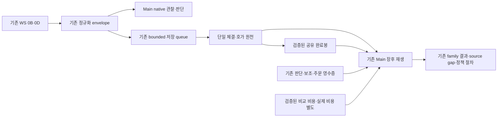

# Main 공통 시장원천 정리와 마이크로 리버전 퇴역 잔재 제거 상세 구현계획

작성일: 2026-10-09 KST

상태: **2026-10-09 17:01 KST `main-market-source-20261009-v1` 배포 완료. 기존 정책 내용을 보존한 코드 연결과 source 10/8 장후 최종화, 10/12 PREOPEN 전체 계약 검증 PASS. T8/G5 성능 잔여는 명시적 사용자 배포 지시에 따라 후속 OPEN으로 보존한다. 실제 다음 영업일 PID·자연 세션 소비는 미관측이다.** 최초 결과는 §14, 이전 보류 당시 상태는 §15와 [후속 리뷰](../audits/main-market-source-consolidation-review-deployment-2026-10-09.md), 최신 배포는 §16에 기록한다.

리뷰 보완: 2026-10-09. 실제 probe·구독 해제·수집 플래그·장후 직접 reader·원천 세대·PREOPEN 소비를 대조한 계획 결함과 수정은 §12에 기록한다.

## 1. 목표·범위·유한 종료 조건

사용자 방향은 마이크로 리버전 전체 삭제에서 **현재 Main이 쓰는 기능을 활용하고 불필요·퇴역 부분을 제거하는 정리**로 바뀌었다. 기존 WS 체결·호가 수신, Main의 연속 반전 관찰, 공통 원천 저장·검증, 비용·종목 정보와 장후 재생을 연결한다. 위젯·에피소드나 독립 마이크로 리버전 매매·AI 연구를 다시 운영하지 않는다.

개선 목적은 다음 세 가지다.

1. 실제 Main 관측 구간과 판단 시점에 결속된 체결·호가를 보관하여 신호 발생→관측→Main 판단→보조 완료→제출의 지연·결손을 설명한다.
2. 기존 진입·보조·보유청산 장후 생산자가 같은 원천과 유효한 파생 결과를 재사용하도록 하여 중복 저장·계산을 줄인다.
3. 퇴역 owner의 추가 구독·명세·전용 계산·보고서 요구와 복원 경로를 제거한다. Main의 승인된 기계·보조 정책과 수동관리·주문 안전 경계는 보존한다.

성능 수용은 §6.1의 실제 작업량 감소와 §7.1–§7.3의 Main 판단·청산 지연 비악화를 함께 확인한다. 평균 CPU 감소만으로 성능 완료를 선언하지 않는다. 아래 수치는 기존 guard와 비교 규칙이며, 실제 측정 결과는 §14에서 구분한다.

**전체 범위는 MS0–MS6로 고정한다.** 코드 종료는 MS0–MS5의 직접 호출·원천·소비 계약과 표적 검증 완료다. 운영 종료는 별도로 허용된 MS6의 선택 릴리스·PID·한 번의 전체 자연 거래 세션 및 그 원천일의 장후 소비 확인이다. 자연 신호·주문·체결이 없으면 해당 효과는 `not_observed`, 불복구 과거 원천은 원 사유의 `source_gap`, 외부 원천·권한이 필요한 단계는 owner와 조건이 명시된 `blocked`로 남긴다. 같은 입력 재실행이나 새 연구 family를 추가하여 종료를 미루지 않는다.

원천·기능 보존 수리에 양의 EV, 실체결 횟수, 새 holdout·최소 거래일을 요구하지 않는다. 전략 후보의 경제성·정책 적용은 기존 family 계약이 소유한다. 비용 미관측은 null로 남기고 raw 가격 상승을 실제 수익으로 바꾸지 않는다.

튜닝 입력의 clean baseline은 `2026-06-05T00:00:00+09:00`이며 그 이전은 archive/audit 전용이다. 현행 후속 정책 연구는 `2026-09-29` source date부터의 forward 경계와 실제 소비된 incumbent를 따른다. 오래된 원천을 연결할 수 있게 됐다는 이유로 이 경계를 넓히지 않는다.

실행 인계 owner는 [10/9 체크리스트](../checklists/2026-10-09-stage2-todo-checklist.md)의 `MainMarketSourceConsolidation1009` 하나다. 기존 NS/H/HP/MW 작업을 보존한다. §16의 승인된 배포에서는 10/12 원 봉인본·수동 OPEN을 보존하고 정식 builder의 자동 구간과 해당 release 준비 영수증만 갱신한다.

## 2. 조사 근거와 해석 경계

기준은 [Plan Rebase](../plan-korStockScanPerformanceOptimization.rebase.md) §1–§8 및 현재 체크리스트다. 다음은 10/9 작업본의 직접 호출 조사이며 현재 PID의 호출 횟수·자연 성과를 입증한 결과가 아니다. 구현 시작 시 최신 작업본·선택 릴리스·실제 소비자를 다시 고정한다.

| 확인한 사실 | 직접 근거 | 구현상 의미 |
|---|---|---|
| Main WS의 0B callback이 현재 반전 backend를 직접 호출하며 시장·세션 함수는 collector 파일에서 import | [kiwoom_websocket.py](../../src/engine/kiwoom_websocket.py), [reversal_current_backend.py](../../src/engine/scalping/reversal_current_backend.py) | Main 실시간 반전 관찰을 보존하고 작은 공통 함수의 무거운 수집기 의존을 제거 |
| Main AI·WATCHING 재평가도 `_explicit_item_venue` 사용 | [ai_engine_openai.py](../../src/engine/ai_engine_openai.py), [sniper_state_handlers.py](../../src/engine/sniper_state_handlers.py) | collector 전체 삭제나 단순 import 제거는 불가 |
| 현재 원천 저장 worker는 정상 stream append 이후 별도 shock detector와 event reference 생성도 실행 | [forward_collector.py](../../src/engine/scalping/micro_reversion/forward_collector.py)의 `_process_allowed_envelope` | raw 저장과 독립 탐지의 생존 소비자를 구분. `discovery_enabled=false`만으로 이 계산이 중지됐다고 판단하지 않음 |
| Main 반전 장후가 정규화 market stream 전체 관측 모집단을 읽음 | [continuous_reversal_source.py](../../src/engine/scalping/continuous_reversal_source.py), [continuous_reversal_postclose.py](../../src/engine/scalping/continuous_reversal_postclose.py) | 선택된 매매 시점만 저장하도록 줄이면 비진입·전체 반전 분모가 달라짐 |
| Main 장후·감시가 비용·종목 master를 사용 | [ai_action_outcome_calibration.py](../../src/engine/scalping/ai_action_outcome_calibration.py), [market_opportunity_census.py](../../src/engine/monitoring/market_opportunity_census.py), [intraday_ws_freshness_monitor.py](../../src/engine/monitoring/intraday_ws_freshness_monitor.py) | `micro_reversion` 이름만으로 비용·master를 삭제하지 않음 |
| Main 보조 paired replay가 기존 Provider 예산·미확정 reservation 계약을 사용 | [compact_auxiliary_paired_replay.py](../../src/engine/scalping/compact_auxiliary_paired_replay.py), [provider_budget.py](../../src/engine/scalping/micro_reversion/provider_budget.py) | 독립 연구 퇴역과 공통 예산 guard 제거는 별개. 불확실 예약을 재사용하지 않음 |
| 장후 summary가 압축된 AI 원천의 원 날짜·decoded hash를 검증 | [postclose_summary_handoff.py](../../src/engine/automation/postclose_summary_handoff.py), [storage_maintenance.py](../../src/engine/scalping/micro_reversion/storage_maintenance.py) | 원천 검증·보관의 공통 기능을 유지 |
| 완료봉은 live entry 선택 조건과 postclose 소비가 다름 | [shared_ws_snapshot.py](../../src/trading/market/shared_ws_snapshot.py), [entry_candle_context.py](../../src/engine/scalping/entry_candle_context.py), [continuous_reversal_postclose.py](../../src/engine/scalping/continuous_reversal_postclose.py) | Main entry의 `adjusted_1`과 WS `raw_same_day` 동등성이 미입증이면 REST 유지. 장후 완료봉 소비는 별도 보존 |
| 전용 attribution 생산자는 퇴역했으나 boot의 날짜별 collection-target reader와 builder 함수는 남음 | [collection_targets.py](../../src/engine/scalping/micro_reversion/collection_targets.py), [kiwoom_sniper_v2.py](../../src/engine/kiwoom_sniper_v2.py), [retirement.py](../../src/engine/lifecycle/retirement.py) | 폐기된 장후 생산자를 재생성하여 명세 결손을 메우지 않음 |
| Main source validator는 depth·event reference·canary 계약을 함께 사용 | [native_packet_validation.py](../../src/engine/scalping/native_packet_validation.py) | 탐지기·reference 파일·canary를 먼저 지우면 생존 소비자가 실패하므로 버전별 소비 계약 이관이 선행 |
| Main exact probe도 `_micro_reversion_observation_only_items/codes` 및 route cache를 사용 | `kiwoom_websocket._acquire_exact_probe_item`, `_discard_exact_probe_item_locked`, `_queue_tick_event` | 이름이 같은 전용 명세 상태와 Main probe의 수신·EventBus 격리를 분리하여 정리 |
| inactive target pruning은 매도 후·비진입 후 관측과 pending attach를 보존 | `kiwoom_sniper_v2._prune_ws_subscriptions_for_inactive_targets`, [sniper_post_sell_feedback.py](../../src/engine/sniper_post_sell_feedback.py), `sniper_state_handlers.should_retain_rising_missed_nxt_post_block_subscription` | WATCHING/HOLDING 밖의 생존 Main 원천 목적·기한도 확인한 뒤 마지막 owner를 해제 |
| 현재 operating 장후도 `ensure_population`을 통해 정규화 stream을 직접 읽음 | [continuous_reversal_operating_postclose.py](../../src/engine/scalping/continuous_reversal_operating_postclose.py), `continuous_reversal_postclose.ensure_population`, `continuous_reversal_source.freeze_normalized_sources` | native validator 수정만으로 모든 Main reader의 품질 연결이 완료되지는 않음 |
| `ensure_population`은 기존 `source.json`이 있으면 즉시 재사용 | `continuous_reversal_postclose.ensure_population` | 원천 추가·교체를 기존 봉인 결과의 덮어쓰기로 처리하지 않고 기존 run/ledger 세대로 인계 |

[10/8 적용 명세](../../data/runtime/scalp_micro_reversion_collection_targets/scalp_micro_reversion_collection_targets_2026-10-08.json)는 퇴역 episode를 포함한 15종목·20경로다. 이는 기대 대상 명세이며 실제 종일 수집 수가 아니다. 최종 재검증한 [WS snapshot](../../data/runtime/kiwoom_ws_snapshot/latest.json)은 `generated_at=2026-10-09T00:27:21`, `micro_reversion_registration_receipt={}`였다. 파일 SHA-256은 `e6673850cd8adbd6b02099d994df59ec1f21d4333659d73b87314ca0d2d1c511`이다. 이 변경 가능한 latest 파일이나 과거 23종목·25경로 수치를 현재 구독/연결의 고정 근거로 쓰지 않는다. 명세·전용 영수증 부재를 Main 자체 구독 전체의 실패로 확대하지 않고 MS0에서 실제 lease·수신·저장을 확인한다.

비고정 신호 조사에는 원천 761행으로 당시 37종목·71개 조회를 재현하고, 실제 가격대 신호 5건의 조회 시 지연 8.836~16.631초를 확인한 근거가 있다. [NS 계획](main-nonfixed-native-signal-observation-and-consumption-remediation-plan-2026-10-08.md)의 원 5초 TTL·collector/native sequence 차이·역사적 재현 한계를 그대로 적용한다. 이 5건을 주문 가능 기회나 놓친 순익으로 바꾸지 않는다.

## 3. 기존 구현과의 역할 경계

| 기존 계획/owner | 본 계획에서 재사용할 것 | 본 계획의 추가 범위 |
|---|---|---|
| [NS0–NS5 비고정 신호](main-nonfixed-native-signal-observation-and-consumption-remediation-plan-2026-10-08.md) | probe lease·비소비 관측·Main claim·원 5초·기존 coverage 진단 | 해당 생애와 저장 원천의 연결, 퇴역 관측목록 의존 제거. 이미 구현된 scheduler를 새로 만들지 않음 |
| [지연/REST·WS 개선](main-post-warmup-latency-rest-ws-bottleneck-remediation-implementation-plan-2026-10-08.md), [430봉 H0–H5](main-430-bar-shared-history-and-incremental-refresh-implementation-plan-2026-10-08.md) | 공유 cache/이력·불변 snapshot·batch 저장·source selection | 기존 source writer/reader의 공통 계약 정리. 이력 상한·REST/WS 가격 동등성을 임의 변경하지 않음 |
| [HP 보유청산](main-holding-profit-exit-runtime-and-postclose-remediation-plan-2026-10-09.md) | 보유 판단·VETO·정책/PID·후행 가격·비용 대사 | 기존 replay가 요구하는 원천만 제공. HP2 실제 비용 원천 결손은 본 작업으로 해결됐다고 하지 않음 |
| [MW 약세 연구](main-market-weakness-observer-repair-and-postclose-research-implementation-plan-2026-10-08.md) | 저장된 시장 상태·기계/보조 결과의 장후 as-of join | 이미 수집된 원천 제공만 허용. MW를 이유로 장중 hook·metadata·queue·thread·API/AI 호출을 추가하지 않음 |
| [Main-only 퇴역](main-only-widget-episode-full-retirement-plan-2026-10-07.md) | 퇴역 실행 차단·Main/manual custody·과거 journal | 남은 micro 관측 전용 호출 정리. 과거 owner 잔량/intent의 flat 대사를 다시 요구하지 않음 |

연결 문서에는 구현·배포 완료 기록과 미실행/예정 전 기록이 섞여 있다. 완료된 NS/H 변경을 중복 구현하지 않고 최신 직접 영수증을 MS0에서 확인한다. 이번 계획은 다른 세션의 운영 승인을 전용하지 않는다.

## 4. 보존·정리·제거 목록과 코드 위치

첫 구현은 기존 모듈 수정이 기본이다. 패키지 전체 이름 변경이나 새로운 수집 service·DB·일일 보고서를 목표로 추가하지 않는다. `src/engine` root 신규 `.py`는 금지하고, 불가피한 신규 파일은 구현 전 location gate에 역할·호출자·기존 대체 불가 사유를 기록한다.

| 대상 | 결정 | 구현 위치/끝점 |
|---|---|---|
| `_explicit_item_venue`, `_session_bucket` 및 필요한 순수 identity helper | Main 공통 이관 | [session_contract.py](../../src/trading/market/session_contract.py)에 현재 저장 partition 의미를 유지하는 순수 함수로 통합. 실행 venue resolver와 이름·반환 의미를 구분 |
| `forward_collector`, `observation_adapter`, `path_journal`의 0B/0D 정규화·비동기 append | 보존·정리 | 현 모듈의 단일 원천 writer를 재사용. raw 처리와 소비 없는 legacy 탐지 가지를 분리; 같은 데이터의 두 writer를 만들지 않음 |
| `detector`, `multi_horizon`, onset/confirmation, registry/coalescer·event-reference의 전용 부분 | 소비 확인 후 제거 또는 최소 보존 | MS0에서 실제 Main reader·현재 정책/AI 입력·archive reader를 구분. 생존 기능까지 명칭으로 일괄 퇴역시키지 않음 |
| `collection_targets`의 episode/widget/prospective rotation·옛 attribution feedback | 제거 | Main 구독 소유권을 WS/기존 probe·fixed-watch 생애로 대체한 뒤 boot 명세 의존 제거. Main 소유 없이 추가된 item만 해제 |
| `_micro_reversion_observation_only_*`, route cache와 exact-probe lease | Main 공유 부분 보존 | WS acquire/adopt/release·callback의 생존 계약. 전용 명세 dict·deferred feedback만 분리 제거하고, 이름만 보고 공통 격리 상태를 삭제하지 않음 |
| canary·source quality의 queue/drop/writer/disk/clock 검증 | 보존·Main 소비에 맞게 정리 | 현 [canary_monitor.py](../../src/engine/scalping/micro_reversion/canary_monitor.py)와 [observer_source_quality.py](../../src/engine/scalping/micro_reversion/observer_source_quality.py). shock 0과 raw 실패를 분리 |
| 완료봉 projection·reader·seed 검증 | 조건별 보존 | [completed_bars.py](../../src/engine/scalping/micro_reversion/completed_bars.py), shared reader, 기존 Main 이력 owner. 실시간 REST 전환을 별도 승인으로 꾸미지 않음 |
| 비용·tax·symbol master·Provider 예산 | 공통 기능 보존 | 현재 생산/검증 owner를 유지하고 Main 소비·전용 잔재만 정리. 기존 [comparison_cost.py](../../src/trading/market/comparison_cost.py)의 widget 가정 비용으로 새 Main 비용을 일괄 대체하지 않음 |
| `main_ai_prompt_optimizer`, bridge·label·replay 함수 | 함수 단위 분류 | entry/holding replay와 consumer가 쓰는 hash·계약·계산을 보존. 퇴역 cycle 전용 함수·도달 불가 분기만 제거 |
| `storage_maintenance`의 공통 압축·원 날짜/hash 읽기 | 보존 | existing cleanup·[log_archive_service.py](../../src/engine/log_archive_service.py)·summary 호출 보존. 전용 정리 대상만 목록에서 제거 |
| 퇴역 보고서·설정·env·감시/복구 문구 | 제거 | 현 wrapper·detector·builder·운영 문서의 실제 호출과 요구를 함께 정리. archive schema 문자열은 역사 해석 필요에 따라 보존 |

**현재 수집 활성화 스위치는 공통 기능이다.** [observation_adapter.py](../../src/engine/scalping/micro_reversion/observation_adapter.py)의 `SCALP_MICRO_REVERSION_OBSERVER_ENABLED`는 collector 생성, `SCALP_MICRO_REVERSION_PATH_CAPTURE_ENABLED`는 raw stream 저장, `SCALP_MICRO_REVERSION_DEPTH_CAPTURE_ENABLED`는 0D writer를 제어한다. 첫 범위에서 기존 키·기본값·선택 릴리스의 유효 값을 보존하고 퇴역 설정 삭제 목록에서 제외한다. `SCALP_MICRO_REVERSION_DISCOVERY_ENABLED=false`는 현재 `_detector.process`를 끄는 스위치가 아니다. 완료봉의 `KORSTOCKSCAN_WS_COMPLETED_BARS_PUBLISH`도 별도 생존 스위치로 유지한다. 향후 이름 변경이 필요하면 writer를 먼저 켜거나 옛 키를 먼저 지우지 않고, 별도 동등성 변경에서 단일 값 해석·충돌 거절·실제 소비 영수증을 닫는다. 이번 계획은 env 값을 조작하지 않는다.

`ai_quality_cycle` 실행 파일은 이미 없고, 현재 `ai_decision_quality --mode` 선택지에도 `micro_reversion_execute`는 없다. 남은 설명 문자열만 보고 실행기를 새로 퇴역시키거나 복원하지 않는다. 반대로 `provider_budget`·optimizer 함수는 Main paired replay의 import가 있으므로 파일 전체를 죽은 코드로 분류하지 않는다.

일시 compatibility wrapper는 실제 기존 caller/명령이 필요한 경우에만 허용하며 종료 단계·마지막 소비자를 MS0 명세에 적는다. 구현 복제나 무기한 이중 owner를 남기지 않는다. 첫 범위의 완료를 모든 `micro_reversion` 문자열 제거로 정의하지 않는다.

## 5. 목표 연결 구조

실시간 Main은 저장 파일을 다시 읽어 신호를 만들지 않는다. 장후는 원천을 같은 의미로 재생한다. 파일 기록 실패나 선택적 연구 실패가 Main의 정상 수신 thread를 중단하지 않도록 현재 격리를 보존하되, 손실된 범위는 장후 적격 자료에서 제외한다.

### 5.1 구독과 관측 모집단

- 기준은 실제 Main fixed-watch·probe/WATCHING·HOLDING 및 각 생존 consumer의 기존 exact-item lease다. 5개 고정감시만으로 제한하거나 과거 episode 종목을 자동 편입하지 않는다. 퇴역 owner 문자열과 Main이 독립적으로 소유하는 같은 symbol을 구분한다.
- 보존 목록에는 이미 존재하는 매도 후 executable BBO의 1/3/5/10분 관측, 유효한 비진입 후 sampler, scanner pending attach의 기한도 포함한다. 각 직접 owner의 현재 활성 조건·exact route·기한까지만 유지하며 OFF 경로를 활성화하거나 TTL/관측기간을 늘리지 않는다. [owner_retirement.py](../../src/trading/config/owner_retirement.py)의 영구 symbol/owner 신규진입 제외를 그대로 적용하고 과거 journal 소유권이나 단순 수신을 Main lease로 바꾸지 않는다.
- Main 매매 소유 item은 보호하고, 기존 probe의 borrowed/adopted/removing 생애와 마지막 owner 해제를 사용한다. observer가 공통 item 전체 REMOVE·강제 REG를 수행하지 않는다. 현 WS/probe/watch 상한과 세션 적격성은 그대로 사용한다.
- MS0는 구 등록 명세의 추가 route와 현재 Main 필요 route를 대조한다. 이미 Main 구독으로 충족되는 route는 명세 없이 수집한다. 명세만 제공하던 route가 생존 Main 소비자에 필수라면 그 소비자의 현 구독 관리에 소유 이유·유효 기간을 명시적으로 이관한 뒤 구 경로를 제거한다. 새 prospective universe나 장후 종목선정기를 만들지 않는다.
- 소비자가 수신한 유효 raw 연속 구간은 결과·주문 유무와 무관하게 보존한다. ENTER/체결/선택된 신호 주변만 저장하는 최적화는 전체 반전·비진입 분모를 바꾸므로 기본 구현에서 제외한다. 관측하지 않은 시장 전체를 커버했다고 표시하지 않는다.
- Main 기본 구독이 없는 상황은 정상 빈 집합일 수 있다. 예상 구독이 있는데 첫 수신이 없거나 실제 마지막 owner 해제 뒤 자료를 요구하면 해당 관측 범위를 결손/검열로 기록한다. 긴 무체결 간격만으로 네트워크 손실을 단정하지 않는다.

### 5.2 원천 identity·시계·세대

기존 envelope·journal 필드를 우선 사용한다. 필수 의미는 `source_date`, symbol, exact item, market-data route, session, exchange/receive clock, native transport/route sequence, collector sequence epoch/series sequence, producer version, path eligibility다. 모든 필드를 새로 발행하는 추가 로거를 만들지 않고 기존 정규화 지점에서 보존 가능한 identity만 단일 원천에 전달한다.

- `_AL`의 `SOR` 저장 partition은 통합 시세 분류다. 실제 체결 venue로 변환하지 않는다. `_NX`/plain item과 날짜·세션을 교차 결합하지 않는다.
- native callback의 epoch/sequence와 collector의 epoch/sequence는 서로 다른 namespace다. 같다고 가정하거나 millisecond timestamp 하나로 중복 tick을 합치지 않는다. 신규 연결이 필요한 경우 원 수신 identity를 그대로 보존하는 최소 필드를 기존 envelope에 추가하고, 과거 자료는 입증 가능한 연결 수준만 표시한다.
- 현재 native callback의 세션은 `now_update_ts` 기준이고 collector 저장 세션은 검증된 `exchange_timestamp` 기준이다. helper 이동으로 한쪽 시계를 다른 쪽에 맞추지 않는다. 09:00/15:30·자정 경계에서 두 원 시각/세션과 직접 packet identity를 보존하고, 계약이 다른 구간을 임의 교차 join하지 않는다. 필요한 연결 의미가 입증되지 않으면 구체 clock/session 사유로 제외한다.
- quote/depth feature는 판단 시각에 실제 이용 가능했던 동일 route의 past-only 원천으로 계산한다. 후행 가격은 outcome으로만 읽는다. 장후에 발견한 미래 depth를 판단 입력에 되채우지 않는다.
- 재접속·마지막 owner 해제·프로세스 교체 시 coverage 구간을 닫는다. 세대 경계를 넘겨 60/120초 이력이 이어졌다고 만들지 않는다. 동일 lease 재조회와 실제 구독 재시작을 구분하는 NS 구현을 재사용한다.
- 과거 latest canary 하나만으로 다른 epoch를 승인하지 않는다. 현재 validator의 epoch 격리·archive 검증을 유지하고, 새 세대는 각 닫힌 구간의 정상 종료/손실 counter·원천 범위가 검증될 때만 사용할 수 있게 한다. 개별 epoch 영수증이 필요하면 기존 상태/manifest의 검증된 확장으로 남기며 과거 손실을 소급 복구하지 않는다.

### 5.3 source quality와 legacy event-reference 분리

기존 raw 순서 검증, timestamp 격리, queue-full·writer 실패·disk self-disable, source hash·partition census를 보존한다. 격리된 row/window는 제외하고, 출처를 특정할 수 없는 전역 계약 손상만 전체 입력 차단으로 처리한다.

현재 Main reader 중에는 legacy event reference가 source contract 일부인 경로가 있다. MS3에서 소비자별로 다음을 확정한다.

1. 실제 Main 결정/신호 identity와 raw cursor만 필요한 reader는 그 identity에 결속된 검증 경로로 이관한다. **shock 발생 횟수나 reference 파일 존재를 정상 raw의 필수 조건으로 요구하지 않는다.**
2. 기존 활성 feature가 shock anchor 자체를 필요로 하면 그 계산·정의·입력 계약을 보존한다. 필요 없다는 증거 또는 의미가 동등한 기존 Main anchor가 확인되기 전에는 detector/reference를 끊지 않는다.
3. 옛 report·정책의 hash 검증은 원 schema의 읽기 전용 계약으로 유지한다. 새 원천을 옛 schema라고 라벨링하거나 report를 재작성해 이관 성공을 만들지 않는다.

이관은 **직접 reader마다** 검증한다. `continuous_reversal_source.freeze_normalized_sources`는 자체 row/clock/sequence 계약으로 stream을 읽으며 `native_packet_validation`을 호출하지 않는다. MS3는 기존 `observer_source_quality`의 순수 검증을 재사용하여, 실제로 필요한 source epoch·손실 범위·완료/종료 근거와 정규화 source manifest의 연결을 이 reader에서도 확인한다. 큰 validator 전체를 import하거나 shock reference 요구를 새 Main reader로 복사하지 않는다. legacy row의 종전 계약은 보존하고 새 완전성 증거가 없는 과거 구간을 소급 PASS로 바꾸지 않는다.

`canary_monitor._ZERO_STOP_COUNTERS`와 `reference_reconciliation_completed`는 현재 stop/close 조건이므로 detector만 지우고 옛 counter를 0·완료=true로 채우면 안 된다. raw 보존·queue/writer·close 검증과 legacy event-reference 검증을 버전별로 구분하고, writer snapshot→canary→daily archive→각 reader가 같은 계약을 소비한 뒤 전용 필드를 제거한다. 알 수 없는 새 schema는 명시 결손으로 처리하며, 이미 확인 가능한 정상 epoch까지 일괄 차단하지 않는다. 기존 latency/disk stop과 latch는 보존하고 자동 재시작으로 지우지 않는다.

`five_trading_days_and_200_mature_events` 같은 옛 micro 연구 floor를 raw 수집 정상·Main 원천 연결의 신규 수용 조건으로 적용하지 않는다. 현 전략 family에 실제 적용되는 검증·경제성 조건은 그 owner에서 유지한다.

### 5.4 실제 연결을 판정할 최소 결과

아래 값은 기존 원천 manifest·진단/report에 반영한다. 새 장중 로거·서비스·독립 일일 보고서를 만들지 않는다. 필드명은 해당 owner의 schema를 재사용하되 의미를 다음처럼 고정한다.

| 결과 | 계산 범위·판정 |
|---|---|
| 기대/등록/수신 대상 | Main lease의 유효 구간별 고유 symbol 수와 exact item 수, 요구 realtime type 집합을 별도로 집계. REG 송신·ACK·첫 실제 수신을 각각 표시하며, 한 타입만 필요한 consumer에 불필요한 양 타입 gate를 추가하지 않음 |
| 저장 완전성 | source epoch/item/type별 수신·enqueue·성공 append·quarantine·drop·미처리 잔량을 기존 counter/cursor로 대사. 정상 drain 시 설명되지 않은 차이 0. 현재 counter로 특정 불가능한 과거 구간은 `unobservable`이며 역산해 정상으로 만들지 않음 |
| 판단 연결 | 고유 Main signal/attempt 중 원 epoch·exact item·as-of quote·원천 품질을 모두 확인한 수 / 해당 quote가 필요한 전체 고유 signal/attempt. 재시도·reference/projection 중복으로 분모를 늘리지 않음 |
| 후행 경로 | 판단 연결된 집합에서 원 family의 horizon별 충족·미성숙·세션 종료/구독 해제 검열·source gap을 구분. 연결되지 않은 판단은 분모에서 숨기지 않고 별도 원인으로 남김 |
| 원인별 미연결 | 기대 구독 부재, 타입 미수신, epoch 불일치, stale/future quote, 원 identity 부재, queue/writer 손실 등 증거가 있는 원인을 기록. 한 raw 파일 존재나 종목 수 일치로 정상 승인하지 않음 |

분모가 0이면 연결률은 null이고 해당 집합은 `valid_empty`/`not_observed`다. 하나의 전체 자연 세션에서 실제 Main 대상 수는 변할 수 있으므로 고정 5·23종목 수와 비교해 성공을 정하지 않는다. T2/T3 fixture는 모든 요구 경계 사례의 연결·차단을 확인하고, 자연 수용에서는 누락 자체를 숨기지 않고 각 누락의 원인·범위와 기존 소비자의 제외 처리가 일치하는지를 검증한다.

## 6. 단계별 구현

| 단계 | 우선순위·선행 | 변경/조사 owner | 산출물과 종료 검사 |
|---|---|---|---|
| MS0 현재 경로·소비 확정 | P0, 최초 | 기존 수집기·Main callback·장후·선택 릴리스·설치 예약 | 함수/산출물별 조치·source/hash·fixture와 §7.2 부하별 성능 기준선/측정 예산 고정. 불명 항목은 삭제 명세에서 제외하고 구체 조사 결과를 남김 |
| MS1 공통 함수 의존 정리 | P0, MS0 | session contract, Main WS/AI/반전 runtime, 순수 계약 caller | collector 비기동 상태에서도 Main import/동일 입력 결과 일치. pinned-code 호환 검증 및 원 source hash 보존 |
| MS2 Main 구독·원천 소유 연결 | P0, MS0/MS1 | `kiwoom_sniper_v2`, WS manager, 기존 fixed-watch/probe/후행 관측 lifecycle | 폐기 attribution 명세가 없어도 Main 원천이 수집. 퇴역 추가 item 0, Main owner item·probe 격리 유지, 해제/재연결/동일 symbol 다중 route 회귀 |
| MS3 수집 경량화·원천 품질 | P1, MS2 | collector/adapter/path writer/quality/`native_packet_validation`/`continuous_reversal_source` | PF1–PF4 작업량·lock/I/O 경계 검증, 무소비 detector 제거·단일 인코딩, 정상 raw·손실/격리·생존 feature와 직접 소비자별 구·신 schema 의미 보존 |
| MS4 기존 Main 장후 활용 | P1, MS3 | continuous reversal·기존 source diagnostics·HP/MW 소비자 | 동일 모집단·cutoff·비용에서 원천→판단→후행 결과 연결. 기존 보고서 안에 가용/제외·지연 원인 반영. 새 독립 연구/정책 family 0 |
| MS5 중복 저장·계산·운영 요구 정리 | P1, MS3/MS4 | 기존 storage/cleanup·summary·freshness·builder·wrapper | PF5·동일 세대 재실행 delta 0·퇴역 predecessor 0, T1–T8/§7.3 성능 gate·문서 parser 통과. 파일 정리는 검증된 대상 명세만 준비 |
| MS6 허용된 운영 전환·자연 수용 | MS0–MS5 종료 및 해당 실행 허용 후 | immutable release·실제 PID·기존 Main 장후/기동 owner | 선택/PID별 소비·retired write 0, 한 전체 자연 source session→장후 연결. 필요한 데이터 정리는 writer/reader/복구본 참조 종료 후 실행 |

### MS0: 유한 조사와 기준 fixture

조사는 위 §4 대상과 직접 import/CLI/예약·파일 consumer의 전이 폐쇄까지만 수행한다. 저장소 전체의 무관한 전략·옛 감사문서를 재검토하지 않는다. 작업본의 기존 dirty 변경과 원 HEAD를 기록하고 다른 세션의 HP/MW/NS/H 구현을 덮어쓰지 않는다.

대상별 기록 필드는 현재 caller/조건·설치 실행 여부·생성/읽기 경로·Main 목적·마지막 소비 증거·source/hash 참조·조치·완료 검사다. 단순 import는 자연 사용 증거와 구분한다. 현재 날짜가 휴장이면 저장된 최근 유효 영수증과 격리 fixture를 사용하고 현재 PID 소비는 `not_observed`로 둔다.

MS0 산출물은 이번 계획의 구현 리뷰 기록에 함수/설정별 판정표와 고정 fixture 참조로 남긴다. MS1–MS5는 이 목록을 소비하며 신규 mandatory 일일 census 생산자를 만들지 않는다. 단순히 `migrate`만 기록하고 이전 목적지·마지막 소비자·완료 검사가 없는 항목은 조사 완료로 닫지 않는다.

축소 fixture는 정상 Main 0B/0D, 무신호, 비고정 신호, 동일 item 재접속, 마지막 owner 해제, quiet tape, timestamp 격리, queue/drop, 장후 파일 append/압축 교체, 퇴역 명세 혼입을 포함한다. 기존 원천에서 필요한 범위만 복사하며 synthetic 경계 사례는 명시한다. 조사를 위해 전일 전체 보고서나 Provider를 재실행하지 않는다.

### MS1: 함수 이관과 정책 code pin

시장·세션 mapping은 먼저 같은 입력 집합의 현재 출력과 대조한다. 기존 session resolver로 대체했을 때 시간 경계/legacy partition 값이 달라지면 의미 변경을 숨기지 않고 현재 동작을 보존하는 순수 adapter로 통합한다. 함수 이동은 새로운 매매 venue 추론 권한을 만들지 않는다.

[v6 contract_modules](../../src/engine/scalping/continuous_reversal_policy_v6.py)는 runtime 모듈의 bytes를 고정한다. import 한 줄의 변경도 `v6_contract_code_changed` 대상이 될 수 있다. MS0에서 실제 pin 목록을 대조하고, 동등성 fixture·실제 family loader로 검증한 뒤 기존 정책 owner의 정식 release/code-binding 절차로 인계한다. hash 검사를 끄거나 새로운 함수 경로를 검증 범위에서 빼지 않는다. 전략 payload·branch membership·threshold·Provider 정책을 정리 작업 때문에 재선정하지 않는다. 동등성/정식 binding이 닫히기 전에는 배포하지 않으며 추가 EV 승인 gate를 만들지 않는다.

### MS2: 퇴역 명세 의존 종료

옛 postclose collection-target builder를 새 scheduler로 되살리는 방식은 사용하지 않는다. Main이 실제로 소유한 구독 생애가 수집 대상의 owner이며, 필요한 source coverage는 기존 WS 상태/영수증에서 투영한다. collector는 승인된 item을 관측하며 신규 매매 대상이나 watch slot을 만들지 않는다.

변경 묶음에는 boot의 `_publish_micro_reversion_collection_target_set`, EventBus command/handler, `_configure_micro_reversion_observation_items`, inactive prune·`execute_unsubscribe`의 옛 pinned/demotion 처리, deferred REG·reconnect의 전용 재구독을 모두 포함한다. 삭제 전 Main exact-probe와 후행 관측이 공유하는 상태를 분리해 보존한다. 오래된 command/future가 도착해도 폐기 집합을 재등록하지 않도록 원 세대 검증을 유지한다. 공통 `observation_only` 격리를 없애 미채택 probe가 일반 tick EventBus·fast-exit wakeup으로 승격되는 부작용을 금지한다. 정상 Main adoption 이후의 기존 전환은 보존한다.

수신 callback→수집 enqueue는 기존 순서를 유지한다. 현재 collector는 `_queue_tick_event`의 observation-only return보다 먼저 원 tick을 받으며, 일반 tick EventBus는 최신 상태를 합친다. 수집을 EventBus 소비자로 옮겨 중간 tick을 잃거나 별도 callback에서 이중 append하지 않는다. 해제와 도착이 경합하는 경우 기존 lease/세대 시점의 소유권으로 적격 범위를 고정하고, 늦은 패킷으로 lease를 되살리지 않는다.

명세 없이 기동, mixed Main/episode 과거 명세, 다음 거래일 전환, fixed-watch+probe 공유, HOLDING 보호, stale manifest, 아직 첫 0B/0D가 없는 route를 각각 검증한다. 필요한 타입 미수신은 `awaiting_first_type`/그 소비자의 기존 원천 결손으로 남기고 0D 한 건을 0B 체결 성공으로 인정하지 않는다. sender REG/ACK/실제 수신을 구분하고 exact route에서 소비자가 요구한 각 타입의 수신을 시점별로 확인한다. 현재 local sent registry를 broker ACK라고 라벨링하지 않으며 ACK 증거가 없으면 미관측으로 둔다.

### MS3: 수집 경량화와 완전성

기존 callback의 bounded enqueue와 불변 envelope 전달을 유지한다. hot path에 JSON 인코딩, fsync, 전체 파일 hash, 전체 관측종목 복사, 장후 reader, 새 REST/AI 호출을 추가하지 않는다. MS0 대비 thread/queue 증가 없이 기존 worker 경로에서 순서·batch append를 정리한다.

소비가 없는 legacy detector/coalescer는 마지막 consumer 이전을 끝낸 뒤 worker 호출과 상태·counter·설정·전용 테스트를 함께 제거한다. 생존 consumer가 필요한 detector까지 제거해 feature를 null/0으로 바꾸지 않는다. raw writer의 drop·disk 보호·source rejection counter는 유지한다. 깨진 tail·중복 source identity·상충 duplicate·out-of-order·재접속은 구간별로 드러내며 임의 정렬/번호 재부여로 정상 경로를 만들지 않는다.

### MS4: 활용 항목과 실제 계산 목적

| 질문 | 기존 입력/계산 | 소비·완료 증거 |
|---|---|---|
| 유효 신호가 제때 Main에 도달했는가 | native signal/branch·원 epoch/deadline, probe 관측·Main claim·기계/보조 완료·submit receipt의 기존 시각 연결 | 기존 NS/performance/원천 진단에서 연결 가능 수, 단계별 지연, 원천 부족·조건 불충족·만료·guard 종료를 구분 |
| 진입·보조 판단 뒤 경로가 어땠는가 | 기존 ENTER/RECHECK/BLOCK·PASS/VETO의 동일 기회, exact item의 판단 당시 ask와 원 family의 후행 label/cost 계약 | 기존 continuous reversal/paired report의 고유 기회 분모·원천 제외·label 유지. AI 미호출을 VETO로 바꾸지 않음 |
| 보유·익절 판단을 재현할 수 있는가 | 기존 HP signal/PID/policy·호가·후행 가격·실제 leg/cost 영수증 | HP replay에 가용 원천 제공. configured 비교비용과 실제 비용을 구분하며 HP2 결손은 그대로 남김 |
| 시장 약세 시 차이가 있는가 | 기존 MW 관찰 snapshot과 저장된 기계/보조/결과의 장후 as-of join | MW owner의 기존 비교 분모·시간/자원 예산 안에서 소비. 원천 부재를 보완하는 장중 수집 추가 없음 |

새 성과 보고서를 병렬로 만들지 않고 위 owner의 기존 report section·source manifest에 연결 상태를 반영한다. 사용하는 schema에는 `metric_role`, `decision_authority`, `window_policy`, `sample_floor`, `primary_decision_metric`, `source_quality_gate`, `forbidden_uses`를 명시한다. source 연결률·지연은 `source_quality_gate`/진단이며 실제 수익이나 정책 적용 증거로 전용하지 않는다.

원 label/cost/기간/모집단·정책 hash를 고정한 비교를 사용한다. 원천 보완으로 새 적격 행이 늘면 기존 공통 적격 집합의 결과 동등성과 새로 편입된 행의 근거를 각각 보고한다. 관측 범위 축소로 연결률이 올라간 것을 개선으로 인정하지 않는다. 초기 정책을 채택했던 표본과 후속 정책 연구 입력은 현행 forward 경계를 따른다.

### MS5: 저장·계산과 생존 비용 계약

- 원천 단일 append를 유지하고 closed shard 압축·canonical logical path·원 decoded hash 검증을 재사용한다. raw/normalized/projection/report를 별개 실적 표본으로 더하지 않는다.
- 기존 source manifest에 봉인된 byte prefix/세대/hash와 알고리즘·정책·label/cost·schema 버전이 모두 같을 때만 파싱/결과를 재사용한다. suffix/partition 추가, append, source replace, 압축 교체, exclusion·cost 변경을 cache 무효화에 포함한다.
- 읽기 projection은 동일 identity의 증분 처리·원자적 발행을 사용한다. 같은 manifest 재실행의 새 고유 행·새 결과·Provider 호출은 0이다. 이를 경제성 비교 예산이나 현행 Provider 호출 상한 증가의 근거로 쓰지 않는다.
- WS 완료봉은 live entry의 수정주가/430봉 조건과 장후의 동일 item 보완 조건을 각각 검증한다. H4가 `price_basis_equivalence_unproven`이면 기존 REST를 유지한다. WS/REST 혼합으로 과거 고가·저가나 판단 입력을 새로 만들지 않는다.
- Main 비용·master·Provider reservation·AI 원천 압축 검증은 공통 owner로 명확히 남긴다. 실제 이전이 필요한 작은 helper만 역할 package로 이동하고, 비용 원천이나 budget ledger의 byte/hash·미확정 reservation을 대량 rename/재생성하지 않는다.
- 퇴역 항목은 cleanup 대상 목록·freshness·summary/strict/checklist에서 같은 세대로 제거한다. 부재를 정상 경제성 0 또는 현재 성공으로 바꾸지 않는다. Main 생존 필수 원천의 검사 강도는 유지한다.

**원천 freeze와 계산 cache의 수명을 구분한다.** 현재 `ensure_population`은 기존 `source.json`을 즉시 재사용한다. 아직 freeze하지 않은 입력은 byte prefix/complete-line/hash를 고정해 한 세대로 발행하고, freeze 뒤 raw append·가격봉 추가·exclusion/비용 변경은 기존 `source.json`·정규화 파일·label·보고서에 덮어쓰지 않는다. 필요한 후속 계산은 현 family의 run/manifest·shared-ledger 세대에 부모 source hash와 변경 범위를 결속하여 인계한다. 생성 중인 run은 기존 lock/원자 발행 owner로 격리하고 두 세대가 같은 출력 파일을 쓰지 않도록 한다.

수정 owner는 `ensure_population`과 그 직접 호출자다. 새 run 영수증에는 선택한 source 세대의 path/hash를 넣고 모든 downstream은 그 영수증을 통해 같은 세대를 읽는다. explicit 세대를 지정했는데 없거나 hash가 다르면 옛 `source.json`로 fallback하지 않는다. 원 세대의 resume는 원 manifest를 계속 소비한다. 새로운 독립 source selector를 추가하지 않고 기존 family의 run 선택·발행 경계를 확장한다. 선택 pointer 변경은 원자적으로 수행하며 이미 발행된 run의 source 선택은 바꾸지 않는다.

기존 request identity·Provider 결과·미확정 reservation과 published/selected 정책의 원천 계보를 유지한다. 같은 정확 입력의 terminal 결과만 재사용하고, `unknown/inflight`는 실패로 간주해 재호출하지 않는다. 새 원천 때문에 입력 identity가 달라진 요청은 기존 결과에 억지 결합하지 않고 현행 승인/예산/재시도 owner의 미실행 항목으로 남긴다. 미래에 허용된 새 세대 처리와 이번 문서 작성의 무호출을 구분한다. 같은 세대 재실행 delta 0에는 새 고유 표본뿐 아니라 추가 Provider 실호출도 포함한다.

### 6.1 성능 저하 방지·개선의 구체 변경 묶음

PF1–PF5는 MS0–MS5 안의 구현 묶음이며 새 전략·별도 checklist owner가 아니다. 기준선과 후보는 같은 HP/MW/NS/H 변경·Python 환경·자원 조건으로 고정하여 본 정리의 차이만 비교한다. 실제 선택 릴리스와 대조본의 차이는 별도 기록한다. 기존 구현이 이미 충족한 항목은 회귀 확인만 하고 다시 작성하지 않는다.

| 묶음·단계 | 실제 변경점·위치 | 줄일 작업과 유지할 계약 |
|---|---|---|
| PF1 수신 경로, MS1–MS2 | `kiwoom_websocket`의 기존 정규화/`_queue_tick_event`, collector `observe_kiwoom_0b/0d`에서 고정 크기 원 identity를 전달. Main 소유 집합은 기존 REG/adopt/release/epoch 전환 시 갱신하고 tick당 전체 종목/owner 목록을 재구성하지 않음 | 수신당 exact-item 조회는 고정 횟수, 전달은 한 번. 깊은 snapshot 복사·JSON·파일 접근·전체 hash·통계 정렬을 추가하지 않음. mutable live dict를 worker에 넘겨 복사를 회피하지 않고 기존 불변 계약 보존 |
| PF2 소비 없는 계산, MS3 | `forward_collector._process_allowed_envelope`의 무소비 detector/coalescer/reference 호출·상태 제거. ring의 순서/결손 검증과 생존 feature는 유지 | 삭제 대상 detector 호출·reference 생성은 0. 정상 raw 행·정책 입력/판단은 동일. 종목·tick·후행 horizon을 줄여 CPU를 낮추지 않음 |
| PF3 단일 인코딩, MS3 | [path_journal.py](../../src/engine/scalping/micro_reversion/path_journal.py)의 `_encoded_size`와 `_append_market_path_points_locked`가 같은 batch를 반복 JSON 인코딩하는 경로를 worker 내부의 한 인코딩 결과 재사용으로 통합 | batch당 동일 row의 JSON 직렬화 2회→1회. 생성한 bytes 길이를 저장공간 검사와 write에 공통 사용. key 정렬·Unicode·newline·행 순서·cross-batch 순서 검증·partial write 처리·symlink/파일 검증·partition lock·fsync 유지 |
| PF4 lock·진단 경합, MS3 | collector `runtime_snapshot`/writer metrics·기존 WS snapshot의 bounded copy를 유지하고 정렬·통계·파일 발행은 공유 lock 밖에서 수행. 새 metadata가 실제 필요하면 기존 snapshot/manifest에 합침 | 기존 lock 순서와 세대 일관성 유지, 새 중첩 lock/장시간 임계구역 0. 이미 lock 밖인 percentile 계산을 다시 구현하지 않음. canary 주기·진단 표본을 줄이는 최적화 금지 |
| PF5 장후 재사용, MS4–MS5 | `continuous_reversal_source`·기존 family run/shared-ledger·storage owner에서 같은 source 세대의 파싱/파생 결과를 재사용. 변경 partition과 그에 의존하는 window만 다시 계산 | 같은 세대의 warm 재실행에서 동일 시장원천 행의 재파싱·동일 파생 계산·Provider 호출 delta 0을 각각 검증. 필요한 manifest 읽기/hash 무결성 검사는 유지하고 mtime/크기만으로 승인하지 않음. 압축/전체 대사/연구를 장중 callback이나 Main loop로 이동하지 않음 |

PF3은 **현재 코드에서 확인한 중복 계산**이다. 별도 인코딩 결과 cache를 운영 전체에 누적하지 않고 기존 제한된 batch의 수명 안에서만 bytes를 보관한다. 공개 append 함수의 기존 caller는 동일 검증 계약을 유지하고 공통 내부 인코딩/쓰기 경로를 사용한다. worker의 queue 크기·batch 크기·flush/fsync 정책·disk watermark를 임의로 바꾸지 않는다. 현재 `flush_interval_sec`는 queue 대기에도 쓰이므로 곧바로 최대 durable 지연이라고 주장하지 않고 실제 enqueue→fsync 완료 시간을 측정한다.

PF1/PF4의 새 필드 검증·counter가 필요한 경우 그 비용도 후보 측정에 포함한다. snapshot lock을 잡은 채 worker drain/join·파일 I/O를 하지 않고, worker가 Main lock을 역순으로 잡지 않도록 종료·재접속 경합을 검증한다. 수신→native 관찰→기존 collector 전달/fast-exit wakeup 순서를 성능만을 이유로 재배치하지 않는다. 데이터가 합쳐지는 EventBus로 raw 수집을 옮기지 않는다.

원천 수집은 기존 bounded queue의 비대기 전달과 실패 계수를 유지한다. queue를 키우거나 tick을 샘플링해 과부하를 숨기지 않는다. slow writer·queue full·disk stop은 기존 source 품질 계약과 observer 보호 경로로 처리하며, source gap을 명시한다. 기존 canary의 latch/중단을 유지하고 새 자동 봇 재기동·watch cap/TTL/threshold 변경을 성능 대응으로 추가하지 않는다. 장후 일괄 계산을 수신 worker에 넣지 않는다.

PF5의 공통화는 source·알고리즘·clock cutoff·label/cost·schema가 같은 계산에 한정한다. 진입 시점 feature와 미래 outcome, 서로 다른 HP/MW family 결과를 같은 cache로 합치지 않는다. 필요한 이전 window는 유지하고 관측 분모·기간·후보 집합을 축소하지 않는다. 장중과 겹칠 수 있는 압축/대사 작업은 현재 예약/partition lock의 제한을 확인하고, 일정·동시성 변경이 필요하면 해당 운영 owner의 변경으로 기록한다. 이번 계획으로 새 예약·프로세스·자원 설정을 설치하지 않는다.

## 7. 검증과 회귀 범위

매 변경 묶음마다 `implementation → self review → supplemental fixes → re-review → targeted validation`을 수행한다. 테스트 이름이 옛 패키지 이름이라는 이유만으로 삭제하지 않고 생존 계약 coverage를 보존한다.

| 검증군 | 재사용할 기존 테스트/owner | 필수 반례 |
|---|---|---|
| T1 시장·세션·wire boundary | [test_kiwoom_websocket.py](../../src/tests/test_kiwoom_websocket.py), [test_kiwoom_market_data_contract.py](../../src/tests/test_kiwoom_market_data_contract.py), micro contracts | plain/AL/NX, 09:00/15:30/자정에서 receive/exchange 세션 차이, source route와 실제 venue 구분, raw 부호/수량 의미 불변 |
| T2 Main 생애·퇴역 구독 | [test_zero_base_probe.py](../../src/tests/test_zero_base_probe.py), [test_main_fixed_watch.py](../../src/tests/test_main_fixed_watch.py), [test_post_sell_feedback.py](../../src/tests/test_post_sell_feedback.py), collection-target tests | mixed/없는 manifest, borrowed/adopted/late result, HOLDING·매도 후/비진입 후 exact route 보존과 기한 종료, 0D-only, retired deferred REG/reconnect 0, 미채택 probe의 일반 tick/fast-exit 승격 0·정상 adoption 유지 |
| T3 수집·저장·품질 | forward collector/path capture/observer runtime/canary/depth/storage 기존 tests, [test_micro_reversion_canary_monitor.py](../../src/tests/test_micro_reversion_canary_monitor.py) | 생존 flag 조합·collector OFF 시 native 독립성, 무손실·queue/drop/disk stop·partial tail·신호 0·재접속, 신/구 schema와 direct freezer 품질 반례, event-reference 제거 뒤 거짓 close/healthy 0 |
| T4 Main native·pin | [test_continuous_reversal.py](../../src/tests/test_continuous_reversal.py), [test_reversal_extended_policy.py](../../src/tests/test_reversal_extended_policy.py), operating/path/source 관련 tests | 관찰/claim·branch subset·원 5초·동일 입력 판정 동등, helper 이동 뒤 code pin 실제 검증·변조 거절 |
| T5 장후·비용·AI 계약 | [test_ai_action_outcome_calibration.py](../../src/tests/test_ai_action_outcome_calibration.py), [test_postclose_summary_handoff.py](../../src/tests/test_postclose_summary_handoff.py), continuous reversal/economic/master/Provider budget tests | 비진입/미호출·cost null·hash 손상, freeze 전후 append·동일 prefix/다른 세대·압축 교체·동시 run, 과거 결과 불변·새 세대 분리·동일 세대 delta 0·unknown reservation 중복 호출 0 |
| T6 완료봉·현재 연구 소비 | [test_entry_candle_context.py](../../src/tests/test_entry_candle_context.py), [test_micro_reversion_completed_bars.py](../../src/tests/test_micro_reversion_completed_bars.py), existing shared-ledger/HP/MW tests | adjusted/raw 불일치, 미래/다른 route 봉, 원 관측 분모 유지, 장중 MW 호출 증가 0 |
| T7 자동화·정리 | 영향 wrapper/bash tests, freshness·builder·bootstrap, [test_next_preopen_readiness.py](../../src/tests/test_next_preopen_readiness.py), [test_intraday_release_handoff.py](../../src/tests/test_intraday_release_handoff.py) | 퇴역 source 없는 Main-only 체인, 생존 env 보존·옛 ledger 복원 금지, 삭제 후보 protected/hash/FD 불일치, stale prepared 거절·정식 새 세대/보존 handoff 및 summary→strict→controller hash 일치 |
| T8 성능·격리 | [test_main_integrated_bottlenecks.py](../../src/tests/test_main_integrated_bottlenecks.py), [test_micro_reversion_forward_collector.py](../../src/tests/test_micro_reversion_forward_collector.py), [test_micro_reversion_path_capture.py](../../src/tests/test_micro_reversion_path_capture.py), [test_scalp_exit_safety_monitor.py](../../src/tests/test_scalp_exit_safety_monitor.py)와 기존 격리 계측 | §7.1–§7.3 전체 경로 비교, 0B/0D 혼합 burst·느린 fsync·canary 동시 snapshot·재접속/close, 단일 인코딩 bytes 동등성, Main/청산 지연·누락·미확정 종료를 CPU 평균으로 가리지 않음 |

Python은 영향 pytest와 compile, wrapper는 `bash -n` 및 해당 계약 테스트, 모든 변경은 `git diff --check`를 수행한다. 문서 변경은 링크·owner·권한 점검과 `PYTHONPATH=. .venv/bin/python -m src.engine.sync_docs_backlog_to_project --print-backlog-only --limit 500`만 실행한다. Provider/브로커 호출·운영 DB·실제 systemd/cron mutation을 테스트 수단으로 사용하지 않는다.

### 7.1 반드시 비교할 경로·측정값

기존 [runtime_performance.py](../../src/engine/monitoring/runtime_performance.py)의 `loop_first`, `loop_work_warm`, `ws_lock_wait/hold`, `confirmed_to_claim`, `claim_to_machine` 등을 재사용한다. `loop_work`는 루프 내부 작업 시간이며 의도된 sleep을 포함한 다음 처리 기회까지의 간격과 구분한다. 미계측 구간은 격리 테스트에서 monotonic clock으로 재고, 새 장중 로거·상시 서비스·tick당 로그/전체 histogram 정렬을 추가하지 않는다.

| 경로 | 측정값 | 판정에 필요한 구분 |
|---|---|---|
| WS 수신·정규화·collector 전달 | 0B/0D 각각 callback/enqueue p50/p95/p99/max, packet→정규화, lock wait/hold | 0B 통과를 0D·전체 WS callback 통과로 대체하지 않음. 새 metadata 비용 포함 |
| Main 루프 | `loop_first` 별도, warm loop 작업 p95/p99/max·다음 iteration 시작까지 간격, 완료 loop 수 | startup 개선으로 warm 악화를 상쇄하지 않음. 같은 work/replay 기회에 대한 throughput·queue 잔량 함께 확인 |
| 신호→판단 | native confirmed→Main claim→machine 판단 완료, 원 5초 내 처리/만료 수 | 같은 고유 signal/attempt와 원 deadline. Provider 지연은 고정한 fixture에서 분리하고 broker submit/성과로 부풀리지 않음 |
| 빠른 청산 반응 | 관련 0B/0D 수신→`ScalpExitSafetyMonitor.wake`→기존 evaluator 시작 p95/p99/max | [exit_safety_monitor.py](../../src/engine/scalping/exit_safety_monitor.py)의 실제 경로를 사용. 운영자 lock·기존 polling/guard·주문 판정 유지. 미채택 probe는 정상 wakeup 대상에서 제외 |
| 저장·종료 | enqueue→fsync 완료 지연, queue high-water/잔류·drain 시간, raw 행/bytes·drop·durable cursor | queue empty/task_done을 durable 완료로 보지 않음. 오류 주입의 예상 제외와 설명되지 않은 누락을 분리 |
| 공통 자원·장후 | 같은 입력 행당 process CPU, peak RSS, thread/queue 수, disk write/fsync 수·bytes, cold/warm 장후 wall time·재파싱/계산 수 | Main+writer를 함께 실행한 값으로 확인. 필요한 무결성 읽기와 중복 파싱, raw 필수 bytes와 제거된 전용 reference bytes를 구분 |

비교 영수증은 commit/변경 파일 hash·정책/source/설정 hash·입력 행과 item/type 분포·배속/도착 schedule·환경/부하·warmup 구분·각 지표 표본 수와 3회 결과를 포함한다. runtime ring의 4,096개 보관 분포와 전체 누적 카운터를 구분하고, 각 테스트 실행은 새 프로세스/진단 세대로 분리해 다른 날의 표본을 섞지 않는다. 없는 지표·신호는 null/`not_observed`이며 성능 PASS로 보충하지 않는다.

### 7.2 비교 시나리오·한정된 측정 절차

MS0에서 다음 입력과 부하 일정을 고정한다. 각 시나리오는 baseline/candidate를 같은 조건으로 각 3회 실행한다. 실제 브로커·Provider를 호출하지 않고 기존 격리 fixture·임시 journal·고정 응답을 사용한다. 디스크 장애는 writer 지연/오류 주입으로 재현하며 운영 디스크에 압박을 주지 않는다.

1. **정상 혼합 부하:** 고정 감시와 동적 Main lease, 실제 비율의 0B/0D·다중 exact route·후행 관측을 포함한다. native/claim/Main loop와 저장 worker를 함께 실행한다.
2. **burst와 공유 상한:** 최근 유효 원천의 관측 최대 유입 구간 및 현재 item 상한 안의 고정 synthetic burst를 사용한다. row 내용·순서·TTL은 보존하고 arrival schedule만 명시적으로 고정한다. cap을 올려 통과시키지 않는다.
3. **경합·과부하:** 느린 fsync, collector/canary snapshot 동시 실행, source-only queue full, close/reconnect를 각각 유발한다. 기존 안전 중단·정확한 제외와 Main/청산 진행을 검증한다. 기준선과 다른 종료·누락으로 실행 시간이 짧아지면 비교 부적격이다.
4. **장후 cold/warm/delta:** 첫 source freeze, 동일 세대 재실행, 한 partition 추가/변경과 압축 전환을 분리한다. 과거 세대 bytes/결과 불변·동일 기회 분모·cache 무효화 범위와 CPU/RSS/wall time을 함께 확인한다.

본 변경분과 무관한 HP/MW/NS/H 개선을 성능 절감으로 합산하지 않는다. 같은 host 자원·설정에서 실행하고 주변 부하로 비교가 불안정하면 그 원인을 기록한다. 최대 반복은 기본 3회/각 구현본이며, 구체 결함을 수정한 시나리오만 다시 측정한다. 결과를 좋게 만들기 위한 무변경 반복·임의 표본 제외는 금지한다.

### 7.3 성능 gate·중단 기준

아래는 수집/엔지니어링 수용 기준이다. 매매 경제성·새 초기정책 승인 기준을 추가하지 않는다.

정상/목표 burst 시나리오에는 모든 gate를 적용한다. 의도된 queue/disk 오류 주입은 사전에 선언한 observer 중단·손실 계수·제외 범위가 정확히 발생하는지 검증하고 이를 새로운 정상 부하 성능 결과에 합치지 않는다. 이때도 Main 판단·청산 진행/지연과 종료 안전은 기준선과 비교한다. 예상한 source 보호 중단을 구현 실패로 오판하거나, 조기 중단으로 짧아진 처리 시간을 성능 향상으로 인정하지 않는다.

| 검사 | 통과 조건 | 실패/미관측 처리 |
|---|---|---|
| 의미·원천 보존 | 동일 적격 집합의 판정/label 차이 0, 설명되지 않은 raw 손실·중복·새 signal 만료 0, 같은 코드 경로의 주문 안전/청산 동작 유지 | 하나라도 발생하면 CPU 개선과 무관하게 해당 변경 묶음 수정·재검증 |
| 기존 절대 guard | [현재 canary 설정](../../configs/scalp_micro_reversion_canary_guard.toml)의 0B callback p95 ≤1ms·p99 ≤2ms, 최소 1,000 callback과 기존 stop/latch 판정 보존. 구현 시 선택 설정 hash와 다시 대조 | 이는 collector 0B 범위의 guard다. Main/0D 전체 한도로 전용하지 않으며 limit/표본 floor를 완화하지 않음 |
| Main·청산·수신 지연 비악화 | §7.1 지연 p95/p99와 최대 지연, warm loop/처리 간격·drain·resource 지표를 시나리오별 독립 비교. 각 지표에서 후보 3회 중앙값 ≤기준선 3회 최대값+측정 해상도 | 새 hard deadline/기존 resource guard 위반은 즉시 실패. 표본 부족·불안정 환경이면 그 측정은 미검증이며 운영 적용 근거로 사용하지 않음 |
| 급격한 편차 | 후보 최악 실행값 ≤기준선 최대값+(기준선 최대−최소)+측정 해상도, 위 절대 guard도 충족 | 평균/다른 지표의 개선으로 상쇄하지 않고 해당 경합·tail 원인을 조사 |
| 실제 작업량 감소 | PF3 동일 batch의 직렬화 2회→1회, 제거 대상으로 확정한 PF2 호출 0, PF5 같은 세대의 중복 파싱/계산 delta 0을 직접 계수 | 단순 파일 이동·가독성 정리를 성능 개선으로 기록하지 않음. 생존 계산 제거·무결성 검사 생략으로 달성 금지 |
| 개선 효과 보고 | 위 gate 통과 후 대상 CPU/I/O/장후 wall time 중 개선된 지표의 기준선·후보·분모를 제시. 측정 잡음 밖의 감소만 절감률로 보고 | 구조적 작업량은 줄었어도 지연/CPU 차이가 잡음 안이면 `성능 효과 미입증`으로 명시하고 추가 개선을 약속하지 않음 |

비악화 비교의 측정 해상도·기준선 범위는 후보 결과를 보기 전에 고정한다. 분모가 다른 시나리오를 합산하지 않고, baseline 자체가 기존 guard를 실패한 경우 그 실패를 새 허용치로 삼지 않는다. 위 상대 비교는 구현 후보 선별용이며 런타임의 자동 threshold/env 조정식으로 배포하지 않는다.

성능 검증 실패는 MS5/G5에서 멈추고 해당 PF 변경만 수리한다. MS6가 허용되어 실제 적용한 뒤 새 Main 지연·원천 손실이 관측되면 기존 observer 보호 및 §8의 허용된 Main-only 복구 절차로 인계한다. 자연 관측에서는 당일 부하·종목·item/type 수 차이를 명시하고 격리 비교와 별도 증거로 남긴다. callback 통과나 평균 CPU 절감만으로 자연 Main 성능을 확정하지 않는다.

## 8. 운영 전환·정리·rollback

MS6 실행 전 최신 selector·실제 PID cwd/start·당일 source date·다음 거래일·작업 중 writer를 재확인한다. 이전 대화의 10/8 PID나 다른 계획의 배포 승인을 그대로 사용하지 않는다. current/rollback Main-only 릴리스와 봉인된 정책·source 계보를 유지한다.

1. 코드·caller·정책 code-binding·표적 검증이 닫힌 immutable release를 준비한다. 필요한 운영 문서·checklist 변경은 같은 변경 세트에 포함한다. README/Plan Rebase/AGENTS 등 기준 문서 갱신은 해당 갱신이 명시적으로 포함된 실행 범위에서만 한다. MS1은 실제 family가 요구하는 code binding을 검증하고, MS6는 별도로 기동 영수증의 릴리스/원천 binding을 검증한다.
2. 허용된 기동 경계에서 기존 writer를 정상 drain/close하고 종료 원천 세대·마지막 durable cursor를 남긴다. 신/구 writer를 같은 파일에 겹쳐 실행하지 않는다. 강제 종료를 정상 flush로 간주하지 않는다.
3. 새 PID의 Main 구독·원천 증가·queue/writer 상태·기존 정책 소비와 퇴역 추가 구독/계산/write 0을 확인한다. 등록 성공만으로 경로 연결 성공을 닫지 않는다.
4. 다음 한 전체 자연 source session과 그 날짜의 Main 장후를 확인한다. 세션 중 신호가 없으면 정상 원천의 `valid_empty_no_signal`과 미관측 결과를 구분한다. 원천 epoch/route 결손은 그대로 제외하고 기존 source repair owner로 원인을 인계한다. 장후 산출물 세대가 바뀐 범위는 원 source date를 유지하여 기존 source→tower→최종 checklist→strict verifier `--require-summary-handoff`→controller DONE까지 연결한다. 중간 report/exit 0으로 운영 완료를 선언하지 않고 verifier/controller 자기 hash를 source 목록에 넣지 않는다.
5. 파일 정리는 현재 reader·선택/복구 릴리스·열린 FD·정책 부모/source hash가 참조하지 않는 것으로 검증된 전용 raw/report/cache/복제본만 대상으로 한다. manifest에 path·identity·bytes·hash·삭제 이유·보존 참조를 고정하고 적용 직전에 재확인한다. 현행 삭제 도구의 날짜/종류 allowlist 밖이면 도구 계약을 검토 없이 넓히거나 우회하지 않는다.

시장 원천 디렉터리를 통째로 삭제하지 않는다. 실재 Main 후행 연구가 읽는 연속 경로·비진입 분모·정책 계보는 보존한다. 과거 잘못된 관측도 복구된 것으로 재라벨링하지 않는다. Main 정책·공통 DB/journal·원 owner/fill/terminal은 파일 정리로 수정하지 않는다.

**봉인된 10/12 준비 보존은 이전 PASS 재사용 허가가 아니다.** [next_preopen_readiness.py](../../src/engine/automation/next_preopen_readiness.py)의 `verify_prepared`는 selector/release와 정확한 source hash를 대조한다. 운영 전환이 허용되면 기동 전 변경은 기존 owner가 새 prepared 세대를 생성·검증하고, 허용된 장중 교체는 기존 [intraday_release_handoff.py](../../src/engine/automation/intraday_release_handoff.py)의 정식 보존 계약을 검증한다. 원 봉인 영수증·checklist는 역사 증거로 보존하며 값만 덮어쓰지 않는다. `prepared_source_or_release_changed`를 무시하거나 검증을 건너뛰지 않고, 기존 초기 정책에 새 경제성 승인 요건을 추가하지 않는다. 이번 문서 리뷰에서는 새 prepared/handoff를 만들지 않는다.

rollback 조건은 Main 수신/판정 불일치, 원천 계보 손상, 설명되지 않은 손실/지연 악화, 주문·custody 안전 결함이다. rollback은 퇴역 차단을 유지한 Main 복구본으로만 수행한다. 수익 미관측이나 source-only 표본 부족만으로 episode/widget·독립 연구·옛 자동 구독을 복원하지 않는다. 원천 schema가 바뀌었다면 복구 reader의 새 schema 처리 범위를 사전에 검증하고, 복구 writer는 새 epoch/새 shard를 사용한다.

## 9. 공식 API 검증과 권한

[Kiwoom API Data Contract의 Official Kiwoom Reference Gate](../kiwoom-api-data-contract.md#official-kiwoom-reference-gate)를 적용한다. 실제 WS request/parser/FID/REG/REMOVE/reconnect 또는 REST/auth/order/continuation 경로를 수정하기 **전에**, 그 시점의 공식 저장소 HEAD SHA·조회 KST·관련 `kiwoom_docs`/specs/core/realtime/Postman 경로를 기록한다. upstream 문서가 없거나 상충하면 기록하고 관측 의미를 추정하여 승인하지 않는다. 과거 리뷰 SHA를 새 조회 영수증으로 재사용하지 않는다. 이번 문서 작성은 wire 변경을 수행하지 않으므로 공식 자료 재조회·API 실행을 하지 않는다.

실제 실행 중인 Main branch/보조 prompt·membership·native TTL·cap·수량·계좌/주문·manual veto·하드 안전을 변경하는 제안은 본 원천 정리 범위를 넘는다. 기계 초기정책에 새 경제성 gate를 추가하지 않는다. 장후 활용은 현행 비용/원천/정책-refresh 경계와 승인된 비교 예산을 따르며 새로운 Provider 실호출·자동 주문·정책 발행 권한을 만들지 않는다.

## 10. 완료표·blocker 처리

| gate | 닫는 근거 | 미충족 시 owner/다음 조치 |
|---|---|---|
| G0 분류 | MS0 직접 caller/산출물 명세·protected 목록·§7.2 성능 기준선/부하 고정 | 불명 기능은 보존하고 그 직접 소비만 조사. 이름 기반 삭제·다른 변경의 성능 효과 합산 금지 |
| G1 공통 기능·정책 동등성 | MS1/T1/T4 및 current family loader/pin 검증 | 해당 helper/정책-binding owner에서 수정·재리뷰 |
| G2 Main 원천 생애 | MS2/T2, 퇴역 명세 없는 기동·다중 owner/route fixture | WS/probe lifecycle owner, 해당 item 누락의 재현과 해제/보호 회귀 |
| G3 품질·불필요 계산 제거 | MS3/T3/T8, 직접 소비 계약 이관 후 retired 가지 0·PF1–PF4 동등성 | collector/writer/canary/native validator/direct freezer owner. 과거 손실은 불변 제외 |
| G4 활용·분모 보존 | MS4/T5/T6, 기존 report의 exact source/attempt/outcome 연결 | 해당 Main family owner. 비용·후행 미성숙은 null/source_gap·not_observed |
| G5 저장/자동화·코드 완료 | MS5/T5/T7/T8, 원 source 세대 불변·동일 세대 delta 0·§7.3 성능 gate·표적 검사·parser | source/run ledger/storage/summary 및 해당 PF owner. 측정 부적격을 PASS로 채우지 않으며 runtime·경제성 완료로 확대하지 않음 |
| G6 운영/파일 정리 | MS6 prepared 또는 정식 handoff·release/PID·자연 한 세션/장후 strict/controller·삭제 manifest | 예정 전은 not_observed. 실행 허용/외부 원천 대기는 조건 명시 blocked; 무변경 재생성 반복 금지 |

G0–G5 완료 후 코드 범위를 닫는다. G6에 신호·체결이 없어서 경제성이 미관측인 사실은 정상 원천/퇴역 실행 종료 확인과 별도다. 새 결함·변경 계약·필수 handoff 실패가 있을 때만 완료된 코드 리뷰를 다시 연다.

## 11. 이번 계획의 리뷰·검증 기록

계획 리뷰에서 다음 경계를 반영했다.

- Main 실시간 함수 호출, 원천 reader, 비용/master, 공통 Provider 예산과 압축 원천 검증까지 포함하여 패키지 일괄 삭제를 제외했다.
- `discovery_enabled`와 실제 worker 탐지 호출을 구분하고 event-reference 소비자 이전을 탐지 제거의 선행 조건으로 고정했다.
- 비고정 관측 모집단·native/collector identity 차이·단일 source writer·multi-epoch 품질을 명시했다.
- 완료봉의 live REST 유지와 장후 소비, 기존 NS/H/HP/MW 작업의 권한과 구현 경계를 분리했다.
- v6 code pin, 비용 null, 미확정 Provider reservation, 퇴역 owner rollback 금지 및 데이터 보호 조건을 포함했다.
- 소비자별 필수 realtime type과 ACK 증거의 유무를 구분했다. 변경 가능한 latest snapshot을 다시 확인하여 옛 등록 수치를 현재 수집 완결 근거로 쓰지 않도록 보완했다.

2026-10-09 초기 작성 검증: 당시 본 계획과 현 체크리스트의 상대 파일 링크 57개 존재 확인, Markdown fence·후행 공백 검사 통과. print-only parser exit 0, 당시 backlog 23건 및 `MainMarketSourceConsolidation1009`의 현재 owner 1개를 확인했다. `git diff --check` 통과와 함께 Git 미추적 상태인 본 계획·현 체크리스트의 whitespace도 별도 검사했다. 후속 재리뷰의 보완은 §12이며, 구현·운영 검증은 MS0–MS6의 후속 작업이다.

문서만 변경했으므로 runtime pytest·compile·Provider·보고서 재생성·정책 발행·배포·재기동·원천 삭제·외부 sync는 실행하지 않았다. 본 기록은 후속 구현과 실제 원천 연결·성능 개선의 완료 증거가 아니다.

## 12. 사용자 요청 재리뷰·보완 기록

리뷰일: 2026-10-09. 대상은 이 계획의 실행 가능성과 직접 생산·소비 계약이다. 아래는 **계획의 누락/모호함**이며 현재 런타임에서 모든 실패가 발생했다는 주장이 아니다.

| ID·우선순위 | 근거와 기존 계획의 문제 | 반영한 보완·후속 검증 |
|---|---|---|
| RV1 P1 | `_acquire_exact_probe_item`이 옛 이름의 observation-only set/cache를 공유. 이를 퇴역 상태로 통째로 지우면 Main probe 격리·해제가 깨질 수 있음 | §4/MS2에서 공유 상태 보존, command·deferred/reconnect의 전용 가지 분리. T2의 미채택 probe 승격 0·정상 adoption·해제 경합 |
| RV2 P1 | inactive prune은 post-sell retain, post-block sampler, pending attach를 별도 보호. 일반 매매 상태만의 대상 목록은 후행 자료를 끊음 | §5.1/MS2에서 유효 목적·exact route·기한 및 owner-retirement 제외 반영. T2의 기한 전 보존/종료 후 해제 |
| RV3 P1 | observer/path/depth flag는 생존 writer의 활성 조건이고 discovery flag는 실제 detector 호출을 끄지 않음 | §4에서 공통 키·값 보존을 명시하고 MS3에서 실제 호출 제거. T3의 flag 조합·native 독립성 |
| RV4 P1 | native validator를 고쳐도 operating→ensure_population→direct freezer 경로는 별도. canary의 reference 필수 counter/close 조건도 남음 | §5.3/MS3에 직접 reader와 snapshot→archive 계약 이관, 옛 counter 0/완료 위조 금지. T3의 정상/손실/미지원 schema |
| RV5 P1 | 기존 `source.json` 즉시 재사용과 일반 cache 무효화 요구 사이에 세대 전환이 빠짐 | MS5에서 freeze·run/ledger·published 계보 보존, 새 세대 원자 발행·미확정 호출 보존. T5의 append/교체/동시 run·무변경 delta 0 |
| RV6 P2 | native는 receive/update clock, raw는 exchange clock으로 세션을 정함. helper 통합만으로 세션 일치를 보장할 수 없음 | §5.2에서 원 시각/세션·namespace 보존, 경계 join을 별도 검증. T1/T4의 09:00/15:30/자정 사례 |
| RV7 P1 | 과거 봉인 보존과 변경 릴리스의 준비 검증·장후 최종 소비 절차가 구체적으로 연결되지 않음 | §8에서 새 prepared 또는 정식 intraday handoff 및 원 source date의 strict/controller 연결. T7의 stale 거절·기존 초기정책 보존 |

재리뷰에서 각 수정의 단계 owner·선행 조건·회귀 반례·MS0–MS6 종료표 연결을 확인했다. 미채택 probe의 격리와 정상 adoption 전환을 구분하고, 공통 env의 정확한 키·명시 source 세대의 fallback 금지까지 보완했다. 이번 문서 리뷰 범위의 미해결 사항은 없으며 실제 구현·운영 결과는 후속 단계에서 검증한다.

RV1–RV7 보완 당시 문서 검증: 계획·체크리스트의 상대 파일 링크 67개, fence·후행 공백 검사 통과. print-only parser exit 0, 당시 backlog 23건 중 `MainMarketSourceConsolidation1009`의 현재 owner는 1개였다. `git diff --check`와 Git 미추적 문서의 별도 whitespace 검사를 통과했다. 체크리스트의 동시 변경된 다른 항목은 보존했다. 문서 변경 범위이므로 runtime pytest/compile·API/Provider·보고서 재생성·정책/준비 세대 발행·배포/재기동·원천 삭제·외부 sync는 실행하지 않았다.

## 13. Main 성능 보호·개선 보완 기록

보완일: 2026-10-09. 사용자 성능 우려에 따라 기존의 금지 사항/평균 자원 측정만으로는 Main 판단·청산 지연을 검증하기 부족한 점을 보완했다.

- §6.1 PF1–PF5에 수신당 작업 상한, 무소비 detector 제거, writer 단일 인코딩, lock 밖 진단, 같은 원천 세대의 장후 재사용을 구체화했다.
- `_encoded_size`와 실제 append의 반복 JSON 인코딩, 기존 writer batch/fsync/queue 동작, `runtime_performance`와 `ScalpExitSafetyMonitor.wake` 연결을 직접 대조했다. 실제 적용/성능 수치는 아직 측정하지 않았다.
- §7.1–§7.3과 T8에 cold/warm Main loop, 신호→판단, 빠른 청산 반응, 0B/0D·저장 완료·과부하 검증을 추가했다. 기존 0B canary 한도와 Main 전체 경로를 구분했다.
- source 분모·행·label·정책·주문 안전을 보존하고, 기준선/후보 차이·측정 잡음·미관측을 명시하도록 했다. 측정 부적격이나 새 원천 손실을 CPU 개선으로 상쇄하지 않는다.
- MS0·MS3·MS5와 G0/G3/G5 및 현재 checklist의 기존 stable owner에 같은 수용 조건을 반영했다. 새 운영 서비스/예약·threshold/env/cap 변경은 포함하지 않는다.

문서 리뷰→보완→재리뷰에서 오류 주입의 예상 보호 중단과 정상 부하의 실패를 구분하고, 필수 hash/manifest 검증을 warm cache의 중복 파싱과 혼동하지 않도록 보완했다. PF1–PF5→T8→G0/G3/G5의 인계와 권한 범위에 미해결 문서 결함은 없다.

검증: 계획·현재 체크리스트의 상대 파일 링크 76개, fence·후행 공백, `git diff --check` 통과. print-only parser exit 0, 검증 시 backlog 23건과 기존 stable owner 1개를 확인했다. Git 미추적 문서의 whitespace도 별도 검사했다. 성능 benchmark·runtime pytest/compile·API/Provider·배포·재기동·외부 sync는 문서 범위이므로 실행하지 않았다. 실제 성능 개선 여부는 구현 후 §7.3으로 검증해야 한다.

## 14. 후속 구현·리뷰와 남은 성능 수용

2026-10-09 후속 요청으로 MS0–MS5 코드를 구현하고 반복 리뷰·수정보완했다. §11–§13은 앞선 문서 작업 당시 기록이며 이번 구현 완료를 부정하거나 운영 승인을 부여하는 자료가 아니다. 상세 결과는 [구현 리뷰](../audits/main-market-source-consolidation-implementation-review-2026-10-09.md), 측정과 정확한 source/설정 pin은 [성능 영수증](../audit-reports/2026-10-09-main-market-source-latency-validation.json.txt)에 있다.

- MS1: 공통 저장 venue/session helper를 `src/trading/market/session_contract.py`로 이관하고 Main v4/v5/v6 code pin에 포함했다. 전 분의 시각·timezone 경계는 동일하며 저장 SOR로 실제 execution venue를 추정하지 않는다.
- MS2–MS3: 퇴역 collection-target boot/pinned/deferred 경로와 feedback REG를 차단했다. Main lease·미채택 probe 격리·후행 관측은 보존했다. 기본 collector는 raw만 저장하고 detector/reference를 호출하지 않는다. `main_market_source_v1`의 raw close·닫힌 epoch 영수증을 추가하고 canary/native/direct freezer를 함께 전환했다. archive 전용 helper/fixture는 직접 runtime caller가 없음을 확인한 뒤 보존했다.
- MS4–MS5: 새 raw row의 epoch·native sequence·receive/exchange clock을 확인한다. invalid row는 식별하여 제외하고 미지의 비용/성과를 0으로 채우지 않는다. 명시 source 세대는 별도 namespace/lock/물리 hash와 run의 `source_receipts`로 연결하며 frozen 세대를 덮어쓰거나 결손 세대에서 기본 세대로 fallback하지 않는다. 같은 세대의 파생/mask/snapshot은 기존 공유 Store에서 재사용한다.
- PF2–PF5: detector/reference 호출 0, batch JSON 인코딩 2회→1회, lock 밖 진단 집계와 동일 세대 두 번째 observe/snapshot/Provider 호출 delta 0을 확인했다. 압축·실제 비용·master·기존 Provider budget·완료봉·Main/manual custody와 주문/수량/freshness/원 5초 TTL은 보존했다.

정상 collector+writer CPU 중앙값은 30.1%, WS queue+exit shell+writer는 24.4% 감소했다. 같은 run의 raw 0B 1,600·0D 800행은 durable count와 일치하고 drop/worker error 0이다. 필수 provenance가 추가되어 raw bytes는 증가했다. 기존 0B canary 절대 한도 1ms/2ms와 최소 1,000회는 변경하지 않았으며 별도 3회·각 2,000 callback에서 통과했다.

**T8/G5는 미완료다.** burst·느린 fsync의 일부 지연 tail/snapshot 편차는 §7.3 상대 기준을 전부 통과하지 못했고 실제 Main warm loop·native signal→Main claim은 미관측이다. 성능 실패를 평균 CPU 감소나 collector 절대 canary PASS로 상쇄하지 않는다. 다음 조치는 해당 부하의 경합/tail 및 같은 신호 단위 측정 보완이며 종료 조건은 §7.3/T8 전체 통과다. 현재 owner는 동일 `MainMarketSourceConsolidation1009` 하나로 OPEN을 유지한다.

최종 표적 회귀·compile·문서 parser 결과는 구현 리뷰에 기록한다. 배포·재기동·정책 발행·실제 장후 재실행·원천 삭제는 수행하지 않았다. 선택 릴리스·봉인된 10/12 checklist·Plan Rebase와 기존 HP/MW 작업본을 보존했다. MS6은 별도 허용된 후속 창과 위 성능 수용을 모두 만족한 뒤 진행하며 과거 정책 pin을 무시하지 않는다.

## 15. 후속 코드 리뷰·승인된 배포 준비 결과

후속 요청에서 배포가 승인됐다. writer 생성/registry 잠금 분리, percentile 단일 정렬, raw 모드의 무소비 pre-event 틱 보관 제거를 수행했다. 순서·시각 watermark와 손실/역행 검사, Main 구독·청산·원천 저장 계약은 보존했다. 과거 정책은 원 릴리스의 엄격한 validator로 검증하며 현재 runtime code pin을 우회하지 않는다.

`continuous_reversal_policy_v6.stage_code_refresh`는 이미 발행된 미래 후보를 같은 정책 내용으로 새 코드에 결속하는 준비 경로다. 원 source·current·기계/보조 payload와 등록 권한을 보존하고 후보/parent CAS·새 코드 pin·원천 hash를 검증한다. 정책 재선정·AI 호출·현재 정책 활성화를 수행하지 않는다. 실제 운영 후보에는 아직 실행하지 않았다.

불변 검증 후보 `main-market-source-20261009-review-v2` (`9d6cff39d0c9455386647612c18055d6825944d6`)에서 통합 회귀 1,436건과 변경 Python 36파일 compile을 통과했다. 후보는 선택하지 않았다. 상세 반례와 측정은 [후속 리뷰](../audits/main-market-source-consolidation-review-deployment-2026-10-09.md)에 있다.

18,200행·200개 고유 exit fence로 비교 분모와 enqueue→실제 fsync 계측을 보완했다. 각 3회 측정에서 burst/느린 fsync의 필수 p95/p99/max 상대 기준은 통과했다. 정상 0D max의 후보 최악값 35.7422ms는 상대 상한을 넘었다. 별도 원인 진단에서 callback 36.5464ms 중 global GC 36.3812ms의 겹침을 재현했으며 실패 표본을 교체하거나 GC/guard를 완화하지 않았다. native→claim→machine 부분 경로는 199 claim/회·원 결과 hash 동일·새 만료 0과 상대 지연 기준 통과를 확인했다. 이 결과는 전체 Main loop가 아니다. Main cold/warm loop 및 장후 cold/warm 전체 성능 비교는 남아 있다.

**G5는 OPEN이며 배포 수용 전이다.** 정상 0D tail와 전체 Main/장후 성능 비교가 다음 조치이고 §7.3/T8 통과가 종료 검사다. 동일 checklist owner를 유지하며 배포 승인을 다시 요청하지 않는다. 기존 선택 릴리스 `main-market-weakness-20261009-v1`의 10/12 PREOPEN 전체 계약 verify는 PASS, 실제 PID 소비는 false였다. selector·운영 정책·봉인된 10/12 checklist·Rebase와 다른 작업본은 보존했다. 새 후보의 선택·정책 코드 결속 발행·준비 재생성·강제 기동·자연 소비·운영 데이터 삭제는 미실행이다.

## 16. 성능 잔여 보존 및 명시적 배포 지시

§15의 보류 사유를 설명한 뒤 사용자는 "그냥 배포하고 최종 릴리스 기준으로 다음 영업일 정상기동 가능여부를 점검하라"고 지시했다. 이번 배포에서는 §7.3/G5의 미통과·미계측을 성공으로 변경하지 않고 후속 성능 항목으로 보존한다. 이 지시는 해당 성능 조건을 이번 선택의 선행 차단으로 적용했던 §15/체크리스트 기록보다 우선한다. 코드 pin·정확 날짜·정책 내용·원천 hash·기동 안전 검증은 그대로 수행한다.

검증한 commit `9d6cff39d0c9455386647612c18055d6825944d6`의 최종 설치 경로를 `main-market-source-20261009-v1`로 준비했다. 다음 영업일은 10/12이며 source 10/8의 이미 발행된 정책 내용을 유지한다. 실제 선택·후보 코드 결속·요약/strict/controller·PREOPEN 준비·예약기동 경로의 최종 검증 결과를 후속 영수증에 기록한다. 휴장일 강제 기동이나 현재 정책의 조기 활성화는 수행하지 않는다.

17:01 KST 배포와 준비 인계를 완료했다. 36개 source hash가 회귀 통과 후보와 일치하며 새 code binding의 정책 내용과 현재 활성 포인터는 불변이다. 새 미래 후보 `ac267bfb42f355a51dc3be080495336a2456c39668160d888e53b2b12ad96889`를 정식 handoff에 반영했다. summary→whole strict/controller→cleanup→PREOPEN→final detector→최종화 DONE을 확인하고, 별도 최종화 세대 검사 `issues=[]` 및 PREOPEN `current_full_contract=pass`를 확인했다. `strict_checklist_generation_stale`는 없다.

10/12 07:35 장전 준비·07:55 Main 예약이 최종 릴리스를 가리키며 필수 cron 8개 경로 검증을 통과했다. 실제 PID는 없고 조기 활성화·Provider/AI 연구 호출은 수행하지 않았다. 기존 보고서 경고와 G5 성능 잔여, 자연 거래 세션·장후 소비는 별도 후속 관측이다. [배포·다음 영업일 준비 상세](../audits/main-market-source-authorized-deployment-and-next-preopen-readiness-2026-10-09.md).

21:14 배포 후 archive 휴장일 경고 수리를 `main-archive-calendar-20261009-v1` (`9773aefb1fb8e5ea6d09113c40b9beccd4c4e8e8`)로 후속 배포했다. 공통 시장원천 구현과 정책 내용은 그대로이며 archive wrapper·감시 완료 창·예약과 해당 테스트 6파일만 변경했다. 작업본/불변 릴리스 각각 158건 회귀, 새 PREOPEN 전체 검증과 21:15 자연 정기 감시 7항목 PASS를 확인했다. 현재 선택 릴리스는 이 후속본이다. [archive 수리·배포 근거](../audits/dashboard-archive-holiday-completion-repair-2026-10-09.md).
