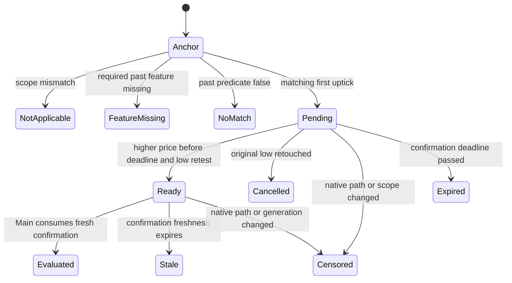

# Main 복수 기계정책 병행 운용·삼성 상승 눌림 최초 적용 계획

## 1. 목표·현재 상태·실행 경계

사용자 요청은 **여러 정책을 병행 운용할 수 있게 구현하고 새 삼성 연구 정책을 적용하는 데까지 계획을 수립**하는 것이다. 이 문서는 구현·검증·정식 발행·적용·운영 확인의 상세 계획이다. 이번 문서 작성은 코드 구현, 장후 실행, 정책 발행, 배포 또는 거래 프로세스 재기동을 실행하지 않는다.

목표는 하나의 Main 진입 판정 안에서 등록된 복수 분기를 평가하고, 하나 이상의 유효 분기가 통과하면 **하나의 ENTER_NOW와 하나의 실행 후보**를 만드는 것이다. 분기별 주문·자본 계정이나 별도 삼성 봇을 만들지 않는다. 실제 제출은 기존 보조 위험판정과 주문·가격·수량·자본·보유 소유권·운영자 veto·hard safety 경로를 따른다.

최초 적용은 기존 12셀 구조를 유지하면서 삼성 정규장 셀에 현재 분기와 새 상승 눌림 분기를 함께 지정한다. 비삼성 9셀과 삼성 프리·애프터는 현재 분기를 한 개짜리 목록으로 이관한다. 복수 분기 기능은 모든 셀이 사용할 수 있게 구현하되 이번에 새 패턴을 활성화하는 대상은 삼성의 검증한 관측 범위다.

근거: [후속 연구 계획](samsung-shallow-pullback-regime-and-confirmation-research-plan-2026-10-07.md), [연구 결과](../audits/samsung-shallow-pullback-regime-and-confirmation-research-2026-10-07.md), [현행 연속 반전 전환 계약](continuous-reversal-machine-policy-nextday-plan-2026-10-06.md), [현행 의미감시 보완 계획](semantic-monitor-current-producer-consumer-refresh-plan-2026-10-07.md).

## 2. 초기 적용 정책과 고정 근거

### 2.1 기존 정책을 시장별로 보존

계획 작성 시 읽은 [10/7 dated policy](../../data/runtime/mechanistic_entry_policy/policy_2026-10-07.json)의 삼성 셀은 아래와 같다. 이는 workspace의 정확일 정책 파일 확인이며 현재 PID 소비 증빙은 아니다. 구현 시작 때 selected release·native current·dated policy·실제 소비를 다시 대조한다.

| 셀 | 현재 규칙 | 최초 이관·적용 |
| --- | --- | --- |
| `samsung|PRE|ALL` | `DROP_GE_1_0` | 현재 규칙의 단일 분기 |
| `samsung|REGULAR|ALL` | `DD5_GE_1_2` | 현재 분기 + 신규 상승 눌림 분기 |
| `samsung|AFTER|ALL` | `DD5_GE_0_4` | 현재 규칙의 단일 분기 |
| 비삼성 시장×가격대 9셀 | 각 셀의 current payload | 동일 조건의 단일 분기 |

참조 bundle SHA: `bf15fc240560605b7fe08796941288d9ef28a5f7c8d2cbf47692787b894f4a98`, family SHA: `e8fe8172831970c399e799efc65ac4df991f0526467239f8b944577b409333ba`, source/publication `2026-10-06`, effective `2026-10-07`. 이후 다른 정책이 정식 적용됐다면 실제 incumbent을 이관하고 차이를 기록한다.

기존 정규장 규칙에 세션 DOWN 조건을 추가하지 않는다. 과거 승리 13건이 세션 DOWN이었다는 관측은 기존 규칙의 허용 범위를 제한하는 운영 계약이 아니다.

### 2.2 새 분기의 최초 지정

등록 ID 제안: `samsung_up_shallow_next_up_5_v1`. 등록 정의·수치·원천 범위는 최초 발행 전에 동결하고 해시를 남긴다.

| 조건 | 정의 |
| --- | --- |
| 종목·시장·관측 경로 | `005930`, `REGULAR`, `SOR`, exact item `005930_AL` |
| 직전 하락폭 | 첫 반전 전 하락 구간의 peak→low ≤0.4% |
| 세션 상승 | 당일 해당 item/정규 세션의 첫 정상 관측가격 대비 첫 반전 가격 ≥+0.4% |
| 최근 상승 | 첫 반전 시각 직전 60초 변화 ≥+0.2%, 정상 native 연속성 필요 |
| 저점 구조 | `[t−30,t]`의 저점이 `[t−60,t−30)` 저점보다 높음; 빈 구간은 UNKNOWN |
| 관측 낙폭 | 첫 상승 직전 최대 300초의 정상 관측 고점 대비 원 저점 낙폭 0.4~0.8%, 양 끝 포함 |
| 추가 확인 | 첫 반전 뒤 5초 이내에 첫 반전 가격보다 높은 정상 가격을 관측 |
| 무효화 | 확인 전에 가격 ≤원 저점, native 경로 단절, 날짜·item·시장 변경 또는 만료 |
| 진입 기준 | 추가 확인 틱의 정상 매도호가; 그 시점부터 30분 결과 계산 |

5분은 최대 lookback이다. 기존 연구/kernel처럼 완전한 5분 대기를 새로 요구하지 않는다. 세션 기준은 공식 시가가 아니다. SOR는 관측 경로이며 실제 체결 거래소를 SOR로 입증하지 않는다. KRX/NXT 단독 관측·프리·애프터에 신규 분기를 자동 확대하지 않는다. 해당 경로의 기존 분기는 계속 평가한다.

[고정 후보](../../tmp/samsung-shallow-regime-confirmation-20261007/preferred-research-candidate.json)는 과거 31/31·미확정 19, 오늘 09:55:48.565 동결 접두 3/3이다. 확인 시점 중복 제거 후 누적 32/32·미확정 18, 목표 접촉 시각 6개다. 오늘 3건은 같은 한 번의 목표 도달이다. 이 수치는 후보 근거이며 실주문·실현 수익이 아니다. DD5 <0.4%의 별도 연구 후보는 이번 초기 지정에 포함하지 않는다.

### 2.3 선택 기준과 초기 지정

Main 연속 반전에는 [오늘 체크리스트의 명시 override](../checklists/2026-10-07-stage2-todo-checklist.md)를 적용한다. 비용 0.23%, 진입 후 30분의 비용 후 +0.4%/soft −3% 선도달, `WIN / (WIN + FAIL_STOP + FAIL_TIMEOUT)`의 누적 원분수를 사용한다. UNRESOLVED는 분모에서 제외하되 이유·수량을 공개한다. 최소 표본/일수·holdout·EV·손익비·기존 성공 100%/80% 보존을 추가 채택 문턱으로 요구하지 않는다.

이는 기계 후보의 라벨·선택 계약이다. 현재 보유 청산·실제 손절·numeric entry price·수량·분할·scale-in 소유자의 값을 이 라벨로 변경하지 않는다.

계획 실행 승인 시 최초 조합은 **incumbent + 지정 신규 분기**다. 기존 13/13과 신규 32/32의 동률 또는 기존 무매칭 구간의 null 때문에 신규 분기를 버리는 전역 단일 winner 로직을 적용하지 않는다. 구현·원천·날짜·정책·소비 계약이 유효하면 정식 초기 지정으로 발행한다. 연구 JSON의 `runtime_effect=false`를 true로 바꾸는 방식은 금지한다.

이후 정기 선택은 8절의 같은 시계·중복 제거를 적용한 조합 비교로 수행한다. 기존 성공 보존은 탈락 조건이 아니며 현행 병행 조합이 항상 유지되는 성능 계약도 아니다.

## 3. 현 코드 결손과 변경 소유

현재 loader는 machine payload를 정확히 `{"rule": ...}`로 제한한다. 장후는 셀마다 13개 rule 중 한 개만 선택하며, auxiliary producer도 이 단일 rule로 모집단을 거른다. 런타임은 마지막 first-uptick 하나를 보관하고 원 시각에서 5초가 지난 snapshot을 반환하지 않는다. 새 확인 분기를 목록에 추가하는 것만으로 정상 소비할 수 없다.

| 소유 파일·패키지 | 보완할 계약 |
| --- | --- |
| [continuous_reversal.py](../../src/engine/scalping/continuous_reversal.py) | 공통 native 이벤트·일자/item 기준·확인 상태·신선한 확인 snapshot; 기존 first-uptick 의미 보존 |
| `src/engine/scalping/continuous_reversal_branches.py` 신규 제안 | 등록된 분기 정의·공통 과거 특징·상태 전이·동일 시점 병합. 위치는 기존 scalping kernel 옆의 live/offline 공통 순수 로직 소유 |
| [continuous_reversal_postclose.py](../../src/engine/scalping/continuous_reversal_postclose.py), [continuous_reversal_source.py](../../src/engine/scalping/continuous_reversal_source.py) | 확인 시점 event 재생, 분기·조합 후보, exact cache fingerprint, source/event/label 단일 발행 |
| [continuous_reversal_policy.py](../../src/engine/scalping/continuous_reversal_policy.py), [mechanistic_entry_runtime_policy.py](../../src/engine/scalping/mechanistic_entry_runtime_policy.py) | v1/v2 명시 dispatch·분기 payload·native publish/activate/CAS·코드/정책 해시 |
| [sniper_state_handlers.py](../../src/engine/sniper_state_handlers.py), [ai_engine_openai.py](../../src/engine/ai_engine_openai.py) | 확인 event wake·하나의 Main 평가·실제 요청 수명·원 시각/확인 시각 분리 |
| [reversal_auxiliary_contract.py](../../src/engine/scalping/reversal_auxiliary_contract.py), [ai_decision_trace.py](../../src/engine/scalping/ai_decision_trace.py) | FIRST_UPTICK/CONFIRMED_UPTICK 입력·응답/판정/소비·주문 연결; 원 응답 오용 방지 |
| [owner_custody_registry.py](../../src/trading/order/owner_custody_registry.py), [initial_quantity_bundle_state.py](../../src/engine/scalping/initial_quantity_bundle_state.py), [entry_attempt_identity.py](../../src/engine/monitoring/entry_attempt_identity.py) | Main 부모 진입·기존 분할 leg intent의 영속 연결과 판정/시도 계보를 구분. monitoring 모듈은 관측 전용이며 주문 잠금·idempotency owner로 사용하지 않음 |
| [submission_bottleneck_monitor.py](../../src/engine/monitoring/submission_bottleneck_monitor.py), [artifact_freshness.py](../../src/engine/error_detectors/artifact_freshness.py) | schema/version·분기별 상태·정책 목록 소비·신규 미관측과 source gap 구별 |
| [postclose_summary_handoff.py](../../src/engine/automation/postclose_summary_handoff.py), [main_ai_prompt_consumer.py](../../src/engine/scalping/main_ai_prompt_consumer.py), [verify_threshold_cycle_postclose_chain.py](../../src/engine/verify_threshold_cycle_postclose_chain.py) | 활성 목록·두 component·native generation·last consumer 직접 대조 |
| [next_preopen_readiness.py](../../src/engine/automation/next_preopen_readiness.py), [runtime_release_router.py](../../src/engine/infrastructure/runtime_release_router.py) 및 기존 deploy wrappers | 선택 release·exact effective date·다음 시작 준비·정책 소비·rollback 쌍 |

새 파일을 만들 때 repository 위치 gate를 다시 확인한다. engine root 새 모듈이나 중복 compatibility wrapper는 만들지 않는다. 기존 [test_continuous_reversal.py](../../src/tests/test_continuous_reversal.py) 등을 우선 확장한다. 분기 테스트를 분리하면 위치는 `src/tests/test_continuous_reversal_branches.py`다.

프로토콜 요청/parser/FID/REG/REMOVE/reconnect/auth/account/order 구현은 이번 기능의 변경 표면이 아니다. 구현 중 그 표면의 수정이 필요해지면 AGENTS의 Official Kiwoom Reference Gate에 따라 최신 upstream SHA·관련 문서/SDK·조회 시각을 먼저 검증·기록한다. 정상화된 기존 envelope 소비를 API 규격 변경으로 처리하지 않는다.

## 4. 복수 분기 정책 스키마와 초기 이관

### 4.1 v2 payload

schema 제안은 `continuous_reversal_policy_v2`, registry는 `continuous_reversal_branch_registry_v1`이다. 최종 버전은 구현 때 한 번 확정하고 writer/loader/감시기를 함께 변경한다. `machine_cells`는 기존 12 key를 유지한다.

```json
{
  "composition": "ANY_MATCH_ONE_INTENT",
  "branches": [
    {
      "branch_id": "incumbent_regular_v1",
      "kind": "legacy_rule",
      "rule": "DD5_GE_1_2",
      "decision_phase": "FIRST_UPTICK"
    },
    {
      "branch_id": "samsung_up_shallow_next_up_5_v1",
      "kind": "registered_pattern",
      "pattern": "samsung_up_shallow_next_up_5_v1",
      "decision_phase": "CONFIRMED_UPTICK"
    }
  ]
}
```

이는 설명용 payload이며 runtime policy 파일이 아니다. 수치·scope·필요 특징·확인/무효화 규칙은 동결 registry definition에 결속하고 definition SHA를 payload/발행 manifest에 저장한다. 등록 이름으로 실행 시점의 최신 정의를 찾아 의미를 바꾸지 않는다. duplicate ID·빈 배열·미등록 pattern/phase·NaN·날짜/item/scope conflict는 계약 오류다. 임의 Python 식을 실행하지 않는다.

family는 kernel/feature/branch registry/auxiliary phase contract의 version과 file/content SHA, source/publication/effective date, parent bundle, machine/auxiliary component를 결속한다. 보고서에는 분기별 선택 이유·원 후보 hash·초기 지정 receipt·active scope·통계와 조합 hash/metrics를 남긴다.

`auxiliary_cells`도 phase별 정책을 표현해야 한다. v2 payload는 `phase_policies` 안에 FIRST_UPTICK/CONFIRMED_UPTICK별 arm·input/prompt/schema/validator version과 hash를 둔다. 각 phase의 metrics·disposition·부모 증거는 보고서에 따로 기록한다. `assess()`·`compose()`·실제 요청·capture·감시기는 **선택된 primary branch의 phase**로 같은 항목을 읽는다. 모든 applicable branch phase에 정책이 있어야 발행할 수 있으며, CONFIRMED 항목이 없다고 FIRST 입력으로 내려가지 않는다. 단일 분기 셀은 필요한 FIRST 항목만 가진다.

### 4.2 v1/v2·코드 hash·rollback 정합성

- v1은 기존 발행 bytes/hash를 보존하고 역사·부모 검증에 사용한다. 논리 변환은 rule을 단일 branch로 옮기는 순수 adapter로 만들고 원 schema/hash를 덮어쓰지 않는다.
- 현재 validator는 kernel/version·현 코드 SHA 일치를 요구한다. 새 코드에서 v1을 읽을 수 있다는 사실만으로 기동 호환성이 입증되지는 않는다. 기존 발행 코드 증거와 새 adapter parity를 구분하고, **새 release 기동에는 새 계약에 결속된 native v2 bundle을 준비**한다.
- 초기 parent 검증에 필요한 v1 증거는 원 발행 snapshot/Git blob으로 생성 당시 코드를 검증한다. 옛 bytes를 새 코드가 발행했다고 처리하지 않는다. 증거를 해소하지 못하면 정확한 parent/source gap으로 남긴다.
- rollback은 검증한 구 code+구 policy+selector 조합, 또는 새 code에서 기존 분기만 활성화하는 native v2 rollback bundle이다. 구 policy만 복사하거나 kernel hash check를 완화하거나 current pointer를 손으로 편집하지 않는다.
- 단일 writer·parent CAS·atomic publish·readback으로 전환한다. 구 code가 v2를 소비하는 중간 상태를 만들지 않는다. 준비/기동 실패 시 정합한 기존 조합을 유지한다.

**발행과 활성화를 loader에서도 분리한다.** 현 `load_effective()`는 당일 `policy_<date>.json`의 continuous-reversal bundle을 `current.json`보다 먼저 반환한다. 따라서 current pointer를 보존하는 것만으로 장중 소비를 막을 수 없다. v2는 준비용 candidate load와 운영용 effective load를 구분하고, 운영은 정확한 target/generation·activation receipt·parent CAS·실행 release에 결속된 bundle만 반환하도록 한다. 준비/검증 조회는 activation을 만들지 않는다. 활성화가 없거나 충돌하면 새 v2를 소비하지 않고 검증된 기존 code+policy 조합을 유지한다. 미래 dated 생성, 당일 파일 교체, 날짜 전환, cache 유지/무효화 각각에서 승인된 활성화 이전 소비가 0인지 회귀로 확인한다.

### 4.3 시장별 상속

최초 이관은 PRE/AFTER의 현재 개별 winner를 그대로 단일 분기로 만든다. 이후 무표본 상속은 **대상 시장·지원 경로에서 applicable한 분기가 있는 정규장 부모**를 사용한다. 신규 삼성 분기는 REGULAR·SOR·005930_AL에서만 applicable이다.

현재 정규장 조합이 신규 전용 분기 하나만 포함하면 PRE/AFTER에 그대로 복사해도 실행 가능한 분기가 0개다. 이 경우 `regular_parent_has_no_applicable_branch`를 기록하고, 발행 manifest에 고정한 **대상 시장에 적용 가능한 마지막 검증된 정규장 부모 전체**를 승계한다. 기존 시장에서 가능한 경로를 누락시키지 않는 부모를 고른다. 현재 정규장 부모도 사용할 수 없고 검증 가능한 적용 가능 부모도 없으면 `applicable_regular_parent_missing`으로 발행을 멈추고 기존 정합한 bundle을 유지한다. 임의의 분기 조건·scope 확대나 성공률 합성을 하지 않는다.

상속은 선택한 부모의 전체 payload/hash를 보존하고 local_metrics=null을 남긴다. v1 부모라면 §4.2의 명시적 단일 분기 변환 receipt까지 결속한다. validator는 부모 definition·scope·phase·local null과 각 active 시장/지원 경로의 applicable coverage를 검사한다. 이 기준은 모든 틱에서 조건이 참이어야 한다는 뜻이 아니라 해당 scope에서 평가 가능한 분기가 있어야 한다는 뜻이다. 무표본을 승률 0이나 신규 분기의 실패로 바꾸지 않는다. 최초 PRE/AFTER 승자 보존과 이후 무표본 상속은 별도 회귀로 검증한다.

## 5. 공통 특징·확인 상태·Main 소비

### 5.1 특징의 시점과 원천

- 날짜/시장/venue/item별 첫 정상 관측가격을 WS state에 보존한다. 재기동에서는 같은 날의 증거 있는 checkpoint/기존 접두를 bounded하게 읽어 가격·시각·ID·hash를 복원한다. 확인할 수 없으면 신규 분기의 session anchor는 UNKNOWN이다. 재기동 후 가격을 당일 첫 가격으로 대입하지 않는다.
- 60초 변화와 두 30초 구간은 offline/runtime이 같은 순수 함수·정의를 소비한다. 첫 반전에서 동결하며 확인 대기 중 다른 과거 특징으로 바꾸지 않는다. native 단절 후 60초 연속 상태와 pending은 초기화한다. 세션 첫 가격과 native epoch를 혼동하지 않는다.
- DD5는 첫 상승 틱을 제외한 동일 날짜/item의 최대 300초 정상 관측 고점으로 기존 연구를 재현한다. 현재 offline/runtime의 시간 경계·native restart·결손 행 처리 차이는 접두 parity로 검사하고 source/feature 계약으로 수정·기록한다. 다른 시장/item이나 미래 가격은 쓰지 않는다.
- 같은 시각이어도 native sequence 순서로 first/confirm/retest를 구분한다. null/NaN·quote/source age·required feature 부족은 분기별로 남긴다. 빈 과거 구간을 FLAT으로 채우지 않는다.

### 5.2 pending 상태 전이



pending key는 family generation/cell/branch/symbol/market/venue/item/native epoch/anchor event ID다. 원 저점, first price/time, 동결 feature SHA, deadline, phase를 보관한다. 최대 5초의 관측 창에서 여러 anchor를 추적하며 새 anchor가 나왔다는 이유만으로 기존 pending을 덮어쓰지 않는다.

같은 확인 틱에 여러 anchor가 성립하면 하나의 ready signal로 합친다. 원 anchor ID 목록·가장 이른 anchor·분기별 근거를 유지한다. 저점 재접촉과 확인의 같은 시각 충돌은 native 순서로 먼저 발생한 것을 따른다. quiet tape의 만료를 API 장애로 바꾸지 않는다. 경로 단절과 정상 timeout은 별도 terminal reason이다.

ready snapshot은 확인 시각·확인 source ID를 기준으로 한다. 기존 first-turn의 5초 제한을 10초 등으로 늘리지 않는다. 확인 틱 자체와 현재 decision source가 기존 freshness guard를 통과해야 평가한다. 원 anchor는 과거 문맥 증거이며 현재 fresh quote로 위장하지 않는다.

첫 성립 확인의 시각·quote·source는 불변이다. 당시 매도호가가 결손이면 연구/장후 라벨은 UNRESOLVED로 남긴다. 나중에 수신한 호가를 그 확인 틱의 과거 호가로 채우지 않는다. 실행 시 현재 호가 재검증은 기존 가격/주문 소유자의 별도 fresh receipt로 남긴다.

확인 이후의 가격 변화를 원래 확인 이전으로 소급하지 않는다. 기존 FIRST 분기는 현행 다음 하락 시 `turn=None`·5초 freshness를 그대로 재현한다. 신규 CONFIRMED의 trigger 사실은 고정하되, 소비 전/보조 응답 후에는 현재 경로 연속성·세대·가격·quote·기존 제출 guard를 다시 검사한다. 확인 뒤 저점 재접촉을 별도 신규 전략 veto로 넣으려면 후보 정의와 재생을 함께 변경해야 한다. 단순한 queue 구현에서 그런 조건을 조용히 추가하지 않는다. 확인 후 단절/세대 변경/신선도 만료로 소비 불가가 되면 ready를 종료하고 원 trigger·연구 라벨과 미소비 이유를 각각 보존한다.

### 5.3 전달 누락과 부하

기존 `current_snapshot()`은 하나의 `state.turn`이 중간 하락에서 사라질 수 있다. 확인 event에 bounded ready queue와 Main evaluation wake를 추가한다. 알림 권한은 기존의 기계 평가 요청까지다. WS callback은 상태 갱신/메모리 통지만 수행한다.

Main wake가 선택한 signal과 `analyze_target()`이 평가하는 signal을 **같은 불변 snapshot/token**으로 고정한다. 현재 두 경로가 각각 `current_snapshot()`을 읽으므로 그 사이에 새 틱이 들어오면 다른 event를 소비할 수 있다. queue claim→평가→capture→실제 request까지 token·source/feature/phase hash를 전달하고, 두 번째 latest 조회로 바꾸지 않는다. 현재 quote의 후단 재검증은 별도 시각/receipt이며 동결 신호를 덮어쓰지 않는다. claim은 평가 완료 ACK와 다르고, 평가 전 실패는 기존 deadline 내에서 같은 token을 재시도하거나 명시 종료한다.

rolling monotonic queue와 등록 feature 공유를 사용한다. 전체 이력 재검색·대량 복사·파일 I/O·provider/REST/주문을 WS callback에 넣지 않는다. pending은 확인 창에서 종료하고 ready는 기존 freshness 상한·소비 상태로 제거한다. 자원 상한 도달은 observable overload로 기록하며 묵시적으로 버린 이벤트를 전수 관측으로 보고하지 않는다.

Main admission/warmup, source recovery, transport backoff, provider 간격, broker/quantity/custody/cooldown을 유지한다. 새 event는 기존 BLOCK/RECHECK의 기계 평가 대기를 기존 owner 안에서 wake할 수 있으나 hard guard나 transport retry backoff를 우회하지 않는다. 평가 요청·평가 완료·provider 요청·주문 intent를 구분하고 요청 ID를 먼저 저장한 것만으로 소비 완료 처리하지 않는다.

연구의 첫 가격 관측과 Main 감시 편입/준비 완료는 다른 시점이다. 고정 원천을 replay할 때 실제 확보된 admission·warmup·Main loop 시각도 대조하여 `triggered → eligible_for_main → claimed → evaluated → provider_requested` 수와 지연/차단 이유를 제시한다. 해당 운영 시각이 없으면 synthetic fixture 검증과 `delivery_not_observed`를 분리한다. 오늘의 3개 연구 승리를 Main이 실제 소비했다고 가정하지 않는다. 정확한 원천에서 신규 조건이 참이고 기존 guard가 통과하는 fixture가 실제 Main 경로에서 ENTER_NOW까지 도달하는 통합 회귀가 필요하다.

가격대가 바뀌는 일반 셀은 원 anchor cell과 확인 시점 cell을 대조한다. 다르면 `confirmation_cell_changed`로 기존 pending을 종료하며 다른 셀 payload를 원 특징에 후부착하지 않는다. 삼성 `ALL` 셀의 이번 확인에는 가격대 경계가 없다.

## 6. 분기 판정과 하나의 주문 후보

### 6.1 합성 규칙

| 상태 | 최종 기계판정 |
| --- | --- |
| 공통 policy/source/scope integrity 무효 | SOURCE_INVALID, 분기 명세 보존 |
| 유효하고 applicable한 분기 하나 이상 통과 | ENTER_NOW, matched branch 전체 기록 |
| 통과 없음·필수 특징 부족 또는 확인 대기 | RECHECK, 해당 branch·이유 기록 |
| 통과 없음·대상 분기 정상 평가에서 조건 미충족 | BLOCK |
| 새 분기가 시장/item 비대상 | applicable한 기존 분기로 판정 |

신규 분기의 추가 특징만 결손인 경우 기존 분기의 정상 통과까지 전체 SOURCE_INVALID로 만들지 않는다. 공통 quote/identity/provenance 무효는 다른 분기의 통과로 상쇄하지 않는다. timeout/censored/duplicate는 별도 기록하고 판정 코드를 주문·체결 실패로 합산하지 않는다.

### 6.2 중복과 경쟁

signal ID는 날짜/symbol/market/venue/item/native epoch/확인 sequence로 생성하며 policy generation과 별도로 둔다. generation이 바뀌어도 같은 source tick을 새 주문에 재사용하지 않는다. 동일 signal의 primary branch는 **raw 원분수 → 동률이면 발행 시 동결한 branch 순서**로 결정한다. 배열/스레드 순서나 반올림 표시값으로 결정하지 않는다. matched branch 목록은 모두 보존한다.

primary에 사용하는 분수는 발행된 누적 통계 또는 검증한 carry 부모의 원분수다. 새 일자 local_metrics가 null이면 부모 통계와 local null을 분리한다. 유효한 분수가 있는 matched 분기끼리 먼저 비교하고, 모두 없으면 동결 순서로 결정한다. null을 0으로 치환하지 않으며 순위 이유를 남긴다. 이 선택은 한 신호의 대표 귀속을 위한 것으로 통과한 다른 분기를 새 성능 문턱으로 탈락시키지 않는다.

같은 source signal은 논리적 Main 판정 하나·보조 요청 identity 하나·기존 부모 진입 계획 하나로 연결한다. `ONE_INTENT`는 분기별로 부모 진입을 늘리지 않는다는 뜻이다. 기존 분할 계획의 probe/잔여 leg와 그 leg별 `client_intent_id`·registry intent는 그대로 보존한다. 기존 transport retry가 허용된 경우 실제 호출 attempt는 같은 논리 요청에 연결하고 별도로 계수한다. 보조 VETO 뒤 같은 signal에서 대표 branch만 바꿔 다시 PASS를 구하지 않는다. 확인 시점이 달라도 기존 보유·미완료 BUY intent/주문·quantity/capital/custody/cooldown으로 동시 중복 신규 진입을 제어한다. branch마다 추가 수량을 계산하지 않는다. 매도 후 새 native event는 기존 규칙에서 다음 후보가 될 수 있다.

route 중복에서는 selected route·exact item을 따른다. SOR의 같은 사실을 KRX/NXT의 다른 분기로 두 번 주문하지 않는다. 비동기 provider 응답 후에도 signal/generation/current source/intent를 재검증한다. 만료된 pending이나 옛 generation을 새 가격으로 되살리지 않는다.

동시성은 signal 처리 claim과 제출 단계의 종목 BUY intent 예약을 각 소유 경계에서 원자적으로 수행해 제어한다. Main의 `_initial_quantity_leg_owner_context()`·`_initial_quantity_prepare_first_submit()`·`initial_quantity_bundle_state`와 `owner_custody_registry`가 가진 durable intent/주문 대사를 재사용한다. call-local `entry_attempt_identity`나 in-memory `last_requested_id`를 주문 중복 방지 증거로 삼지 않는다. signal↔논리 요청↔부모 계획↔leg intent 결속은 재기동 후 복원 가능해야 한다. 전송 직후 ACK/영속 기록 전에 중단된 경우는 ambiguous로 대사하고 무조건 재전송하지 않는다. 과거 접두 replay는 feature/session anchor 복원 전용이며 이미 지난 trigger를 ready로 다시 발행하지 않는다. 동일 transport epoch/sequence 충돌은 가격 유사성으로 합치지 않고 원천 충돌로 남긴다.

## 7. 보조판정 시점 계약과 증거 연결

이번 목적은 기계정책 추가다. 보조 모델/arm의 종류는 현재 registry의 5개로 유지한다. 다만 CONFIRMED 입력·문구는 배포 바이트가 달라지므로 [현행 계약 §6.3](continuous-reversal-machine-policy-nextday-plan-2026-10-06.md)에 따라 **새 최종 요청의 실제 응답 비교**를 구현·적용 절차에 포함한다. 구 arm 이름만 승계하고 그 입력의 과거 성과를 신규 phase의 근거로 쓰지 않는다. 이번 계획 리뷰에서는 provider를 호출하지 않는다.

운영 AI total/group quota=None을 유지하고 분기별 횟수 quota를 새로 만들지 않는다. provider 간격·외부 rate limit·timeout/retry·중복·원 응답 보존은 그대로 유지한다.

현 입력은 `FIRST_UPTICK`, `post_trigger_observations=NOT_YET_OBSERVABLE`로 고정되어 있다. 추가 확인을 본 뒤 같은 선언을 보내면 시점 계약 위반이므로 다음을 구현한다.

1. 기존 FIRST_UPTICK 분기의 prompt/input/schema bytes와 원 실적 증거를 보존한다. 조합/primary 변경으로 모집단이 달라지면 일치하는 원 응답만 재사용해 새 분모를 계산하며 옛 점수를 현 모집단 성과로 복사하지 않는다.
2. 신규 분기는 `CONFIRMED_UPTICK` 입력 version을 분리한다. 원 반전 시각/price/ID와 추가 확인 시각/price/ID, 확인 시각까지의 최근 관측·quote를 명시한다. 내부 문구·role·schema는 English ASCII다.
3. `first_price_uptick` 값을 추가 확인 값으로 무단 대체하지 않는다. 원 반전과 추가 확인 사실을 구분하며 필요한 새 canonical fact ID는 allowlist/schema에 정의한다. 미래 목표·label·연구 승률·후보 성공을 암시하는 이름은 모델에 보내지 않는다.
4. carrier/phase binding/prompt hash를 native family에 보존한다. 같은 arm 이름이어도 다른 phase/input/prompt/schema hash의 응답은 재사용하지 않는다. 기존 PASS가 새 확인에서도 PASS한 것으로 추정하지 않는다.
5. 기존 동결 접두의 unique 확인 50점을 입력 manifest로 삼는다. 원천이 유효한 점마다 현재 5개 arm의 최종 production input/prompt/schema를 만들고, byte가 같은 실제 요청·응답만 재사용한다. 전체가 유효하고 cache가 없다면 50×5=250개의 논리 요청 identity다. 이는 이 접두의 작업량이며 운영·장후 호출 quota가 아니다. 추가 source 날짜/수정된 바이트는 별도 세대로 계산하고 미처리 점을 횟수 때문에 버리지 않는다. provider 간격·timeout/retry와 응답/토큰 계수는 기존 계약을 따른다.
6. 결과가 미확정인 18점도 요청 시점 원천이 유효하면 입력/응답 계약 비교에 포함한다. 성과 분모에는 확정된 32점 중 **선택 조합의 실제 primary phase가 CONFIRMED인 점의 실제 PASS**만 넣는다. `WIN/PASS_resolved` 원분수와 현행 arm tie 순서로 비교하며, provider 오류·계약 무효·미호출을 VETO/패배/0%로 바꾸지 않는다. 완전한 5-arm 비교 모집단·arm별 관측 모집단·누락을 각각 공개한다. 기존 FIRST 응답과 새 CONFIRMED 응답은 phase·hash·모집단별로 분리한다. FIRST의 새 적격점에 정확한 cache가 없으면 그 점도 기존 장후 호출 경로로 계산한다. 250개는 CONFIRMED 동결 접두의 산정값이며 전체 후속 작업량 상한이 아니다.
7. 비교 가능한 PASS 분모가 셀 전체에 없으면 해당 phase를 지원하는 기존 arm의 **새 바이트와 실제 요청/응답 검증 증거**를 명시적 initial carry로 결속하고 local performance=null을 남긴다. 유효한 부모/입력 계약까지 없으면 정확한 결손으로 남긴다. 높은 승률을 얻을 때까지 문구를 반복 변경하지 않으며 EV/holdout/최소 표본·미래 새 날짜 대기를 최초 기계 지정의 추가 조건으로 만들지 않는다.
8. publisher의 machine dependency와 auxiliary `phase_policies`/선택·carry source를 정확히 결속한다. auxiliary producer가 단일 rule을 직접 읽는 부분도 보완한다. 동시 통과 시 선택되는 primary phase를 replay에서도 동일하게 결정하고, 구 phase 점수를 새 기계 모집단으로 복사하지 않는다. 이후 자연 발생 새 phase의 실제 요청/응답을 장후 소비한다.

새 consumption schema에는 family/branch definition/feature/phase/input/response schema hash, matched branch 전체·primary branch, anchor ID 목록·confirm ID·signal ID, source/publication/effective/as_of, PID/start ticks를 남긴다. 판정→실제 request→response→submit intent→broker order→fill/terminal→cost/PnL의 기존 연결에 추가하고 연구 재구성과 자연 운용을 구분한다.

## 8. 장후 생성과 지속 선택

### 8.1 모집단과 라벨

기존 normalized 전체 반전 원천에서 동일한 순수 branch engine으로 원 anchor→확인→signal을 재생한다. ENTER/BLOCK/RECHECK 로그로 모집단을 제한하지 않는다. 라벨은 실제 확인 ask와 새 30분 시계로 계산한다. 같은 item의 기존 완성 분봉 보완, dual-clock/both-barriers/boundary/source-gap의 엄격한 처리를 유지한다.

### 8.2 분모·비교·순위

- 원 anchor 통계, 확인 signal 통계, 미확인/만료/원 저점 재접촉, required feature 부족, UNRESOLVED 이유를 분리한다.
- 분기 성과와 **같은 확인 source tick을 한 번만 센 조합 성과**를 모두 보존한다. 다른 시각의 같은 상승 파동은 승률에서 임의 제거하지 않고 목표 접촉 시각 집중을 함께 공개한다.
- 조합 순위는 unique 확인 signal의 raw 원분수다. 분기별 승리 수를 단순 합산하지 않는다. 같은 signal의 entry price/label이 충돌하면 계약 결손으로 격리한다.
- 후보 manifest와 tie 순서를 먼저 고정한다. 최초 삼성 REGULAR catalog는 기존 rule 단독 13개, 신규 B 단독 1개, 각 기존 rule+B 13개인 27개 조합과 현행 조합이다. 현행 조합이 이미 있으면 중복 등록하지 않는다. 다른 11셀은 기존 13개 단독 후보와 현행 조합을 유지하며 B를 scope 밖에 등록하지 않는다. 새 분기를 등록할 때에는 해당 셀의 비교 조합도 명시적으로 갱신한다. 매일 임의 파라미터나 전체 powerset을 탐색하지 않는다.
- 모든 후보는 같은 동결 source 날짜·item/route universe·label/cost 정의를 사용한다. 공통 결손은 동일하게 제외하고 신규 특징 결손은 분기별 coverage로 공개한다. 분기마다 실제 신호 집합은 다를 수 있다. 양쪽이 모두 통과한 교집합만 남겨 조합의 분모를 축소하지 않는다. 신규 B 단독 등 scope가 좁은 조합은 §4.3의 셀별 applicable coverage도 만족해야 하며, scope 결손을 낮은 승률로 바꾸지 않는다.
- 최초 지정 이후 현행 조합보다 높은 raw 승률의 유효 조합을 선택한다. 동률은 **현행 조합 유지**다. 조건 수가 적은 단독 rule을 우선하여 새 분기를 바로 제거하지 않는다. 기존 성공 100%/80% 보존은 조건이 아니다.
- 새 분기/조합의 판정 가능 결과가 0이면 승률은 null이다. carry/source_blocked/valid-empty를 구분한다. 0WIN·양의 분모는 정상 측정값으로 순위에 포함한다.
- 현행 조합도 같은 동결 누적 원천으로 재계산한다. 현행만 null이고 유효 분모가 있는 후보가 있으면 기존 생성기의 유효 후보 순위를 따르되 `incumbent_not_comparable`을 남긴다. 이를 현행 대비 승률 개선이 입증됐다고 쓰거나 null을 0%로 만들지 않는다. 유효 후보 자체가 없으면 §4.3의 검증된 부모 승계를 따른다.
- 최초 발행 뒤에는 고정 후보를 자연 발생하는 새 source 날짜에서 비교한다. 미래 날짜의 독립 검증을 최초 지정의 추가 대기로 요구하지 않는다. 실제 주문 PnL과 반사실 raw 승률을 혼합하지 않는다.

### 8.3 cache와 원천 유지

manifest/cache key에는 native source/byte prefix, selected route/item/universe, anchor 정의, feature/kernel/branch 정의, 확인 규칙, price/quote, 완성 분봉 hash, cost/target/stop/horizon, source/publication/effective/parent와 phase를 포함한다. 기존 FIRST label/AI cache를 새 CONFIRMED로 전용하지 않는다.

이번 9월 이후 동결 source/event/분봉/후보/code hash/판정 명세는 [원천 삭제 계획](pre-september-source-data-permanent-deletion-plan-2026-10-07.md)의 6~8월 대상이 아니다. 정식 발행 때 실제 소비자가 읽는 최소 manifest/definition/report/source를 native 소유 디렉터리에 결속하고 tmp만이 유일한 실행 의존성이 되지 않게 한다. 무관한 6~8월 raw 복구·새 API 수집·대규모 백업을 요구하지 않는다.

## 9. 구현 단계와 종료 조건

| 단계 | 실행 작업 | 종료 조건 |
| --- | --- | --- |
| P0 기준 고정 | dirty workspace·selected/native incumbent·12셀·기존 발행 코드·연구 접두/정의/source 고정, native 거래일·Main intent 저장/대사 owner 확인 | parent hash/삼성 3셀/연구 원천 검증, 현재 실행 owner 하나 |
| P1 공통 분기 engine | registry/rolling feature/anchor/5초 pending/확인 event와 단일 v1 adapter | 기존 분기 parity·미래 정보 없음·epoch/item 격리·확인 가격/시각 재현 |
| P2 v2 발행·평가 | 목록/hash/ANY_MATCH·phase_policies·native validate·준비/활성화 분리·상속/rollback | 12셀 완전·단일 분기 등가·applicable 분기 없는 활성 셀 및 activation 전 새 v2 소비 0 |
| P3 Main 연결 | immutable ready claim/전달·영속 중복 제어·FIRST/CONFIRMED 보조 phase·capture | 한 signal당 논리 판정/request/부모 진입 하나, 기존 leg 보존·race/crash 회귀 PASS |
| P4 장후·감시 | 유한 catalog·확인 라벨·분기/조합 순위·phase별 실제 응답 비교 producer·summary/strict/last consumer | 분모 보존·원 응답 오용 0·활성 목록 발행→소비 완전 |
| P5 반복 리뷰·재현 | self review→보완→재리뷰→표적 회귀·native producer 연구 대조·Main 전달/부하 측정 | 미해결 범위 내 코드 결함 0·필수 회귀 PASS·정상 guard 포함 Main 평가 가능 |
| P6 최초 조합 발행·준비 | 실행 지시 범위에서 §7 고정점의 최종 보조 요청 실측·arm 확정, 기존+신규 지정·정확 effective target·summary/strict/controller/PREOPEN | 정규장 2분기·그 외 11셀·phase별 바이트/응답·rollback·설치 경로/hash PASS |
| P7 적용·자연 확인 | 대상 시작일 native CAS/loader·Main release 기동·자연 소비 receipt | 새 bundle/분기 목록을 실제 PID가 소비, 자연 판정/후단 결과 별도 보고 |

P5 동결 비교는 과거 8일 356,455개 기존 라벨 차이 0, 신규 후보 53 anchor-entry/50 unique 확인 signal, 34/34→32/32·UNRESOLVED 19→18을 재현한다. 차이가 있으면 원 행/경계/quote/cache를 특정해 수정하고 수정 결과를 공개한다. 기대한 100%를 지키려고 행을 제거하지 않는다. 오늘 완결 데이터와 09:55 접두가 다르면 새 일별 결과를 다른 세대로 저장한다.

## 10. 필수 회귀와 성능 확인

| 대상 | 필수 검증 |
| --- | --- |
| 단일 호환 | 기존 12셀/13rule, FIRST 입력, 비삼성, PRE/AFTER, 가격대, 동률 순위의 단일 분기 재현 |
| feature/source | 30초 경계·60초 접두 불변·session anchor 복원·빈 구간·5분 미만·무효 틱·epoch/sequence/item/day/scope 중복 |
| pending | 5초 경계/초과·확인 전 retest 취소와 확인 후 사실 보존·기존 FIRST 가격 하락 무효화·같은 시각 sequence·quiet timeout·단절·복수 anchor·재기동·가격대 변경 |
| 합성 | old 미충족/new 통과·역방향·둘 다 통과·신규 특징만 결손·공통 무효·비대상·primary 동률의 순서 불변 |
| Main 전달 | wake A 뒤 새 틱 B가 와도 A로 평가·claim/ACK/timeout·입장/warmup/provider guard 충족 fixture의 실제 Main ENTER·지연으로 미소비된 점 별도 집계 |
| signal/intent | 같은 confirm의 복수 분기/anchor·route 중복·동시 스레드·generation 변경·재기동/전송 후 미ACK·부모 중복 0/기존 leg 수 보존·늦은 provider·retry/backoff |
| 분모/장후 | 새 ask/30분 시작·동일 item 완성 분봉·dual-clock/both barrier·unique 조합·null/0WIN·성공 보존 gate 없음·cache 무효화 |
| 보조 phase | FIRST bytes parity·CONFIRMED 원 사실/확인 사실/as-of·미래 label 차단·phase별 arm resolver·기존 PASS 재사용 거부·실측 실패/부분 비교/null·원 응답 hash/버전별 분모 |
| 발행/감시 | v1/v2·구 kernel+새 policy와 역방향 거부·parent CAS·당일/미래 dated·날짜 전환/cache·activation 전 소비 거부·atomic read 경쟁·historical 분리 |
| 상속 | 신규 전용 REG 부모의 PRE/AFTER 상속 방지·지원 route별 applicable coverage·검증한 과거 REG 부모/phase 전체 승계·부모 결손 시 incumbent 유지 |
| 기동/퇴역 | exact-date ready와 PID 구분·옛 prepared 무효화·native target·Main singleton·위젯 퇴역/episode pin/custody/수동 veto 보존 |
| 부하 | 같은 동결 burst의 callback/lock 시간 p50/p95/p99·Main signal→평가 지연·queue 길이/expire/drop·CPU/메모리·HTTP/provider 횟수 비교 |

성능 합격은 기존 source/decision freshness 상한 안에 Main까지 전달되고 callback이 provider/파일 I/O에 막히지 않는 것이다. 유효기간 연장이나 provider 간격 축소로 부하를 해결하지 않는다. 단일 분기 fixture baseline과의 차이를 기록한다.

프로젝트 `.venv`에서 관련 pytest·Python compile·`git diff --check`를 수행한다. 기존 대상은 `test_continuous_reversal.py`, `test_reversal_auxiliary_contract.py`, `test_mechanistic_entry_runtime_policy.py`, `test_submission_bottleneck_monitor.py`, `test_error_detector_artifact_freshness.py`, `test_main_ai_prompt_consumer.py`, `test_postclose_summary_handoff.py`, `test_verify_threshold_cycle_postclose_chain.py`, `test_next_preopen_readiness.py`와 변경한 Main wake/provider fixture다. wrapper 변경 시 bash -n·`test_threshold_cycle_wrappers.py`를 추가한다. 퇴역 관련 authority 차이가 있을 때 해당 표적을 추가하며 무관한 전체 suite를 반복하지 않는다. 실제 provider/브로커 주문 없는 fixture로 code gate를 닫는다.

## 11. 적용·기동·rollback 최종 절차

1. P5 후 검토한 코드·native v2 초기 조합·source/report/phase 정의·차이 목록·rollback 조합을 검토 가능한 상태로 준비한다. 실행 지시가 없는 동안은 계획 상태다. P6의 보조 최종 바이트 실측은 코드 gate 종료 후 수행하고 실제 결과로 phase별 선택/승계를 봉인한다. 요청 바이트가 다시 바뀌면 해당 identity의 비교도 갱신한다.
2. source/publication 날짜를 구분하고 `mechanistic_entry_runtime_policy.next_target(publication_date)`가 해석한 **다음 실제 거래일**을 effective로 삼는다. 토·일·휴일을 단순 날짜 가산으로 처리하지 않고 지난 10/7 PREOPEN에 소급 발행하지 않는다.
3. 승인된 실행에서 immutable release를 구성하고 native publisher로 machine/auxiliary phase·bundle 새 세대를 **준비용 경로**에 발행한다. 구 loader가 우선 읽는 dated 파일을 activation 없이 교체하지 않는다. current를 보존한 상태에서도 실제 effective resolver가 신규 세대를 반환하지 않는지 확인한다. 설치 router/systemd/cron의 소비 계약과 새 코드+정책의 전환 단위를 고정한다.
4. 영향받는 native 기계·보조·summary/last consumer·strict/controller/finalization·exact-date PREOPEN을 같은 세대로 닫는다. 준비 검증 consumer는 명시적 candidate loader로 target/hash를 확인하고 `prepared`로 기록하며 runtime `effective`/PID 소비와 혼동하지 않는다. EOD나 무관한 family를 재생하지 않는다. code/dependency가 바뀐 prepared를 옛 PASS로 이용하지 않는다.
5. 대상일 정상 PREOPEN에서 parent CAS/activate receipt를 원자적으로 결속하고 Main을 지정 code+policy로 기동한다. 부모/target/release/hash 충돌 시 신규 조합을 읽지 않으며 중간 실패는 준비한 정합 code+policy 쌍으로 rollback한다. 정지 상태는 ready를 검증하고 기동 이후 PID를 별도 확인한다. 운영 중 변경을 별도로 지시하면 fresh custody/open orders/current generation의 native intraday handoff·기존 restart 절차를 사용하며 과거 PREOPEN을 재작성하지 않는다.
6. PID/start ticks/release/target/bundle/component/branch 목록/phase를 검증한다. 기존 삼성 3시장 규칙·새 삼성 scope·삼성 정규장 외 11셀의 차이와 owner/quantity/capital/hard guard를 점검한다. unit 설정을 PID 소비로 대입하지 않는다.
7. 자연 발생에서 기존·신규 분기의 matched/condition_missing/pending/confirmed/expired, Main 평가, 실제 보조 요청, submit/terminal/cost를 분리한다. 신규 신호 미발생은 `not_observed`이며 코드/준비 PASS에서 주문 성공을 만들지 않는다.
8. source/provenance 파손·이중 intent·guard 우회·잘못된 시장/옛 generation 소비·freshness 파손은 기존 hard failure owner로 넘기고 정합한 rollback 조합을 사용한다. 신규 분기만의 결손은 분기 상태로 격리하며 유효한 기존 분기를 영구 정지시키지 않는다. 분기만 중지하는 경우도 native 새 세대 발행·감사로 수행하고 수동 편집하지 않는다.

완료를 **구현 완료=P5**, **적용 준비=P6 exact-date prepared**, **실제 적용=P7 PID 목록 소비**로 나눈다. 신규 분기 자연 판정/주문/체결/손익은 별도 수용 항목이다. 수익 발생을 정상 기동의 조건으로 요구하지 않는다.

## 12. 실행 owner와 문서 리뷰

통합 실행은 [당일 체크리스트](../checklists/2026-10-07-stage2-todo-checklist.md)의 `DirectFamilySourceRepairMainMechanisticEntry`, 의미감시 연결은 `SemanticMonitorProducerConsumerRefresh1007`에 인계한다. 이 계획을 기존 완료 리뷰의 재실행 명령이나 새 cron으로 취급하지 않는다. 구현 지시 때 당시의 parsed OPEN owner를 확인하고 해당 stable ID의 Acceptance/예정 Slot/TimeWindow를 보완해 실행 owner 하나를 유지한다. 오늘 예약 소비 이력은 보존한다.

이번에는 이 proposal을 리뷰·보완하며 봉인된 checklist/Plan Rebase/README/runbook/prompt/AGENTS를 변경하지 않는다. 구현으로 automation 계약이 바뀌는 단계에는 소유 운영문서·checklist를 같은 change set에서 정합화하고 parser와 native generation을 다시 봉인한다. 보조 phase 변경은 새 계약 범위로 해당 실행 owner의 Acceptance에 연결하며 완료된 과거 보조 리뷰를 현재 실행 owner로 취급하지 않는다.

`korstockscan-review-gate`에 따라 문서의 producer/consumer·scope·권한·hash·상속·기한·중복·rollback을 리뷰→수정보완→재리뷰한다. 링크·print-only parser·diff/신규 파일 공백 검사를 수행한다. 계획 단계에는 trading suite·provider/API·정책 재생성·PID 검사를 추가하지 않는다.

초기 작성 때의 링크/parser PASS는 당시 문서의 구조 검증이다. 이번 리뷰에서는 현재 runtime·publisher·장후·보조 계약을 다시 대조해 아래 설계 결손을 추가로 발견했다. 아래 항목의 문서 보완과 구현 회귀를 구분하며 문서 보완을 코드 결함 해소로 보고하지 않는다.

## 13. 10/7 추가 리뷰와 보완 사항

| ID | 지적과 코드/계약 근거 | 계획 보완·구현 시 종료 검사 |
| --- | --- | --- |
| R1 | `machine_report()`의 무표본 부모 복사는 신규 REG-only 단독 winner의 적용 가능성을 보장하지 않음 | §4.3·§8: 대상 scope에 applicable 부모를 고정. PRE/AFTER/지원 route 빈 활성 셀 0 |
| R2 | `load_effective()`는 current보다 당일 continuous-reversal dated bundle을 먼저 반환 | §4.2·§11: candidate/effective 분리·activation receipt·CAS·cache. 준비만으로 새 정책 소비 0 |
| R3 | Main wake와 `analyze_target()`에서 `current_snapshot()`을 각각 읽어 서로 다른 틱을 소비할 수 있음 | §5.3: immutable claim 전달. wake A와 evaluation/request A 일치·claim을 소비 ACK로 오인하지 않음 |
| R4 | monitoring identity는 실행 잠금이 아니며 Main은 부모 계획 아래 여러 leg intent를 소유 | §6.2: durable 부모/leg 결속·원자적 중복 제어·ambiguous 대사. 재기동 중복 부모 0·기존 분할 보존 |
| R5 | 새 보조 문구를 실측 없이 initial carry하는 초안은 현행 §6.3의 최종 요청 실제 비교와 충돌 | §7·P6: 동결 확인점×기존 5 arm의 새 요청 비교·정확 cache. 옛 응답/점수 전용 0 |
| R6 | `assess()`의 단일 `payload.arm`으로 FIRST/CONFIRMED별 계약과 점수를 표현할 수 없음 | §4.1·§7: phase_policies와 primary-phase resolver·발행 coverage. 잘못된 phase fallback 0 |
| R7 | 현재 FIRST는 가격 하락 시 turn을 지우며 연구 확인 틱과 Main 입장/warmup 시점은 다름 | §5.2–§5.3: 기존 의미 보존·확인 사실과 제출 당시 guard 분리·실제 전달 회귀. 연구 승리를 실진입으로 표기하지 않음 |
| R8 | 매일 비교할 복수 조합 목록·분모가 추상적이면 단독 winner로 회귀하거나 무제한 조합 탐색 가능 | §8: 삼성 27개 명시 조합+현행·같은 원천/라벨·unique signal raw 분수·동률 현행. 성공 보존율 gate 0 |

재리뷰에서 부모 진입과 분할 leg의 차이, null의 순위 처리, 조합 변경 후 보조 primary 모집단, 준비 consumer와 runtime effective loader의 분리까지 보완했다. 문서 범위의 미해결 지적은 없다. 상대 링크 30개·JSON 예시 1개·현재 OPEN owner 두 ID의 각 1건·print-only backlog parser·신규 파일 공백/충돌 표식·`git diff --check` 검증 PASS다. parser 출력은 `/tmp/korstockscan-multi-policy-plan-review-20261007-backlog.txt`이며 외부 sync는 실행하지 않았다. 구현·최종 보조 요청 실측·정책 발행·배포·PID 소비는 아직 실행하지 않았다. Python/매매 회귀는 문서 변경에 해당하지 않아 실행하지 않았고 위 표의 코드 종료 검사는 구현 단계에 남아 있다.
