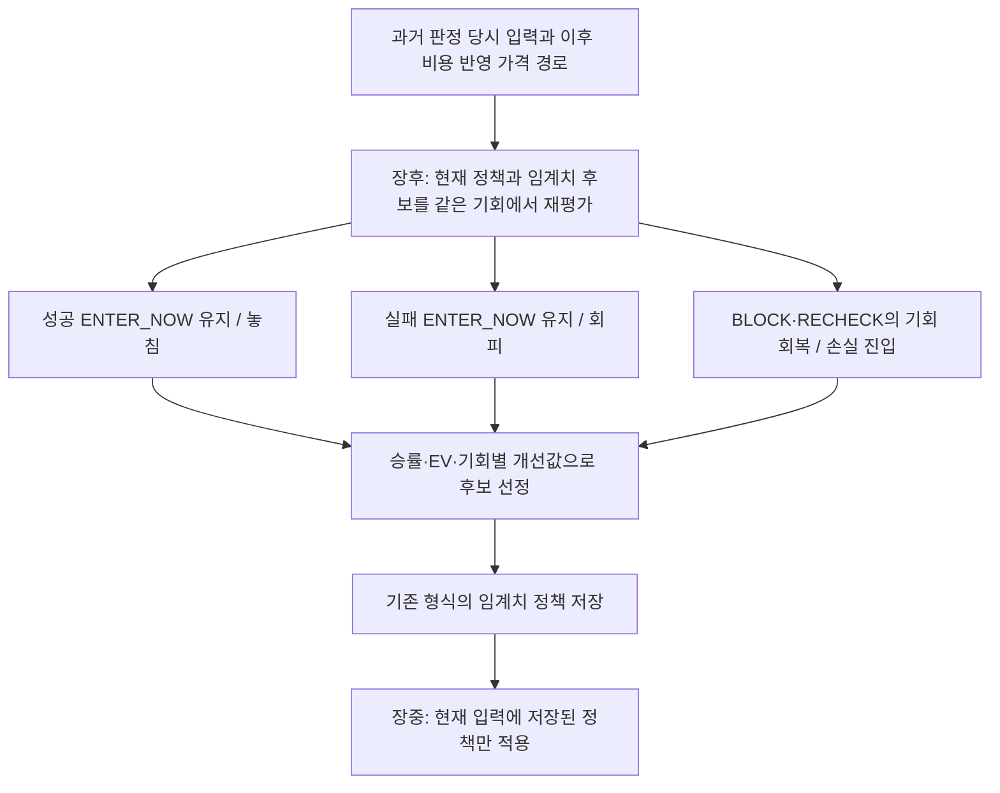

# 메인 BLOCK/RECHECK 전환 임계치 학습·장중 적용 보완계획

작성: 2026-09-21 KST / 전면 보완: 2026-09-22 KST
상태: **기존 M1–M6 완료. 성공 ENTER_NOW 참조 평가 보완은 §9의 v4 구현·비교·커밋/푸시·배포·정책 발행·번들 PID 소비 완료. 갱신 KRX 분기의 자연 사용은 다음 정규장 확인 대상.** 기존 완료 근거: 2026-09-22 09:40 KST 독립 계산·세 구간 발행·KRX 자연 PID 소비·승계·장후 연결 검증.
실행 owner: [9/22 체크리스트](../checklists/2026-09-22-stage2-todo-checklist.md)의 `DirectFamilySourceRepairMainMechanisticEntry`.
연결 계획: [장후 실행기 분리](machine-postclose-runner-separation-implementation-plan-2026-09-22.md), [보조 AI 양방향 튜닝](auxiliary-ai-opportunity-error-tuning-runtime-implementation-plan-2026-09-22.md).

## 1. 목적·기존 완료와 보완 범위

현재 부모 정책으로 재평가한 BLOCK/RECHECK의 ENTER_NOW 전환 기회비용을 학습한다. 9/22 소표본 과대평가 보완에 따라 **표본 보정 승률 점수 → 평균 비용 반영 이익 → 기회비용 회복값 → 유일 기회 수 → 적은 분기·변경 수**로 선정한다. 원 승률은 별도 보존한다. 평균이익 음수도 선정·적용하며 절대 손익0, 승률60%, 최소10bp, 5일/5종목을 갱신 문턱으로 추가하지 않는다. 보조 AI 응답·실체결·포트폴리오·scale-in·청산 재생은 선행조건이 아니다.

표본 보정은 Wilson 형태의 하한 계산(z=1.6448536269514722)에 기존 기회별 동일 가중 승률과 선택된 고유 기회 수를 넣는다. 이는 상관된 기회·기회 내부 승리 비율에 적용한 순위 보정이며 실제 승률 예측이나 통계적 우월성의 보증이 아니다. 반복 attempt 수는 n을 늘리지 않는다. 예:1/1→26.99점,3/5→27.25점,6/10→35.16점,12/20→41.86점. 새 최소 표본 승격 장벽은 추가하지 않는다. 선정 버전 `support_adjusted_win_rate_preserve_entries_v3`를 checkpoint input hash와 frozen 후보 재사용에 결속하고 단일 scope 및 scope 간 선택이 같은 계산을 사용한다.

9/21 source의 기존 결과는 정책 생성·발행·로더·장후 종료가 검증된 상태이며, 최적 조합 탐색 완료를 뜻하지 않는다. 기존 변경·배포 근거는 [복구 리뷰](../audit-reports/2026-09-21-postclose-source-order-repair-review.md)에 보존한다. 이 문서는 과거 계획의 구현 완료 표현과 충돌하는 경우 현재 보완 계약을 소유한다.

완료 범위는 **결함 수정 → 코드 리뷰·검증 → 고정 원천으로 계산 → 정책 선정 → 배포 → 장중 원자적 적용 → 실제 PID 소비 → 다음 정책까지 승계 → 장후 자동 재실행 연결**이다. 계획 수립 자체는 해당 런타임 작업을 실행하지 않는다.

## 2. 확인된 결함과 수정 위치

| 결함·제약 | 현재 증거 | 보완 위치·완료 기준 |
| --- | --- | --- |
| 단일좌표 후보가 전체 예산 소진 | registry82개, KRX 미지원15개, 단일 변경 초기134개, 예산96개. 실제48좌표·동시 변경1개·selector 없음 | `entry_strategy_policy.joint_candidates`, `build_main_strategy_refinement`: 예산 내 탐색군별 최소 배정 보장 |
| 선정 후보가 있으면 미완료 탐색 조기 반환 | 동일 input hash + candidate이면 previous 반환; 입력 변경 시 cursor0 | train 탐색 checkpoint와 최종 holdout 소비를 분리하고 상태·재개 key 명시 |
| 유형별 정책이 실제로 만들어지지 않음 | 최신 후보 nodes1 | root와 selector+leaf를 함께 탐색; 다축·분기 후보의 실제 평가 영수증 필수 |
| 시가총액 producer 부재 | `strategy_metadata.market_cap` reader만 존재 | 기존 종목 master → 당시 유효 metadata → capture → replay → live selector 연결 |
| 일부 자료 누락이 전체 좌표 동결 | train+holdout 중 하나라도 결손이면 해당 좌표 고정 | train만으로 지원 cohort 구성, 결손 row는 parent fallback, 평가 분모 보존 |
| 부적격 scope가 다른 후보 적용을 막음 | `select_report_candidate`가 순위를 먼저 매긴 뒤 activation에서 promotion 검사 | 부모·scope·증거 유효성 검증 후 적격 후보만 순위 선정 |
| 한 scope만 갱신 | 전체 후보 중 하나만 활성화 | scope별 독립 선정 결과를 한 generation에 합성; 각 scope CAS·비교 분모 독립 |
| 기존 ENTER_NOW 영향이 점수 밖 | nonentry만 점수화 | 기존 ENTER_NOW 전이 수·새 차단 이유 별도 보고. 축소를 개선 점수에 넣지 않음 |

주요 owner: [registry/selector](../../src/engine/scalping/entry_strategy_policy.py), [학습](../../src/engine/scalping/ai_action_outcome_calibration.py), [공유 판정](../../src/engine/scalping/entry_setup_evidence.py), [발행/활성화](../../src/engine/scalping/mechanistic_entry_runtime_policy.py), [장중 resolver](../../src/engine/scalping/entry_setup_live_policy.py).

## 3. 모집단·기회비용·입력 계약

- clean baseline 이후의 실제 main 판정 당시 raw와 exact venue/session/attempt/promotion/time을 사용한다. widget/episode/manual과 보유·추가매수는 제외한다. 사후 선정 종목만 남기지 않는다.
- 현재 부모 정책으로 모든 지원 attempt를 다시 판정한다. BLOCK/RECHECK만 기계 기회비용 점수의 분모이며 기존 ENTER_NOW 변화는 별도 diagnostic이다.
- 기회 key는 date/symbol/promotion, promotion 부재 시 attempt ID fallback이다. 지표·train/holdout·해시 생성이 같은 identity helper를 쓴다. 현재 identity 함수 간 fallback 차이를 해소한다.
- 기존 `entry_quality_path_v1`의 기준가격·비용·목표/손실 경계를 재사용한다. 목표는 비용+순이익0.10%이고, 목표 우선이면 해당 순 경로 값, 손실 우선이면 손실 거리−왕복 비용이다. 라벨 경계는 이번 optimizer가 바꾸지 않는다.
- 같은 봉 양쪽 도달, 원천/비용 결손, 미도달·미완결은 별도 제외한다. 승률 분모에 넣거나 이익0으로 바꾸지 않는다. 원본 보존·제외 이유·coverage를 기록한다.
- 반복 attempt는 기회별 동일 가중치로 계산한다. 기존 승률은 기회 내부 선택 attempt의 승리 비율을 기회 간 평균한 값이다. `episode_positive_mean_rate`를 보조 진단으로 추가하되 주 지표 정의를 조용히 바꾸지 않는다.
- 평가 원천의 비용 반영 가격경로와 실제 체결손익을 구분한다. 후단 가드 통과나 주문 발생을 기계단계 이익으로 주장하지 않는다.

## 4. 제한 예산 안의 조합 탐색

기본 계산 예산96회는 유지하되 **incumbent/control 포함 총량**으로 정의한다. 초기 배정은 control4 / 단일좌표20 / 2~3축 결합24 / selector+leaf32 / 넓은 결합16이다. 비어 있는 탐색군의 예산은 다른 지원 군으로 재배정하고 사유를 기록한다. 유효 후보가 없어도 한 군의 입력 오류가 나머지 탐색을 취소하지 않는다.

1. 82개 registry에 역할·단위·원천·소비 함수·허용 범위·미지원 사유를 부여한다. strategy 조건과 source/주문 hard safety를 구별한다. 미지원 좌표를 과거 기본값으로 덮지 않고 부모 값을 보존한다.
2. 단일좌표 순서를 알파벳으로 고정하지 않는다. 이전 train의 미탐색 좌표·판정 blocker·유효 원천 coverage를 사용해 순환 배정한다. holdout 결과는 순서·경계·종목 선정에 사용하지 않는다.
3. 2~3축군은 실제 blocker와 관련한 구조/거래량/호가/트리거 조합을 포함한다. 넓은 결합군은 모든 지원 좌표가 참여할 수 있는 결정적 순열을 유지한다.
4. selector 경계는 train 시점 가격·tick 비율·유동성·변동성·watch age·시가총액의 분포에서 고른다. 분류만 바꾸는 후보와 분류+양쪽 leaf 좌표를 함께 바꾸는 후보를 모두 넣는다. 우선 한 단계 분기부터 구현하며 registry에 없는 분류를 임의 추가하지 않는다.
5. parent가 이미 tree이면 초기 후보는 그 tree를 보존한다. leaf 수정과 새로운 상위 분기 추가를 서로 다른 후보로 평가한다. 상위 분기의 unknown 경로에도 기존 tree를 보존하며, 63-node 예산을 넘는 분기는 leaf 탐색으로 재배정한다. root만 고쳐 leaf에는 효과가 없는 후보를 hash 중복 제거와 실제 선택 profile 비교로 제거한다.
6. 자료가 부족한 row는 parent profile로 평가한다. 같은 candidate 내 지원 row만 child를 적용한다. 전체 분모와 unknown fallback을 보존하여 좋은 종목만 제외·선별한 점수 상승을 막는다.
7. 각 군의 attempted/invalid/evaluated/deduplicated 수, 지원 좌표 coverage, 동시 변경 수, selector/leaf 수, fallback 수, 예산 소진 사유를 보고한다. 제한된 탐색을 전역 최적이라고 부르지 않는다.

예산을 늘리기 전에 위 배정이 실제로 수행됐는지 확인한다. 가격대나 시가총액의 모든 조합을 무제한 Cartesian product로 펼치지 않는다. 종목 축소가 필요하면 이미 확보된 원천·기존 완료 추천·이전 train 성과 순으로 정하고 frozen 선정 manifest에 이유와 제외·이월을 기록한다. main의 원래 판정 모집단 기록은 삭제하지 않는다.

## 5. 재개·선정·유형 입력

- checkpoint key: parent machine hash / train raw generation / source contract / kernel / domain / selector / budget version / cohort. cursor·visited hashes·각 군 진척·best train candidate를 저장한다.
- `searching_train`, `budget_exhausted`, `selection_frozen`, `holdout_evaluated`, `published`를 분리한다. 미완료 train은 이어서 실행하며 best candidate가 있다는 이유로 반환하지 않는다. 도메인이 바뀌면 새 탐색으로 기록한다.
- holdout은 학습 예산 종료 후 선택한 후보에 한 번만 쓴다. 이미 holdout까지 확인한 회차는 재실행으로 선택을 바꾸지 않는다. 추가 탐색은 새로운 학습/검증 경계로 실행하고 과거 holdout을 재사용해 독립 검증이라고 주장하지 않는다. 자료가 한 날짜뿐이면 holdout 없음으로 명시하되 기계정책 자체를 차단하지 않는다.
- scope별 적격성 검사 → train 순위 → 동률에서 부모에 가까운 단순 정책 → scope 합성을 수행한다. 평균이익 음수도 허용한다. 동일 정책이면 포인터를 불필요하게 갱신하지 않는다.
- 현재 부모의 ENTER_NOW를 그대로 반환하는 후보는 신규 회복0으로 기록한다. 유효한 새로운 전환 후보가 없으면 부모를 유지한다. 손실인 새 후보를 손익0의 미노출 control 때문에 제외하지 않는다.
- 시가총액은 기존 `get_basic_info_ka10001` 수집의 `mac`을 공식 단위(억원)에서 KRW로 바꾼 별도 `StrategyMetadata` snapshot으로 묶는다. 기존 `Marcap` 열은 단위·관측시각 이력이 없어 selector 원천으로 사용하지 않는다. 값·KRW 단위·known_at·effective_at·source hash·동일 응답 기준(가격/주식수 혼합 없음)을 보존한다. 당시 기록이 없으면 unknown으로 두며 최신 시총을 과거에 소급하지 않는다. API 추가가 필요할 때만 공식 Kiwoom reference gate를 별도로 수행한다.
- 완성봉 `strategy_completed_bars`, trusted tape, micro window의 capture 경로도 함께 검사한다. 원본 redaction 결손은 복원했다고 주장하지 않고 이후 신규 source 지원 여부를 확인한다.

## 6. 장중 적용·버전 승계

1. 구현·리뷰·선별 테스트 후 immutable release를 준비한다. 실행 직전 현재 PID/cwd, 현재 machine/AI component hash, 활성 scope, 운영 override를 읽어 적용 전 영수증을 남긴다. 01시의 PID/정책 상태를 장중 상태로 재사용하지 않는다.
2. 고정 원천의 machine-only 계산을 실행하고 후보·coverage·지표·차이를 저장한다. 후보가 없으면 현재 정책 유지와 구체적인 blocker를 보고한다.
3. 기존 publisher lock 아래 최신 bundle을 다시 읽고 **machine component parent CAS**를 검증한다. 적격 scope만 교체하고 현재 AI component를 그대로 합성한다. AI만 병행 갱신됐다면 최신 AI를 보존할 수 있고, machine parent가 달라졌다면 재평가한다.
4. 새 immutable generation을 기록·검증한 뒤 current pointer를 atomic replace한다. source date / publication timestamp / effective_from을 따로 저장한다. 과거 발행일을 장중 시각으로 위장하거나 다음 PREOPEN까지 적용을 미루지 않는다.
5. 각 판정 attempt 시작 시 machine+AI generation을 한 번 pin한다. 다음 attempt부터 새 정책을 읽고, 진행 중 AI 응답은 기존 pair에만 연결한다. 제출 직전 generation/유효시간이 달라졌다면 기존 신규진입 재평가 경로로 돌린다. 오래된 응답을 새 임계치 결과에 붙이지 않는다.
6. 코드 갱신으로 프로세스 교체가 필요하면 기존 guarded restart/보유 custody 절차로 수행한다. 정책값만 바뀌고 live loader가 지원하면 재기동 없이 반영한다. 기존 주문/보유 상태는 유지하며 확인용 주문을 보내지 않는다.
7. receipt에 PID/start time/release/machine hash/AI hash/selector leaf/effective thresholds/attempt를 남긴다. 실제 자연 판정에서 소비를 확인하고, 관측이 아직 없으면 `published_awaiting_natural_attempt`로 남긴다. 파일 존재만으로 PID 적용 완료 처리하지 않는다.
8. 다음 적격 정책 또는 명시 rollback까지 지속 승계한다. 날짜 변경·주말·후속 AI 실패·장후 보고서 지연은 기본값 회귀 사유가 아니다. rollback도 해당 machine component만 복구하며 최신 AI를 보존한다.

## 7. 구현 순서·검증·완료 기준

| 단계 | 변경 | 검증·종료 조건 |
| --- | --- | --- |
| M1 | registry 소비 전수 점검, identity 통일, 탐색군 배분 | 실제82좌표 fixture/예산96에서 단일·2축·3축·selector 평가 및 미탐색 이유 확인 |
| M2 | train checkpoint/최종 freeze 분리, parent tree 보존 | 중단 재개·후보 존재 재개·중복 제거·기존 leaf 효과·holdout 재선정 금지 |
| M3 | 시총·완성봉·tape 생산/소비와 row별 fallback | 당시 유효성·미래 metadata 거절·누락 row가 다른 row 학습을 막지 않음 |
| M4 | 적격 후보 우선·scope별 합성 | 고득점 부적격+저득점 적격, 여러 scope, 동률·모두 음수·무후보 |
| M5 | 장중 component CAS·attempt pin·승계 | machine/AI 동시 갱신, 오래된 응답, 자정·재시작·부분 실패·rollback |
| M6 | 실제 source 재계산·배포·장중 적용·장후 연결 | 후보 manifest, 적용 전후 영수증, 실제 PID 소비, 독립 stage terminal |

재사용 테스트: `test_entry_strategy_policy.py`, `test_mechanistic_entry_runtime_policy.py`, 기존 live resolver/AI engine/submit handoff tests. 신규 대형 테스트 파일 대신 기존 owner에 실제82좌표 회귀를 추가한다. Python compile·대상 pytest·diff 및 문서 parser를 실행한다.

승률 개선·ENTER_NOW 증가를 실제 수익 개선으로 보고하지 않는다. 기계판정 완료는 AI 튜닝·hard guard 튜닝·scale-in·청산 완료와 별개이다.

## 8. 구현·운영 명령과 검증

구현·리뷰 근거: [9/22 기계정책 보완 리뷰](../audit-reports/2026-09-22-main-machine-policy-repair-review.md).

- 독립 생성: `PYTHONPATH=. .venv/bin/python -m src.engine.scalping.ai_action_outcome_calibration --target-date YYYY-MM-DD --machine-policy-only --write --activate-now`.
- 이미 본 검증 날짜를 학습으로 편입하는 새 회차는 `--training-through-date YYYY-MM-DD`를 명시한다. 이후 날짜만 holdout이며, 이후 원천이 아직 없으면 holdout 없음으로 기록한다. 새 독립 검증 성공으로 표현하지 않는다.
- `--search-limit`은 이번 호출의 처리량이다. 총96회 탐색 중 남은 부분을 `machine_train_checkpoint_DATE_SCOPE.json`에서 이어서 처리하며, 진행 중에는 선정·holdout·발행을 하지 않는다.
- 결과는 `machine_policy_DATE.json`, 독립 종료 영수증은 `machine_policy_terminal_DATE.json`이다. `selections` 안의 `search_domain`, `train_checkpoint.group_counts`, 원천 제외와 비용 반영 경로 지표를 함께 확인한다.
- 정규 `run_threshold_cycle_postclose.sh` 및 기존 수동 paired wrapper에서 이 독립 stage를 먼저 실행한다. legacy 전체 보고서는 기존 소유를 유지하되 별도의 `--activate-now`로 새 기계정책을 다시 덮지 않는다. 통합 final-refresh의 다른 family 분리는 별도 계획 소유다.
- 적용은 최신 machine parent CAS·scope별 검증 후 한 generation으로 발행한다. 기존 AI component를 보존한다. 제출 직전 pair가 달라졌으면 신규진입 recheck로 돌린다.
- 명시 rollback: `PYTHONPATH=. .venv/bin/python -m src.engine.scalping.mechanistic_entry_runtime_policy --rollback-machine-to GENERATION_SHA256`. 해당 generation의 machine component만 복구하고 현재 AI를 보존한다.
- 코드 변경은 guarded release/restart, 정책 변경은 current pointer를 통해 다음 자연 attempt에 반영한다. 기계 capture의 `runtime_consumption`으로 PID/start ticks/cwd/bundle/AI hash/선택 leaf/적용 임계치를 검증한다.

완료 체크는 생성·발행·실제 PID 소비를 별도로 기록한다. `search_complete`는 선언한96회 예산 완료이며 `cartesian_exhausted=false`이므로 전역 최적성 증명이 아니다.

장중 적용 전 범위 검증: 기존 ENTER_NOW를 BLOCK/RECHECK로 바꾸는 후보는 현재 미진입 전환 점수로 그 손익을 평가하지 못하므로 선정·승격에서 제외한다. 이는 손익/표본 하한이 아니라 기계 미진입 전환 작업의 평가 범위 보존 조건이다. 적용 가능한 후보가 없으면 기존 정책을 유지한다.

## 9. 성공 ENTER_NOW 참조를 포함한 장후 평가 보완계획

작성: 2026-09-22 KST. **v4 구현·리뷰·비교·배포·정책 발행·번들 PID 소비 완료. 갱신 KRX 분기 자연 사용은 다음 정규장 확인 대상.** §1–§8은 기존 v3 구현·운영 근거로 보존한다. 이 절은 구현 후 사용할 후속 평가 계약이며, 기존 정책의 선정 결과를 소급해서 바꾸지 않는다. 실행 owner는 당일 체크리스트의 `MainMachineSuccessReferenceEvaluation`이다. 9/22 후속 사용자 지시로 E1–E6 구현·코드리뷰·고정 원천 비교·커밋/푸시·배포 및 기계판정 사전 기록 지연 보완을 실행한다.

### 9.1 목적과 쉬운 도식

성공한 기존 ENTER_NOW를 **새 임계치도 같은 좋은 타점을 찾아내는지 확인하는 참조 사례**로 사용한다. 수익 사례를 복제하거나 임의의 2배·3배 가중치를 부여하지 않는다. 성공·실패·미진입을 함께 넣어, 성공 유지·실패 감소·놓친 기회 회복을 같은 계산에서 비교한다.



예: 기존 ENTER_NOW의 순 경로수익이 +1%라면 후보가 ENTER_NOW를 유지할 때 +1%를 전체 진입 성과에 포함한다. 후보가 차단하면 현재 정책 대비 −1%의 기회 손실을 기록한다. 기존 순 경로수익이 −1%인 진입을 차단하면 +1%의 손실 회피값을 기록한다. 이는 설명용 가격 경로 수익이며 실제 체결손익이 아니다.

### 9.2 같은 모집단과 사전 입력

- `build_main_strategy_refinement()`의 기존 지원 모집단을 재사용한다. 경제성 계산의 `outside_nonentry_population` 제외를 해소하여 현재 부모 재평가 기준 ENTER_NOW/BLOCK/RECHECK를 모두 포함한다. 당시 실제 기계 action도 별도 보존하여 역사적 성공 사례의 현재 부모 재판정 결과를 추적한다. AI PASS 여부·실제 주문·종목별 최종 실현손익으로 모집단을 선별하지 않는다.
- 평가 단위는 기존 date/symbol/promotion(부재 시 attempt fallback) 기회 ID이며 scope는 정확한 venue/session으로 분리한다. 부모와 모든 후보가 동일한 frozen row·비용·라벨·제외 manifest를 사용한다. 후보마다 불리한 표본을 제외할 수 없다.
- `entry_quality_path_v1`의 현재 비용·목표/손절 경계·first-hit 규칙을 재사용한다. 순 경로값 양수는 성공, 음수는 실패, 정확한 0은 중립으로 둔다. 실현 매매 수익률이나 사후 최고가를 대체 라벨로 쓰지 않는다.
- 비용/라벨 결손·미성숙·동봉 양쪽 도달 등은 기존 원천 규칙에 따라 제외한다. 결과가 없는 기존 진입의 ENTER_NOW 여부를 바꾸는 후보는 평가 불가로 제외한다. 검증 가능한 기존 진입만 차단 전환을 허용하며 source/hard safety를 완화하지 않는다.
- 성공 사례만 추가하고 실패 사례를 누락하지 않는다. 알려진 전체 지원 모집단, 비교 가능한 성공·실패·중립·미진입 수, 원천 제외 수를 별도로 보고한다. 특정 집단의 원천 결손을 우수 성과로 해석하지 않는다.
- 후보의 입력·selector·경계는 판정 당시 값만 사용한다. 성공/실패 라벨은 장후 점수에만 사용하며 feature와 종목 선정으로 역류시키지 않는다. train/holdout의 기회 중복을 막고 기존 날짜 분리·동결·재개 규칙을 유지한다.

### 9.3 계산과 정책 선정

각 비교 가능한 attempt i의 비용 반영 순 경로값을 r_i, 부모/후보의 ENTER_NOW 여부를 각각 b_i/c_i(0 또는 1)로 둔다.

```text
부모 즉시진입 값 = b_i × r_i
후보 즉시진입 값 = c_i × r_i
후보의 개선값   = (c_i − b_i) × r_i
```

미진입의 0은 이 즉시진입 비교 실험의 미노출 값이다. 미성숙 결과나 RECHECK 이후 재진입·보유 lifecycle의 손익을 0으로 대체하는 값이 아니다.

- **전체 선택 진입의 승률/EV:** 기존 진입과 새 진입을 합쳐, 선택된 attempt를 기회 내부에서 평균한 뒤 선택된 기회 간 동일 가중 평균한다. 승리는 `r_i > 0`이며 0도 선택 표본 분모에 포함한다. 기존 Wilson 형태 보정의 n은 고유 선택 기회 수를 사용한다. 반복 attempt로 n을 늘리지 않는다.
- **동일 모집단 개선값:** 모든 비교 가능 기회에 대해 기회 내부 attempt 개선값을 평균한 뒤 기회 간 평균한다. 후보가 선택한 표본만으로 개선값 분모를 다시 만들지 않는다. 같은 기회의 일부 attempt만 선택한 영향도 이 고정 분모에 남긴다.
- **선정 순서:** 전체 선택 진입의 표본 보정 승률 → 평균 순 경로 EV → 동일 모집단 평균 개선값 → 고유 선택 기회 수 → 적은 분기·변경 수. 별도 성공 가중치는 추가하지 않는다. 잃어버린 성공의 비용은 세 번째 항목에 반영되므로, 더 앞선 승률/EV 개선이 있으면 성공 일부를 포기한 후보도 선정될 수 있다. 성공 전수 보존을 보장하는 계약은 아니다. 이 절충을 최종 비교표에 숨기지 않는다.
- **부모도 같은 평가를 받는 후보로 포함:** 부모와 새 후보 모두 같은 지표로 순위를 매긴다. 부모 선택 진입이 없으면 그 승률/EV는 null이며, 전부 미진입인 0손익 control로 음수 EV 후보를 탈락시키지 않는다. 선택 진입이 있는 유효 후보 중 최상위를 고른다. 모두 평가 불가이면 기존 정책을 유지한다.
- 평균 EV 음수도 허용한다. 손익0·승률60%·최소 개선폭·새 최소 표본 수를 승격 문턱으로 추가하지 않는다. 완전 동률이면 부모를 우선하며 같은 정책을 다시 발행하지 않는다. 신규 BLOCK/RECHECK 회복이 0이어도 기존 실패 진입을 개선한 후보를 평가할 수 있도록 `train_machine_no_recovered_entry` 조건을 수정한다. 진입을 모두 없앤 후보는 순위 대상이 아니다.
- 기존 ENTER_NOW 전이의 무조건 탈락을 제거하되, 바뀐 진입 여부의 원천·결과가 평가되었는지는 반드시 검증한다. 기존 `preserve_existing_entries` 플래그만 지워서 승격시키지 않는다.

보고서는 `기존 성공 유지/놓침`, `기존 실패 유지/회피`, `중립 진입 변화`, `미진입 회복 성공/실패/중립`을 분리한다. attempt 전이 수의 보존식과 기회별 집계 분모를 명시한다. 한 기회 안에 여러 전이가 있으면 집단별 고유 기회 수는 겹칠 수 있으므로 단순 합산하지 않는다. `selected_path_ev_pct`, 원 승률, 보정 승률, 전체 개선값, 기존 성공 유지율, 놓친 성공의 순 경로값, 회피한 손실의 값, 최악 경로를 부모/후보 나란히 제시한다. 성공 표본이 없으면 유지율은 null이다.

### 9.4 구현 위치와 버전 호환

| 단계 | 기존 owner에서 수정할 내용 | 완료 조건 |
| --- | --- | --- |
| E1 | `ai_action_outcome_calibration._machine_admission_metrics()`와 지원 원천 연결 | 전 action 경제성·고정 분모·성공/실패 분해, missing≠0, 반복 기회 동일 가중 |
| E2 | `build_main_strategy_refinement()`, `entry_strategy_policy.machine_existing_entry_changes()` / `machine_admission_rank()` | 평가된 기존 진입 변경 허용, 부모 재평가, 신규 회복0 후보·전부 차단·동률 처리 |
| E3 | `promotion_errors()`, `select_report_candidate()`, machine publisher/activation의 근거 검증 | 같은 v4 지표·원천·부모 hash로 선정과 발행 판정 일치; legacy 호환 |
| E4 | 기존 checkpoint·machine-only 보고서·독립 stage terminal | source→계산→선정→발행 근거의 평가 버전 연결, 무효 캐시 재사용 방지 |
| E5 | 기존 테스트와 고정 원천 비교·장중 시간 측정 | 아래 기능/경제성/성능 비교 증거 및 리뷰 완료 |
| E6 | 기존 machine component 발행·current pointer·PID 소비·장후 owner | 승인된 실행 시 정책 생성/장중 반영/다음 정책까지 승계와 자연 소비 별도 확인 |

예정 선정 버전은 `support_adjusted_win_rate_full_population_v4`, 평가 basis는 `machine_full_population_opportunity_v1`로 구분한다. 버전·라벨/비용 kernel·모집단 manifest·부모·scope·train 경계를 checkpoint input hash, candidate evidence hash, report, terminal에 포함한다. v3의 best score/checkpoint/전이 보존 근거를 v4로 재사용하지 않는다. 판정 당시 raw와 유효 라벨은 재사용할 수 있다.

v3 발행 정책은 v3 계약으로 계속 검증·소비한다. 새 validator가 기존 정책을 잘못 무효화하지 않도록 평가 basis별로 분기하고, v4 후보가 v3 검증으로 승격되지 못하게 한다. 무효 basis·혼합 버전·parent 변경은 명시적으로 거절한다. 원본 보고서와 기존 generation을 덮어쓰지 않는다.

### 9.5 장중 지연과 장후 계산량 제한

장중 evaluator에 과거 성공 검색, 라벨 로딩, 유사 사례 비교, 통계 계산, 추가 AI/API/DB 호출을 넣지 않는다. 장후에 고른 기존 형식의 임계치/selector 정책만 적용한다. publisher/loader 호환 검사도 기존 세대 로드 경계에 두고 판정 attempt마다 역사 표본을 검증하지 않는다.

- registry와 허용 임계치 범위, 현재 96회 총 탐색 예산을 유지한다. 이번 보완을 이유로 종목별 예외 rule이나 추가 분기군을 만들지 않는다. 기존 tree/node 상한을 늘리지 않으며, 첫 비교 실행은 동일 후보 구조·최대 깊이·분기 수 안에서 두 평가 방식만 비교한다.
- raw/비용/라벨은 한 번 전처리하고 후보마다 재생성하지 않는다. 원천 hash가 같은 결정적 feature·라벨만 캐시하고, 정책 의존 재판정 값은 정책 hash 없이 공유하지 않는다. 대형 JSONL 전수 재독·후단 통합 재생은 추가하지 않는다.
- 시간 예산 초과 시 기존 checkpoint로 이어서 실행한다. 불가피한 표본 축소는 사전 원천 완전성·당시 추천 등 결과를 보기 전 기준으로 고정하고 성공/실패를 알고 선별하지 않는다. 부모/모든 후보/v3-v4 비교가 같은 축소 manifest를 사용하며 전체 대비 제외·이월을 보고한다.
- 동일 frozen 입력·동일 정책으로 장중 evaluator의 변경 전/후 결과 동일성과 호출 수를 확인한다. 별도로 실제 선정된 v3/v4 정책을 같은 입력에 적용해 warm/cold, p50/p95/p99/max·표본 수·하드웨어/부하·policy hash·선택 깊이를 비교한다. 오프라인 라벨 로딩 시간은 장중 판정 시간과 분리한다. 임계치 변화로 달라진 action은 지연 회귀와 구분한다.
- 반복 측정에서 기존 변동 범위를 넘는 지연 증가 또는 신규 I/O가 확인되면 장중 적용 전에 원인을 수리한다. 새 실시간 차단 임계치나 5초 AI 예산 변경으로 덮지 않는다. 측정 없이 “지연0”을 완료 근거로 사용하지 않는다.

### 9.6 검증·재생성·적용 순서

1. 기존 `test_entry_strategy_policy.py`, calibration/정책 발행 테스트에 성공 유지/놓침, 실패 회피, 중립, 신규 진입, mixed attempt, 반복 ID, 소표본100%, 음수 EV, all-block, 동률 부모, 결손 기존 진입 보호를 추가한다. 라벨을 바꾸어도 runtime feature가 바뀌지 않는지 확인한다. 코드 수정은 구현→리뷰→수정→재리뷰→대상 검증으로 닫는다.
2. 한 frozen source·부모·scope·후보 목록·train/holdout 경계로 v3와 v4를 **발행 없이** 비교한다. 성공 ENTER_NOW의 원천 coverage와 실제 점수 참여 수를 먼저 확인한다. 표본이 없거나 비용/경로가 결손이면 지원 불가와 다음 수집 owner를 보고하며 성공 참조가 작동했다고 주장하지 않는다.
3. 부모·v3 선정·v4 선정을 v4의 동일 모집단 기준으로 나란히 재평가한다. v3의 nonentry 점수와 v4의 전체 점수를 직접 빼서 개선이라고 하지 않는다. 원 승률·보정 승률·EV·성공 유지·실패 회피·기회 회복·제외/미성숙·기회별 개선값을 보고한다. 독립 holdout이 없으면 train 결과임을 명시하고 기존 허용 규칙을 유지한다.
4. 장중 성능 검증 후 기존 독립 machine-only 장후 경로로 생성한다. 이미 실행 중인 v3 writer는 고정 원천/코드를 유지하며 stage 경계에서 v4 새 generation으로 재개한다. 공용 AI/widget/episode 실행기를 새로 묶거나 동일 날짜 writer를 중복 실행하지 않는다. 다음 정기 장후 실행도 v4 평가·선정·terminal을 사용함을 확인한다.
5. 구현/운영 실행이 승인된 때 기존 machine parent CAS·scope 검증·atomic pointer 교체로 적용한다. 최신 AI component와 하드 가드·주문/보유 custody를 보존한다. 정책은 다음 유효 정책까지 승계한다. 재기동은 코드 소비에 필요한 경우만 기존 절차로 수행한다.
6. 자연 attempt의 PID/release/bundle/선택 leaf/임계치 소비와 적용 시각을 확인한다. 미발생이면 대기 상태로 보고한다. rollback은 직전 machine generation을 사용하고 현재 AI를 보존한다. 장후 비교 우위·정책 발행·PID 소비·실현 수익은 각각 별도 완료 근거다.

완료 보고의 핵심은 **성공 ENTER_NOW가 실제로 평가에 참여했는가, 어떤 성공을 유지/포기했는가, 손실 회피·기회 회복과 함께 비교했는가, 장중 추가 작업 없이 정책을 소비하는가**이다. 실제 개선이 없으면 동일 표본 비교 결과와 부모 유지 이유를 그대로 보고한다.


### 9.7 구현 보완과 검증 기록

- `support_adjusted_win_rate_full_population_v4` / `machine_full_population_opportunity_v1`를 구현했다. 비용·라벨은 frozen row마다 한 번 해석하며, 부모 재판정과 후보 평가에서 같은 비교 모집단 해시를 사용한다. 원 승률·보정 승률·EV·고정 분모 개선값·성공 유지/놓침·실패 회피·중립·과거 실제 action별 결과를 기록한다.
- 원천 로더와 공통 모집단에서도 미성숙·비용 결손 row를 기계 단독 평가의 변경 보호용으로 유지한다. 이 row는 손익 점수에 들어가지 않으며 기존 진입을 차단하는 후보는 거절된다. 신선도·원천 hash·identity 격리는 유지한다. 결과가 정확히 0인 경로를 부동소수점 잔차 때문에 승리로 세지 않도록 순 경로값은 소수 12자리로 정규화한다.
- 발행 gate는 v4 계약·부모·scope·모집단·버전·기존 진입 변경 평가 수를 확인하며, 부모보다 낮은 순위의 후보를 거절한다. 동일 정책은 재발행하지 않는다. v3 기존 정책의 소비 계약은 유지한다.
- 장중 main은 최종 `mechanistic_entry_observation_v1` 원천 기록을 사용한다. 중복 prepromotion 문맥 기록을 최종 입력 freeze 전에 수행하지 않으며, 다른 경로의 기록은 유지한다. 최종 preflight와 trace의 snapshot ID·시각·체결/호가별 provenance를 일치시킨다. 기존 3초 신선도와 5초 AI 예산은 유지한다.
- 정책 로더는 current receipt·generation·부모·근거 및 rollback 등 실제 읽은 모든 파일의 inode/크기/mtime/ctime 서명이 같은 경우 검증 결과를 재사용한다. 파일 변경·누락 시 재검증하고 반환 객체는 복사한다. 기존 정책 반복 조회 중앙값은 35.81ms→0.55ms(24회), 최초 조회는 42.23ms→41.03ms(각 1회)였다.
- 체결 공백의 역사적 사례에서 거래 표시 시각→내부 수신 시각 차이는 약 0.197초/0.302초였다(거래 시각 정밀도 1초). 마지막 수신 이후 갱신 공백과 판정 준비 지연은 확인됐으나 이후 시장 무체결 또는 원천 유실 여부를 증명하는 연속성 근거는 없다. 해당 공백을 네트워크 장애나 정상 무체결로 단정하지 않는다.
- 변경·리뷰·비교·배포 근거는 [성공 참조 평가 및 입력 지연 보완 리뷰](../audit-reports/2026-09-22-machine-success-reference-and-input-latency-review.md)에 기록한다. 장후 machine-only CLI와 main_machine_policy stage는 기존 소유를 재사용하며, 기계 final-refresh systemd의 코드 경로도 같은 검증 release로 연결한다.

- 9/22 완료:747 source/release tests PASS,35eb8e489 push/deploy, PID269562.17:25:36 bundle0c329961 발행 후 자연3건 소비·입력 시각 일치 확인. 정규장 성공3건 유지, 선택6→11기회, 승률50→54.55%, 평균 순 경로EV−0.45184→−0.39440%. 공통 분모 개선값−0.00170%p, v3/v4 동일 후보 시험의 선정은 같았다. 통합/장전은 부모 유지. 가격44350 분기의 두 leaf는 동일3개 변경을 사용하므로 가격대별 차등화 성과를 주장하지 않는다. 상세 비교·한계·rollback은 위 리뷰가 소유한다.
