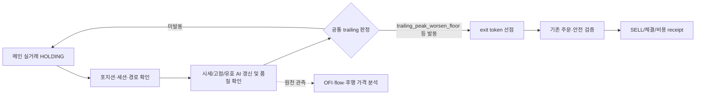

# 메인 스캘핑 익절 런타임 단일화와 생산자 보완 계획

작성: 2026-09-24 KST. 상태: **구현·재리뷰 완료, immutable 릴리스 선택·bootstrap 배포 완료; 실제 PID·자연 성과 미확인**. 대상은 메인 실거래 `SCALPING/SCALP` 보유분의 **익절**이다. [Plan Rebase](../plan-korStockScanPerformanceOptimization.rebase.md) §1–§8의 안전·경제성 원칙과 [현재 체크리스트](../checklists/2026-09-24-stage2-todo-checklist.md)가 우선한다. 완료 포지션의 원천·비용·후행 관측은 [9/23 연결 계획](./holding-exit-position-outcome-runtime-threshold-lineage-implementation-plan-2026-09-23.md)과 [9/28 이관 owner](../checklists/2026-09-28-stage2-todo-checklist.md)의 관측 범위다. 이 문서는 그 원천을 이용할 **향후 런타임 정리와 생산자 보완 순서**를 정한다. 아래 §1–§4는 계획 당시의 판단 계약이며, 구현·배포 결과는 §5 영수증을 따른다.

## 1. 목표와 현재 기준

한 포지션의 익절 결정을 `scalp_trailing_take_profit` 한 owner로 모은다. `trailing_peak_worsen_floor`는 이 owner 안의 **빠른 발동 유형**으로 유지한다. 트레일링 감시 시작값·강한 점수 기준·강/약 고점 되돌림폭은 현행 유효값을 먼저 동결한다. **판단에 쓰이는 가격·AI 점수·고점·체결 원천을 상시 갱신**하되, 익절 신호 뒤의 추가 보류나 다른 익절 owner가 청산시점을 다시 선택하지 않도록 한다. 상시 기동은 적격 보유분 평가가 봇 수명 동안 날짜/enable 게이트 없이 동작한다는 뜻이며, 시세 결손이나 주문 안전 조건을 무시한다는 뜻은 아니다.

현재 확인한 값과 분기는 다음과 같다. 이는 코드/선택 env 기준이며 실제 PID 소비 증명이 아니다.

| 항목 | 현행 소비·선택 상태 | 목표 처리 |
| --- | --- | --- |
| `SCALP_TRAILING_START_PCT=0.6%`, `SCALP_TRAILING_STRONG_AI_SCORE=75`, `SCALP_TRAILING_LIMIT_WEAK=0.4%`, `SCALP_TRAILING_LIMIT_STRONG=0.8%` | [`constants.py`](../../src/utils/constants.py) 및 [`sniper_state_handlers.py`](../../src/engine/sniper_state_handlers.py)의 fast/normal 판정. 포지션별 override·effective receipt를 함께 확인해야 함. | 네 값은 1차 구현에서 동결. 강/약 갈림과 fast worsen 발동을 공통 순수 판정으로 묶고, 각 값의 출처·적용 시각·비교값을 기록. 수익률만 보고 일괄 고정폭으로 치환하지 않음. |
| fast exit 250ms monitor / `FAST_EXIT_GUARD_ENABLED`·`ACTIVE_DATE` | [`exit_safety_monitor.py`](../../src/engine/scalping/exit_safety_monitor.py)는 폴링 껍데기. 선택된 [9/28 bootstrap](../../data/runtime/policy_bootstrap/runtime_policy_bootstrap_2026-09-28.env)은 enable=true이나 active date가 없어 현행 fast 평가 gate를 통과하지 못함. | **fast 익절만** stop 판정과 분리한 뒤 익절 enable/date gate 제거. 250ms는 우선 동결하고 지연·부하 생산자로 평가. |
| `trailing_peak_worsen_floor` | fast 경로에서 고점 대비 실행가능 bid 되돌림과 강/약 폭으로 발동. 일반 경로의 가격 선택과 차이가 있음. | 공통 익절 판정의 `trigger_kind`로 보존. fast/normal 모두 동일한 고점·유효 점수·신뢰 가능한 실행가능 bid 기준으로 계산하되, 정상 경로의 시점 변화는 별도 replay로 확인. |
| continuation/high-peak/quote-recovery 및 loss-conversion recheck | 선택 bootstrap에는 enable=true와 2026-07-21 active date가 함께 있어 9/28 선택값만으로는 발동하지 않음. | 익절 **신호 후 보류·재선택 판단**과 전용 임계치/state/env를 제거. 유용한 시세 복구는 신호 전 공통 품질 경로로 이전. |
| `holding_flow` 익절 override / OFI smoothing | trailing 후보가 flow의 defer/force/confirm 검토를 받을 수 있음. Plan Rebase는 OFI smoothing을 가드 내 ON으로 규정. | 익절 규칙을 override 대상에서 제거. OFI·flow **원천 생산과 관측**은 유지. 손절·다른 owner의 override는 분석·별도 승인 전까지 변경하지 않음. |
| AI momentum decay / profit stagnation / low-profit stagnation hard exit | [`sniper_state_handlers.py`](../../src/engine/sniper_state_handlers.py)의 별도 수익 청산 후보. 선택 bootstrap에서 두 stagnation 계열이 ON. `low_profit_stagnation_hard_exit`은 이름과 달리 조정수익률 +0.2~+1.0% 구간에서 SELL을 결정할 수 있음. | 실제 live 개입·비용을 먼저 분리 확인한 뒤 세 분기의 독립 익절 SELL 권한을 제거하고 관측 feature로만 유지. 별도 승인된 안전 계약이 확인되면 그 계약을 명시하고 변경 범위를 재검토. |
| `scalp_mfe_protect_exit` | 고점 이익이 되돌려져 남은 수익이 0~+0.1%일 때의 별도 `PROFIT_PROTECT` 후보. | R0에서 hard/protect 안전 계약인지, 사실상 독립 익절인지 분류한다. 안전 계약이면 우선순위를 보존하고 익절 성과와 별도 보고. 독립 익절이면 단일화 대상에 포함하되 안전 완화 없이 별도 변경 승인 경계를 세운다. |

손절, hard/protect/emergency, broker/account/order/quantity/cooldown, 수동·widget·episode·machine custody와 그 안전 우선순위는 이 계획의 변경 대상이 아니다. `scalp_preset_protect_profit`의 과거 잔여 참조는 검색·호출자 대사 후 익절 owner가 아닌 호환성 자료만 별도 정리한다.

## 2. 구현 순서와 변경 경계

| 순서 | 작업·담당 코드 | 구체적 완료 조건 |
| --- | --- | --- |
| R0. 현행 경로 봉인 | [`sniper_state_handlers.py`](../../src/engine/sniper_state_handlers.py)의 fast/normal 후보, `_HOLDING_FLOW_OVERRIDE_EXIT_RULES`, 직접 env 판독, 포지션 고정값, selected release/env와 실제 PID를 각각 조사. | 청산 후보별 익절/손절/안전/custody 분류표와 실제 effective 값·비교 연산자·우선순위·날짜 gate·출처를 봉인. 수정 전 동일 tick/position replay 세트를 고정. 실제 PID가 없으면 `selected_only`로 명시. |
| R1. 안전 분리와 공통 판정 | fast 평가 함수에서 hard/protect/emergency·손절 경로를 먼저 분리. 공통 **순수 익절 판정**은 역할상 `src/engine/scalping/`에 두고, 기존 state handler가 I/O·주문·receipt를 소유. 새 파일을 만들 경우 엔진 root가 아닌 scalping 패키지에 두며 기존 호출자와 위치 gate를 재확인. | 동일 입력에서 fast/normal의 감시 arm, strong/weak, peak/bid, 발동 유형이 한 함수로 계산됨. `exit_token` 단일 선점으로 동시 폴링·normal 중복 SELL 방지. stop의 발동 시점/규칙은 기존과 동일. |
| R2. 데이터 보정 상시화 | 기존 holding WS freshness/REST 복구, quote consistency, NXT `0B` stale·`0D` fresh bid guard, peak ledger, holding AI 유효 점수/TTL을 신호 **전** 공통 입력으로 연결. | 날짜/enable 게이트 없이 적격 venue/session/position에 평가. REST는 stale/conflict 시에만 bounded 호출. 신뢰할 수 없는 bid는 `source_gap`으로 막고, 점수 결손은 검증된 유효점수/fallback 계약에 따라 약한 폭 등 안전한 기본 분기로 처리한다. NXT bid guard는 NXT 해당 경로에서만 사용. |
| R3. 직접 관측 생산 | 기존 [`holding_exit_observation_report.py`](../../src/engine/holding_exit_observation_report.py), [`sniper_trade_review_report.py`](../../src/engine/sniper_trade_review_report.py), [`sniper_post_sell_feedback.py`](../../src/engine/sniper_post_sell_feedback.py)에 판정→주문→체결→후행 관측 연결을 보강하고, 제거 예정 익절 후보의 실제 개입을 먼저 계측. | 기존/신규 분기별 직접 신호·effective 값·정확 비용·관측 결손의 분모를 봉인. 이 단계의 보고서는 후보만 발행하며 live 임계치 자동 변경 권한은 없음. |
| R4. 결정 파편 제거 | continuation/high-peak/loss-conversion의 익절 지연, trailing에 대한 flow override, AI decay·두 stagnation의 독립 익절 SELL 후보를 제거. `scalp_mfe_protect_exit`은 R0 분류 결과에 따라 안전 계약 보존 또는 별도 익절 권한 제거. bootstrap 생성자·loader·선택 env·상태 필드·호출자·문서에서 **해당 익절 키와 죽은 참조**를 함께 수거. | `scalp_trailing_take_profit` 외 메인 **일반 익절** SELL 후보 0, `trailing_peak_worsen_floor` 발동 유지, 날짜/enable로 익절을 꺼둘 수 없음. 별도 hard/protect/emergency 안전 분기는 보존. 사용자/운영문서의 현행 override 설명은 실제 변경 시 함께 갱신. |

R1의 가격 계약은 **신뢰 가능한 거래가격으로 peak를 갱신하고, 해당 route의 신선하고 충돌 없는 실행가능 bid로 익절 되돌림을 판단**하는 방향이다. 이는 현재 normal 경로의 mark 사용과 판정 시각이 달라질 수 있다. 같은 포지션·순서·원천시각을 고정한 fast/normal replay에서 차이 전량을 설명하고, 임계치/가격 선택 변경의 효과를 분리해야 적용 가능하다. quote 결손이면 익절 판정을 보류 사유와 함께 남기며, hard/protect/emergency 판정을 이 보류에 종속시키지 않는다.

R4 전에 R3으로 경쟁 익절 후보의 자연 발동 건수·주문 시점·비용을 따로 대사한다. 규칙 추정 라벨은 실제 개입으로 인정하지 않는다. 삭제 대상 env는 **실제 코드 독자·bootstrap 생산자·선택 release·운영 문서·회귀 fixture**를 역검색하여 소유권이 끝난 것만 제거한다. 날짜 조건을 단순히 오늘 날짜로 바꾸는 방법은 채택하지 않는다. 롤백은 이전 검증 release와 봉인된 effective 값으로 수행하며 새 날짜 플래그를 만들지 않는다.

## 3. 생산자 결손과 보완 계약

9/23 원천 snapshot은 clean baseline 이후 완료 유효 거래 329건을 담지만, 명시적 `exit_signal`·effective threshold receipt는 각각 0건이다. 9/23 자연 완료 8건도 규칙은 전부 추정이며 정확 비용은 직접 체결 6건만 확인됐다. 사후 6건은 `partial_window`, 잔고대사 2건은 정확 매도 fill 시각이 없다. 따라서 현재 보고서는 **네 임계치 어느 것에도 실거래 비용 후 선택 권한을 주지 않는다.** 기존 observation 보고서의 `SCALP_TRAILING_LIMIT_WEAK +0.2%p` microcanary는 후보만 생성하며 적격 cohort 0, `eligible=false`다. 이 수치는 제안값도 적용값도 아니다.

| 조정 가능 축 | 현재 생산자/결손 | 추가로 필요한 생산자 출력·선택 조건 |
| --- | --- | --- |
| 감시 시작 `START_PCT` | peak·최종 청산은 일부 관측되나 **감시 arm 이전부터** 시계열 가격/신호가 완전하지 않음. 전용 적격 제안자 없음. | 포지션 시작→arm→발동의 신뢰 가능한 tick/quote 경로와 후보별 첫 arm 시각, 미진입/미발동·censor 사유. arm 값만 바꾼 동일 포지션 replay에서 실제 fill 가능성과 비용 후 EV·holdout을 비교. |
| 강/약 판정 `STRONG_AI_SCORE` | runtime score 소비는 있으나 당시 유효 점수의 원본/TTL/provider/fallback과 정확한 발동 연결이 결손. 전용 제안자 없음. | 유효 score 분포·품질·강/약 전환 시각을 판정 receipt에 연결. 동일 quote 경로에서 점수 경계만 바꾼 paired 결과와 결손 score 비율·tail 손실을 제시. |
| 약한 폭 `LIMIT_WEAK` | observation microcanary 후보는 있으나 적격 실제 표본 0, 완전 후행창/비용·holdout 결손. | 정확 fill·비용과 1/3/5/10분 완전창, 현재/후보 폭의 첫 실행가능 bid crossing, 비체결·미발동·고점 확장 및 tail을 함께 계산. 현재 후보는 gap 해소 전 비적격. |
| 강한 폭 `LIMIT_STRONG` | 전용 적격 제안자 없음. 강한 score에서 peak 확장과 손실 전환의 실제 경로 부족. | 강한 점수의 유효성·가격 경로·후속 peak/되돌림·crossing과 비용 후 paired/holdout. 약한 폭 변경과 상호작용을 분리해 한 번에 한 축만 제안. |
| 폴링 간격 250ms | `decision_to_order_sent_ms` receipt는 있으나 놓친 crossing, CPU/REST 호출량, fast/normal 경쟁 분모를 선택하는 생산자가 없음. | 소스 시각·수신 시각·평가 시각·주문 시각의 분포, 놓친/중복 crossing, REST rate·CPU·지연 tail. 안전/운영 품질 축으로만 심사하며 EV 튜닝값으로 자동 전환하지 않음. |
| 시세 신선도·차이, AI TTL | quote consistency backtest와 runtime 검사는 있으나 현행 대상의 false reject/conflict 및 score 오류 비용 대사가 부족. | 기존 품질 producer에 route별 source clock·age·spread·divergence·fallback/recovery 결과와 오류율을 보강. 이는 **안전·출처 품질 계약**으로 고정하고 수익률을 이유로 자동 완화하지 않음. |

새 독립 가격 수집기를 만들지 않는다. 기존 post-sell producer의 실행가능 BBO·1/3/5/10분 관측을 확장하고, **진입→청산까지의 평가 시점**은 기존 runtime event/quote receipt에 작은 필드만 추가한다. 최소 연결 키는 `position_id/record_id`, `attempt/cycle`, `account/custody`, `symbol`, `venue/session/route`, source·receive·evaluation timestamp, event sequence, peak/trusted bid, arm/strong-weak/trigger 비교값과 effective threshold 출처, AI 유효성, exit token, order/fill ID·수량·비용, post-sell quality다. 포지션별 원시 250ms 전량을 무제한 저장하지 않고 trigger 부근·전이 이벤트와 재현 가능한 bounded source reference를 우선한다. 기록 손실은 0이나 미발동으로 해석하지 않는다.

생산자 보고서의 분모는 `전체 COMPLETED + valid profit_rate → 직접 신호 연결 → threshold/AI/시세 출처 완비 → 정확 체결·비용 → 성숙한 사후창 → paired replay 적격`으로 단계별 ID 집합을 제시한다. PREMARKET, REGULAR, 통합 AFTERMARKET은 venue/session을 보존해 따로 보고하고, 표본이 없는 구간은 `insufficient_source`로 남긴다. 청산 후 추가 상승률은 기회 진단이며 그 자체가 더 늦게 팔았을 때의 순익은 아니다. 실제 첫 발동·주문 가능 가격·비용·실패 주문·partial fill을 포함해야 후보 경제성을 계산할 수 있다.

## 4. 검토·적용 수용 기준

1. **코드 리뷰:** 일반 익절 1 owner, fast trigger 보존, stop/protect 경로 비변경, 익절 날짜/enable 잔여 독자 0, quote 결손 차단·AI 결손의 안전한 fallback, exit token 경쟁 및 중복 주문 0을 영향 호출자 전체에서 확인한다. 최초 회귀를 남겨 수정·재리뷰하고 관련 pytest/compile·`git diff --check`를 통과시킨다. Kiwoom API request/parser/recovery를 수정하게 되면 공식 reference gate를 먼저 수행한다.
2. **행동 동등성·차이:** 동결된 값과 같은 source의 replay에서 기존 fast/normal·신규 공통 판정 차이를 포지션 단위로 전부 설명한다. 특히 normal mark→bid, NXT 0B/0D, AI TTL, stale/rest recovery, 장 전환, 동시 poll, partial fill, stop 우선순위를 별도 확인한다. 예상 밖 stop 지연·주문 오류·출처 손상은 적용 차단이다.
3. **선택·소비:** 코드 통과, 정책/bootstrap 생성, 설치 release, 실제 메인 PID의 env/hash·호출 경로 소비, 다음 자연 `exit_signal`을 각각 다른 receipt로 확인한다. 날짜 게이트 제거가 문서에서만 끝나면 미완료다. 운영문서·Plan Rebase §5의 holding-flow 익절 override 설명과 checklist owner는 실제 코드 전환과 같은 변경 세트에서 동기화한다.
4. **생산자·경제성:** [9/28 자연 표본 owner](../checklists/2026-09-28-stage2-todo-checklist.md)의 직접 신호/정확 비용/후행창 수용을 먼저 닫는다. 네 임계치의 제안자는 각각 결손 분모, 동일 모집단 paired replay, 비용 후 EV와 순이익, rolling 또는 독립 holdout, tail/안전 veto, 현재/후보 적용 범위를 제출한다. 결손이면 `hold/source_gap`이며 수치 제안·live auto apply는 없다.
5. **운영 순서:** R0→R1/R2→R3→R4의 코드 변경, 문서·bootstrap 정리, release 준비, 실제 적용, 자연 성과 판정을 별도 단계로 승인·기록한다. 기존 검증 release와 effective 값의 복귀 경로를 준비한다. stop 지연, 주문 실패, 심각한 손실 또는 출처 훼손은 즉시 안전 rollback 조건이다.

현재 결론: **런타임을 정리할 구현 위치와 삭제·유지 경계는 정해졌지만, 임계치 생산자는 네 축 모두 live 선택 요건을 충족하지 못한다.** 먼저 신호·시세·체결 비용의 직접 연결을 생산하고, 그 후 한 축씩 경제성에 따라 제안한다.

## 5. 9/24 구현·재리뷰·선택 배포 영수증

- 검토 코드: `2a099e1acff0c975abc221fc2d37d629ab11e794`; 격리 작업 트리에서 두 차례 보완한 뒤 `/home/ubuntu/KORStockScan-runtime-releases/scalp-trailing-unified-r3-20260924-2a099e1a`에 clean source로 고정했다. 9/24 21:12:31 KST에 이전 `bd001179757149ac412ae9ad9932147eebe1c377`에서 selector를 원자적으로 전환했고, 이전 selector는 `/home/ubuntu/KORStockScan/tmp/runtime-release-selection-before-scalp-trailing-20260924-211231-035582.json`에 보존했다. `--check-release-set` PASS, 9/28 PREOPEN print-plan·cron 경로가 새 릴리스를 가리킨다. 메인 봇은 실행 중이지 않아 actual PID 소비는 false다.
- 구현: fast 익절을 날짜/enable로 제한되는 fast 손절 평가와 분리하고 공통 `evaluate_trailing_take_profit`에서 arm·strong/weak·trusted peak-to-bid 되돌림·`trailing_peak_worsen_floor`를 판정한다. 기존 stop 우선순위와 exit token 선점을 유지했다. 손절 이후 정상 경로의 bounded REST 회복, NXT 실제 `0D` bid 품질, 거래 체결가 기반 고점, AI 유효점수, source-gap 차단을 보존했다. continuation/high-peak/loss-conversion의 신호 후 보류, trailing flow override 및 AI decay·stagnation의 독립 익절 SELL을 제거했다. 현재 이미 비활성인 post-add trailing grace 호출도 제거했다. `scalp_mfe_protect_exit`은 별도 보호 계약으로 유지한다. 현재 선택된 보호 lock의 `TRIGGER_PROFIT_PCT=-0.3`과 코드의 최저 허용 수익 0%가 함께 적용되므로 현재 값으로는 발동하지 않는다. 보호 lock은 변경하지 않았다.
- 생산자: `scalp_trailing_input_transition`에 첫 arm·시세 품질·강약·발동 전이의 source/evaluation clock, peak, bid, effective threshold, AI 유효성을 남긴다. 추가 리뷰에서 `0D`만 있는 frame의 공통 갱신 시각이 없는 `0B` 시각으로 오인되는 결함을 고쳐 type별 source clock을 분리했고, REST bid 수신 시각과 clock provenance를 기록한다. 재시작 후 list로 복원된 동일 관측 state의 중복 전이도 막았다. `trade_review`와 `holding_exit_observation`에 전달해 완료·직접 신호·입력 완비·정확 비용·성숙한 후행창의 ID 분모와 네 축별 `trailing_threshold_readiness`를 출력한다. paired replay·독립 holdout이 아직 없어 후보값은 null, live 심사·자동 적용은 false다. 250ms 전량 tick 복원과 과거 체결 결손 합성은 완료 주장에 포함하지 않는다.
- 선택된 릴리스의 공식 bootstrap 생산자를 사용해 9/28 env·해시 manifest를 함께 다시 발행했다. 이전 env 대비 폐기된 continuation/loss-conversion 및 NXT 날짜/enable 키 34개만 제거됐고 다른 env 값의 추가·변경은 0건, 원천 incumbent와 operator lock도 동일하다. env SHA256=`037c9b165e2c9fb51356c71e452b45d3ce19549776c26c2e7ece9b08f969aaa9`, manifest SHA256=`550b575479acfed5132d384f5f81f3751a1b9a75390a552b881d763b9f9c9bfd`, read-only bootstrap verify PASS. 이전 파일과 상세 영수증은 `/home/ubuntu/KORStockScan/tmp/scalp-trailing-deployment-20260924/bootstrap-deployment.json`에 연결했다. 9/28 자연 표본의 직접 체결·비용·완전 후행창과 실제 PID 소비는 기존 [이관 owner](../checklists/2026-09-28-stage2-todo-checklist.md)가 판정한다.
- 검증: 최초 회귀에서 bid 결손 arm, 잘못된 REST 종목, fast 손절 gate의 익절 억제, 오래된 post-add 잔여 코드와 NXT 관측 권한 표기를 발견해 고쳤다. 추가 리뷰에서 source clock 결함을 발견해 보완했다. 앞선 영향 범위 `pytest` 1,332 passed·1 경고, 최종 선택 릴리스 영향 범위 1,173 passed, Python compile·wrapper `bash -n`·`git diff --check` 통과. 공식 Kiwoom 참고 게이트는 2026-09-24 19:59:17 KST에 upstream `Kiwoom-Securities/Kiwoom-REST-API` SHA `953e5dbff123f437ab4d11a78a95191a685eb51f`의 `postman/kiwoom-openapi.postman_collection.json`, `kiwoom/specs.py`, `kiwoom/core`, `kiwoom/realtime/packets.py`를 확인했다. 해당 revision에는 `kiwoom_docs`가 없었다. `ka10004`는 POST `/api/dostk/mrkcond`, `api-id=ka10004`, KRX/NXT/SOR 종목코드와 `buy_fpr_bid` 최우선 매수호가 계약에 맞춰 사용하고, 원시 시각을 freshness 증명으로 승격하지 않는다.
- 운영 경계: 9/24 `threshold_cycle_postclose`는 20:10:14에 `failed/exit_code=2/command_failed`였고, 사용자가 승인한 두 대기 wrapper만 21:10:57 KST에 종료했다. 종료된 PID·자식과 사유는 `/home/ubuntu/KORStockScan/tmp/scalp-trailing-deployment-20260924/wrapper-stop.json`에 남겼다. 실패한 9/24 장후 chain을 PASS로 재라벨링하거나 재실행하지 않았다. 자연 청산, 새 코드의 실제 PID 사용, 비용 후 경제성은 아직 별도 확인이 필요하다.
