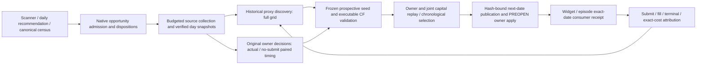

# Widget·episode 전체 폐루프와 연구 확대 성능 구현계획 — 2026-09-17

## 1. 목적·현재 상태·범위

상태: **C0–C8/P1–P6 source 구현·반복 리뷰 및 최종 gate 통과, 1차 commit/push·배포·4서비스 기동 완료, 보완 gate1,089 PASS·후속 배포 진행**. 이번 사용자 지시는 구현·코드리뷰/수정 반복·commit/push·배포·기동을 명시적으로 승인했다. 계획 문서만으로 운영 권한을 추론하지 않는다. [이번 구현·검증 기록](../audit-reports/2026-09-17-widget-episode-full-closed-loop-implementation.md)에서 source closure, 실제 release/PID, 자연 다음 날짜 소비, mature 경제성을 분리한다.

목표는 시장에서 발견한 유효 기회를 실제 체결 여부와 무관하게 연구에 연결하고, 비용·원래 수량·실행가능성·공동 자본 아래 더 좋은 정책을 선정하여 **다음 거래일 위젯/episode가 자동 소비하고 결과를 다시 연구에 돌려주는 것**이다. 무조건 종목/정책을 늘리는 목표가 아니다. 모든 발견 기회의 admission/defer/block 이유를 보존하며 연구 범위 확장을 표본·grid 축소로 상쇄하지 않는다.

기준은 Plan Rebase §1–§8, clean baseline `2026-06-05T00:00:00+09:00`, [전수 계획](entry-opportunity-cost-full-population-tuning-implementation-plan-2026-09-17.md) U10A/U10B/U11과 오늘 checklist다. Main/widget/episode/manual owner·venue/session·실제/CF를 분리하고 기존 provider/bot/가격/수량/cap·broker·hard safety를 유지한다. 현행 OFF/retired family와 turnover 후보 전용 연구에 새 실행 권한을 만들지 않는다.

| 경로 | 현재 코드에 있는 연결 | 남은 연결·증거 |
| --- | --- | --- |
| 위젯 종목 탐색 | `load_symbol_universe`가 고정/watch와 완료된 일일 추천을 자동 편입 | Canonical census의 미등록/누락 기회까지 admission 원장·수집 용량·검증 상태로 자동 연결 |
| 위젯 정책 | signal/auto 연구→next-date publisher→dated loader→dynamic spec catalog | 신규 signal seed의 전향적 실행 검증, joint capital 결과와 선정·발행 결속, version별 실제 소비·성과 |
| Episode 확장 | expanded research→`low_price_two_leg_auto_expansion_policy`가 신규 종목/기존 시간대 extension 발행→auto-expansion service | 확대 후보의 raw 실행·공동 자본 gate 일관화, source/carry/retire disposition, 실제 다음 날짜 소비·성과 |
| Timing 전수 | 원래 미체결 decision·common300s CF·actual 분리·source day 보완 | before-gate opportunity union에서 report→selector→approval→registered consumer까지 native ID/count 대사 |
| R3/R5 부가 근거 | `research_universe_handoff`, `joint_capital_demand` | 현재 진단/수요 메타데이터를 실제 downstream decision gate로 소비; 이 metadata만으로 자동 등록/선정됐다고 표시하지 않음 |

코드 owner: [universe/research](../../src/engine/monitoring/widget_symbol_signal_policy_research.py), [일일 추천 lineage](../../src/engine/monitoring/machine_candidate_lifecycle.py), [위젯 publisher](../../src/engine/monitoring/widget_symbol_runtime_policy.py), [위젯 실행 reader](../../src/trading/widget_auto_trade/policy.py), [위젯 catalog consumer](../../src/trading/widget_auto_trade/engine.py), [episode 연구](../../src/engine/monitoring/low_price_two_leg_expanded_candidate_research.py), [episode publisher](../../src/engine/automation/low_price_two_leg_auto_expansion_policy.py), [episode consumer](../../src/trading/low_price_two_leg/auto_expansion_service.py), [common economics](../../src/engine/monitoring/policy_research_economics.py).

## 2. 목표 흐름과 상태 원장

기존 producer/report에 additive ledger와 receipt를 넣는다. 새로운 daemon/DB/cron을 기본안으로 만들지 않는다. 공통 raw fact를 공유하더라도 전략 신호·상태·주문 owner를 공유하지 않는다.

- Native identity: census opportunity ID/원래 decision event ID/lifecycle/attempt, source date, symbol, owner, actual venue/session/route, source generation·clock·epoch, cost hash. 동일 native ID의 projection은 중복 opportunity가 아니다. 다른 owner의 신호는 해당 owner 연구로만 admission한다.
- 발견 ledger: `input = admitted + deferred_capacity + source_gap + excluded_by_contract + duplicate_projection`; 각 항목에 reason/owner/input location/hash/next action을 둔다. Retrospective forward 결과는 원천 누락 audit에만 쓰며 당시 후보 등록·seed 선택·순서에 미래 수익을 사용하지 않는다.
- 연구 ledger: `admitted = raw_only + proxy_only + pending_prospective_validation + executable_validated + research_blocked`로 as-of의 배타적인 상태를 대사한다. 검증된 상태는 `selected + carry + measured_no_edge + hold_sample + allocation_blocked`의 선정 disposition으로 연결한다. Family/window별 표본수와 검증된 zero-day는 별도다. Census 하나가 여러 owner/session 연구 lane으로 분기하면 parent→child mapping/count를 별도로 보존하여 다른 phase의 raw counts가 같아야 한다고 가정하지 않는다.
- 적용 ledger: selected proposal→published next-date policy→PREOPEN owner activation→actual consumer receipt→post-apply outcome. publication/PID/체결은 단계이지 같은 count가 아니다. 일대다 policy/profile mapping을 원장으로 보존하고, 아직 신호가 발생하지 않은 selected 정책은 `consumed_no_signal`이다.
- Actual 경제성은 `COMPLETED + valid exact-cost profit_rate`, CF는 원천·수량·target/TTL/terminal 계약을 가진 별도 지표다. partial/full·held/censored·unknown order submission·missing cost는 구분하며 null을 0으로 만들지 않는다.

## 3. C0–C3 — Admission·수집·실행 검증 연결

### C0. Producer/consumer 계약과 성능 기준 봉인

기존 writer·loader·scheduler·owner apply가 소비하는 schema/path/hash/version을 표로 확정하고 고정 완료 fixture를 만든다. Before-gate 결정, actual·no-submit, bar proxy, valid-zero, censored를 포함한다. 현재 최적화된 reference와 이번 추가 의미 변경을 구분한다. 아래 §7의 N/D/G/K/행수·요청량·read bytes/CPU/wall/RSS/disk를 먼저 계측한다.

산출물은 기존 report/receipt 안의 input contract·phase metrics와 전체 원장이다. source-only fixture에서 실제 운영 API·provider·orders를 호출하지 않는다. Closure는 contract map·원천 count 보존·현재 correctness reference 확정이다.

### C1. Census→연구 admission 자동 연결

기존 scanner/일일 추천과 canonical census의 **인과적으로 기록된 후보**를 합친다. Census forward panel만으로 새 후보를 발명하지 않는다. Diagnostic census의 not-enrolled는 원래 scanner candidate/차단 event에 join한 뒤에만 자동 research admission한다. Source ID가 없는 종목은 source gap으로 남는다.

Research catalog는 실행 policy/수동 veto 목록과 분리된 주문 권한 없는 상태다. 기존 catalog writer에 source date·native ID/hash·symbol identity·session·admission reason·최초 관측일·재평가 상태를 추가한다. 기존 operator watch와 별도 승인 override를 덮어쓰지 않는다. 기존 고정 watch max-count 규칙을 연구 총종목의 숨은 상한으로 쓰지 않고 budgeted admission catalog를 별도로 소비한다. 미래 구현에서 schema/compatibility·원자 publication·reader 재구성 검증을 먼저 닫는다.

동일 generation 재실행은 idempotent, 새 추천 generation은 delta admission한다. 원래 veto/retired/manual custody는 유지하며 연구 admission이 symbol owner activation이나 BUY permission을 만들지 않는다. Source-valid 0signal일도 날짜 원장에 남는다. Closure는 native census→catalog→scheduled source→research disposition의 count/hash 대사다.

### C2. 수집 용량과 관측 품질

현재 REST watcher의 3요청/종목·18/min·headroom3 아래 명목 cycle은 `N×3/15×60 = 12N초`다. N=19일 때228초, N=50일 때600초다. 이 회전 raw/bar 수집으로 1초 checkpoint·fresh5초 BBO·full-session PASS coverage를 증명하지 않는다. 확보된 과거 bars를 현재 BBO 표본으로 세지 않는다.

1. 원래 timestamp/epoch/실제 venue가 검증된 공통 WS/quote/BBO와 day OHLCV fact를 기존 writer에서 한 번 기록하고 여러 연구 consumer가 읽는다. 신규 symbol WS scope는 현재 승인된 관측 범위·subscription capacity 안에서만 admission한다. 부족하면 명시적 defer이며 기존 주문/holding 필수 관측이 우선한다. 프로토콜/FID/REG/복구 변경을 구현할 경우 공식 Kiwoom reference gate를 선행한다.
2. REST는 검증 source가 없는 gap과 missing completed day만 담당한다. 사실 입력 요청량은 N에 비례하며 seed/후보 K마다 재조회하지 않는다. 외부 context·차트도 현재 공통 캐시의 semantic key가 같은 경우만 공유한다.
3. Budget scheduler는 결정 시점에 알 수 있는 필요성과 원래 admission 시각·안정된 symbol 순서를 사용한다. 예약·실사용·defer·coverage debt를 기록한다. Capacity 분류를 위한 우선순위는 연구 제외가 아니며 deferred 항목은 원장에 남아 공정하게 다음 slot을 받는다. 실현 미래수익 순으로 수집 종목을 고르지 않는다.
4. Raw-only와 seeded event 평가를 분리한다. Coverage는 unique source lineage·실제 시간 간격·source role로 검증하고 반복 소비로 새 raw 표본을 만들지 않는다. 기존 Regular300/AM240 등 **family별 등록 조건**과 BBO freshness를 임의로 완화하지 않는다. Full-session zero-day 자격과 유효한 partial-day completed pair는 별도이며, 전체 날짜 coverage 부족 때문에 이미 유효한 pair까지 폐기하지 않는다.

Closure: universe 확대 fixture의 요청량/budget·defer 보존·기존 관측 우선순위, role/session별 coverage, 실제 seed effective 이후 event에 결속된 executable input. Capacity 부족을 자동 실행/정책 skip 성공으로 바꾸지 않는다.

### C3. Proxy discovery와 전향적 실행 검증 분리

현재 `signal_execution_feasibility`는 selected calibration/holdout episode 전체의 exact prospective seed+BBO를 요구한다. 처음 발견한 정책에는 과거 seed가 없으므로 clean-baseline 전체 episode에 이를 요구하면 신규 정책이 계속 막힐 수 있다. 회전 sampling으로 model entry/exit±5초 quote를 놓치는 문제도 별도로 존재한다. **이 요구를 무조건 해제하거나 과거 quote를 합성하지 않고 검증 계약을 분리해 구현한다.**

- Historical proxy stage: full clean-baseline/1,536 grid/cap1–5/두 half/최근16거래일 holdout 연구를 유지한다. 비용·등록 수량·순익·tail·점유로 후보를 찾지만 proxy-only는 실전 후보가 아니다.
- Candidate freeze: calibration으로 정한 parameter/owner/수량/entry·exit·target·TTL·cost/window 계약을 seed revision에 봉인한다. 이후 결과를 보고 다른 seed로 바꿔 동일 검증 window를 재사용하지 않는다. K개 후보를 관측하면 K와 선택 횟수를 기록하고 prespecified cohort/다중 탐색 계약을 둔다. 실행 검증 가능한 seed 용량이 부족한 후보는 pending이며 full proxy grid 결과를 삭제하지 않는다.
- Prospective stage: effective boundary 이후 실제 raw fact로 causal owner decision·원래 수량/depth/TTL/취소·부분체결·exit를 재생한다. raw-only에서 미래 seed 신호를 만들어 과거 검증 표본으로 쓰지 않는다. 미래 label은 evaluation 전용, 실제 주문 없이 observation/CF가 가능한 등록 경계를 사용한다.
- Window 제안: 신규 widget signal 후보의 별도 전향적 calibration은 최소10 source 거래일/두5일 half, 이후16 source 거래일 holdout으로 고정하고, 기존10 calibration/각 half4/holdout4 episode floor와 full-cost/base·stress/EV/tail guard를 유지하는 계약을 제안한다. Calendar는 사전에 고정하고 실패/누락 날짜를 건너뛰어 더 좋은 구간을 찾지 않는다. Episode/timing/auto는 각 family의 existing window/floor를 그대로 매핑한다. 이 신규 이중-window 계약은 구현·리뷰·consumer version migration 전까지 **제안**이며 현재 gate는 유지한다.
- Common horizon timing300초는 해당 timing CF 평가 계약이다. Widget/episode의 원래 target/TTL/force-flat·holding contract를 300초 exit로 바꾸지 않는다. Changed target에 old-target fill을 재사용하지 않는다. Executable CF는 실제 broker fill 증명이 아니다.

Closure: 과거 seed 부재인 새 후보가 proxy→pending→전향적 검증을 통과해 후보가 되는 bootstrap 회귀와, 과거 label/seed 역적용·중간 seed 교체·partial/TTL/censored·short depth·cross-epoch·미래 clock 차단. 새 계약이 미구현인 기간에는 proxy stage에서 멈춘다.

## 4. C4–C6 — 공동 선정·자동 발행·실행 소비

### C4. Shared capital/owner replay를 실제 선정 gate로 연결

현재 `joint_capital_demand`는 선택된 episode의 수요 diagnostic이다. 그 출력만 보고 portfolio 최적화가 끝났다고 표시하지 않는다. 기존 allocation/owner contract의 exact-date 연구 snapshot으로 cash·동시 exposure·기존 holding/reservation·수량·cooldown·venue/owner conflict·거래비용을 가져오며 research publisher가 broker balance를 새로 조회하지 않는다. Missing allocation contract는 `allocation_blocked`, feasible combined profit=null이며 known actual profit/candidate proxy도 별도 보존한다.

개별 후보의 existing EV/tail·incremental cap·전향적 source 조건을 통과시킨 뒤, **calibration에서만** 공동 후보 bundle/실시간에도 계산 가능한 deterministic arbitration rule을 비교한다. 원래 source opportunity 순서로 cash release/reservation/partial/exit를 재생한다. 아직 끝나지 않은 outcome을 보고 당시 진입 우선순위를 정하지 않는다. Main/manual holding은 원래 owner의 소유로 계산하고 타 owner 신호/청산을 만들지 않는다.

Bundle 공간은 재고 없는 단순 symbol subset 전수와 혼동하지 않는다. 실제 allocator의 bounded rule space와 조작 축을 manifest로 명시하고 joint search 후보 누락/defer를 보존한다. Same-stage owner/canary registry와 승인된 stage-disjoint 경계를 만족하지 못하면 allocation_blocked로 남으며 새로운 병행 canary 권한을 만들지 않는다. 새 joint rule owner/등록 권한이 없다면 기존 allocator를 고정해 feasibility·incumbent 개선만 검사하고 새 arbitration 정책은 manifest-only다. 규칙·bundle을 holdout 전에 동결하고 holdout 탈락 시 다른 holdout winner를 찾지 않는다.

경제성은 independent modeled sum/feasible joint modeled profit/actual completed profit을 각각 출력한다. Joint EV·순익/day·tail·점유의 기존 incumbent 대비 비훼손/개선 guard와 family별 guard를 함께 만족해야 한다. Closure: 겹친 진입의 자본 이중사용 없음, 동일시각 exit→entry 정렬, pending reservation·partial·한 owner hold·zero/missing day·비용 변경·cross-session conflict, publisher가 source/joint decision hash를 독립 재검증.

### C5. Existing publisher→next-date owner/PREOPEN 자동 인계

Widget `widget_symbol_runtime_policy` 및 auto-policy writer, episode `low_price_two_leg_auto_expansion_policy`, timing `machine_microstructure_policy_approval`을 기존 등록 family의 next-trading-date 경로로 연결한다. C1–C4 decision/source/parameters/cost/window/joint hash가 proposal→manifest→policy에 결속되고 publisher 재구성/loader 검증이 일치해야 한다. Exact parent incumbent을 비교하며 unchanged verified carry는 새 승격으로 세지 않는다.

정책·관측 catalog·source receipt의 multi-file publication은 immutable generation을 준비·검증한 뒤 하나의 manifest pointer로 노출하는 방식 또는 기존 hash-bound writer의 동등한 재시도 계약을 사용한다. Partial write·두 writer race·같은 날짜 conflict는 이전 verified generation 보존/차단이며 오늘 policy를 수동 덮어쓰지 않는다. 기존 symbol owner policy apply·custody migration·operator veto와 runtime family registry를 통과해야 실행 catalog에 들어간다. 새 arbitrary family/quantity/cap/venue/provider/bot authority를 만들지 않는다.

Closure: 신규 종목·신규 registered-axis 정책이 조건을 충족하면 별도 종목별 사용자 승인 없이 기존 자동 경로로 next-date 발행되고, no-edge/hold_sample/source_gap/carry/allocation_blocked는 원래 이유로 대사된다. 이중-window/executable/joint gate의 새 의미는 versioned evidence contract와 capability receipt로 결속한다. 구 reader가 새 검증 의미를 지원하지 않으면 신규 정책을 소비하지 않으며, 현재 검증된 incumbent의 legacy carry는 별도로 유지한다. Producer/publisher/reader·owner apply를 같은 검증 source generation으로 migration하고 additive field만 추가했다는 이유로 새 gate 호환을 가정하지 않는다. 기존 자동 범위 밖 조작 축은 manifest-only이며 안전조건을 없애야만 선정되는 후보는 선정되지 않는다.

### C6. Actual consumer acknowledgement

Widget dated reader/engine dynamic catalog는 적용 거래일을 정확히 소비하고 변경 hash/수량/owner/session을 검증한다. Episode service는 현재 startup에서 exact-date profiles를 읽으므로 기존 PREOPEN 완료→08:56 timer 순서와 owner activation의 선행 조건을 검증한다. Policy가 기동 뒤 늦게 완성되면 `published_not_consumed` receipt를 남긴다. 자동 회복은 기존 lifecycle에서 활성 episode/held qty를 먼저 대사한 뒤 적용하도록 설계하며 무조건 intraday restart/reload를 기본안으로 넣지 않는다. 손에 든 position의 exit-only custody는 신정책 실패와 별도로 유지한다.

Ack에는 policy/profile version, effective date, source generation, 실제 process cwd/import root/PID/start time, owner activation, accepted/rejected reason을 넣는다. 신규 entry policy가 소비되지 않았거나 활성 session/quantity가 맞지 않으면 실전 신정책 소비 PASS가 아니다. Manifest/PID를 order/fill로 해석하지 않는다. Closure는 실제 자연 PREOPEN→next-date consumer receipt와 singleton·holding 보호, stale/future policy·늦은 publication·active-episode update·owner mismatch 회귀다.

## 5. C7–C8 — 성과 회수·회복·최종 폐루프 완료

### C7. Version attribution을 다음 연구 입력으로 회수

실제 decision→submit/cancel→full/partial fill→owner terminal을 selected policy/profile version에 결속한다. no-submit의 incumbent reject와 candidate alternatives는 동일 raw opportunity·비용·수량·기간으로 CF paired 평가하며 실제 손익과 합치지 않는다. 집계는 rolling/cumulative/post-apply version window와 unique signal/attempt별 경제성·참여·censor rate를 함께 제공한다.

Actual 완료 손익에 원래 비용/qty가 없으면 null+source owner를 유지한다. 수익이 없는 날과 missing/censored를 구분한다. 신규 정책의 next calibration은 완료·matured source만 받으며 아직 남은 holding을 0으로 넣지 않는다. Mature nonperforming 신규 profile의 retire/carry는 기존 family 계약으로 판단하고, 새 BUY 중단과 이미 소유한 position의 SELL/custody를 분리한다. 경제성 sample 부족을 safety rollback으로 이름 바꾸지 않는다.

### C8. Handoff·부분 실패·유일한 owner

단계 완료 상태는 `not_yet_due / waiting / running / failed / complete`와 semantic disposition을 함께 기록한다. Checkpoint는 exact source/code/contract generation으로 재개하고 invalid 단계 이후 dependent output을 재생성한다. Scope 격리가 증명되면 정상 scope를 보존하고 identifiable bad rows/windows를 제외한다. Global 계약/불가분 joint/source snapshot 손상은 fail closed다.

Final ordering은 기존 `final sources → tower → next checklist → strict verifier --require-summary-handoff → controller DONE → cleanup/final detector`를 유지한다. Cached PASS가 새로운 실패 generation을 덮지 않는다. Mandatory closure artifact가 없거나 interrupted/deferred work가 남으면 전체 완료를 주장하지 않는다. Execution cardinality가 0이어도 유효 no-edge인지 source/owner/consumption gap인지 대사한다.

현재 실행 owner는 오늘 checklist의 `KiwoomCommonHealthOpportunityCostAcceptance0917`(U10A/B·U11 연결), 자연 widget 평가 owner는 `WidgetPostcloseEvaluationPinAcceptance0916`다. 별도 중복 checkbox/cron을 만들지 않는다. 날짜 이관 시 기존 acceptance·history를 그대로 옮겨 current parsed owner1개를 유지한다. 이 계획의 단계는 의존 관계이며 오늘 완료/예약 일정이 아니다.

전체 완료는 C0–C8 source 구현·review closure, 배포·actual consumer, 자연 next-date publication/consumption/attribution이 각각 증명될 때다. 새 시장 종목·새 registered policy가 **실제 주문 전 CF 연구만으로** admission/검증/자동 발행에 도달하는 회귀를 요구한다. 실체결이 있어야 연구를 시작하는 순환조건을 만들지 않는다. 실제 수익 개선은 별도 mature economic acceptance다.

## 6. 구현 순서·검증·롤백

| 단계 | 작업 묶음 | Closure와 다음 의존 |
| --- | --- | --- |
| F0 | C0 계측·입력 계약, 기존 O0 | 의미/작업량 봉인·oracle fixture; 실행 snapshot 요구 확정 |
| F1 | C1 admission ledger, §7 P1 source index/공통 fact | 전체 native count 보존; source capacity/defer를 숨기지 않음 |
| F2 | C2 capacity·event evidence, C3 이중-window/seed lifecycle, P2 executable index | 새 seed bootstrap과 causal/partial/TTL 회귀; 신규 의미 oracle 확정 |
| F3 | C4 joint gate, P3–P4 incremental replay/집계 | Full reference와 동일 의미의 grid/선정, allocator·incumbent·holdout guard |
| F4 | C5 publication/owner apply, C6 ack, P5 phase checkpoint | Publisher/구 reader 호환·원자 generation·실제 next-date consumer |
| F5 | C7 attribution·C8 fixed point, P6 storage/scale fixture | 자연 handoff/strict final과 source→version 경제성 회수 |

각 묶음은 implementation→self review→보완→re-review→targeted validation으로 닫는다. 신규 공통 Python은 `monitoring`의 fact/economics, `automation`의 publication/ledger orchestration, `infrastructure`의 filesystem/receipt 중 실제 owner를 location gate로 정한다. Engine-root 새 module·중복 compatibility 구현을 기본안으로 두지 않는다.

주요 검증 suite는 `test_policy_research_economics.py`, `test_widget_symbol_signal_policy_research.py`, `test_widget_symbol_runtime_policy.py`, `test_widget_auto_trade_policy_calibration.py`, `test_widget_paired_policy_replay.py`, `test_widget_signal_auto_trade.py`, `test_widget_runtime_verification.py`, `test_machine_candidate_auto_expansion.py`, `test_low_price_two_leg_expanded_candidate_research.py`, `test_machine_entry_timing_tuning.py`, `test_machine_microstructure_policy_approval.py`, `test_symbol_owner_policy_auto_apply.py` 중 변경 owner에 해당하는 것과 compile/shell/diff checks다. E2E는 mock/no-order gateway와 고정 원천 fixture로 수행한다. Source unit tests와 자연 운영 acceptance를 분리한다.

기존 source-quality/authority gate를 보존한 reader/replay로 fallback한다. Cache/projection만 실패하면 재계산하며, semantic/source 경제성 gate 실패를 fallback으로 우회하지 않는다. 새 entry 정책 되돌리기는 exact parent/owner의 next-date carry/rollback 계약을 따르고 활성 position exit를 보존한다. Managed release rollback은 실제 affected consumer와 current receipt를 확인해 최소 범위로 수행한다. 구현 중 wrapper/scheduler/automation 변경이면 owning 운영문서와 current checklist를 같은 change set에서 갱신한다.

## 7. 확대에 따른 성능 오버행과 P1–P6 최적화

기존 [O0–O3 계산 최적화](postclose-computation-optimization-implementation-plan-2026-09-17.md)와 [widget source/performance 계약](widget-postclose-performance-and-source-closure-implementation-plan-2026-09-16.md)을 확장한다. 기존 snapshot·prefix feature·setup/exit reuse·compact projection·checkpoint가 이미 있으므로 다시 만드는 범위가 아니다. **추가 correctness가 완료된 동일 의미**의 reference를 기준으로 incremental/확대 비용을 최적화한다.

### 작업량 모델과 기준

N=연구 종목, D=clean source 거래일, B=day bars, G=signal grid(현재1,536), K=전향적 seed, E=실제 opportunity/episode 수, F=owner/family 수로 계측한다. Full proxy 경로는 대략 `N×D×G×B`, cap1–5는 기존 episode prefix 집계이지 무조건5배 replay가 아니다. Component/paired/epoch/quantity 변화로 다른 state 경로면 별도 replay다. Joint rule space는 별도 R을 기록하며 모든 종목 subset의 `2^N` 전수를 기본안으로 하지 않는다.

기존 최종 synthetic benchmark는 native19종목×72거래일×390bars/전체grid에서 cold1,209.895초, warm43.818초, peakRSS281.3MiB, remote0였다. Engineering fixture 결과이며 추가 C1–C8/실제 원격 acquisition·실행 source/joint replay 성능은 측정되지 않았다. 비례 외삽하면 N=50 cold약3,184초, N=100 약6,368초로 기존 단계 budget5,400초를 넘을 가능성이 있다. 이는 예측일 뿐 실제 throughput 보장이 아니다. Worker 늘리기/CPUQuota·MemoryMax 증설을 기본 해법으로 쓰지 않는다.

| 비용 증가 | 최적화 owner/작업 | Acceptance |
| --- | --- | --- |
| P1. N 증가의 chart/raw 재조회·다중 reader decode | 기존 source snapshot/compact writer/sidecar를 source-date·symbol·route/session·generation·parser/exclusion key로 공유. 완료 source freeze에서 canonical digest·index1회, hot consumer는 검증 manifest 소비. Directory 전체 재탐색 대신 writer-issued per-day generation manifest. Stat-only fingerprint가 source 사실을 증명하지는 않음 | Missing/changed day만 acquisition, seed K 증가로 추가 raw TR0. Warm raw full audit 최대1회/generation. Rewrite/truncate/symlink/append/비용·exclusion 정정 cache miss/fail-closed |
| P2. K seeds×E depth/TTL 검증 반복 | Completed raw fact를 clock/epoch/quote ID로 index하고 seed-specific causal decisions와 평가 labels를 분리. Common terminal·cost·quantity 상태를 정확한 semantic key로 재사용. 이미 활성화된 causal seed trace를 재생; signal 없는 raw를 seed event로 변환하지 않음 | Fact decode1회/day, seed별 raw 파일 재스캔0. Prospective K 확대에서도 TTL/partial/full/target/epoch·censored disposition oracle 동일 |
| P3. N×D×G replay·rolling repartition | 기존 bounded per-day cache를 활용. New day/정정 day만 replay하고 winner/half/holdout/cap/component 집계를 원래 calendar로 재구성. Cross-day holding은 독립 day cache로 잘라 재사용하지 않고 state boundary hash를 키에 넣어 다음 안정 경계까지 invalidation | Unchanged day replay0. One-day append의 replay는 신규 day+state dependent 범위. 모든 G/caps·near-zero/tie·선정·episode identity 동일 |
| P4. F별 동일 경제성·joint bundle 중복 | Normalized outcome/cost/quantity 충분통계와 interval index 공유. Family eligibility/권한은 독립. Frozen calibration의 registered joint rules만 interval sweep, 후보별 state는 immutable. Sparse event를 처리하고 notional/held/reservation 상태 재사용 | Missing→zero 금지, native duplicate 제거·zero-day·joint feasibility/economics 동일. Independent sum을 joint profit으로 이름 바꾸지 않음 |
| P5. 20:10/21:15 predecessor wait·재시도 full recompute | 기존 stage receipt에 source-wait/provider-wait/compute/write와 completion manifest를 분리. Final refresh는 완료된 동일-generation 선행 연구를 소비하고 바뀐 phase만 재개. 장후 stage 시작은 EOD·seed·source readiness 유지 | Warm/retry completed phase replay0; 실패 stage·generation·exit code 보존. Timer/phase wait 축소를 계산 CPU 감소로 보고하지 않음 |
| P6. Expanded traces/cache/report 디스크·RSS | Symbol 순차 처리, bounded buffers·candidate sufficient stats, 선정/필수진단/native ledger만 detail 저장. 공통 raw pointer로 여러 family의 full JSON 복제 억제. Optional cache는 current run/live consumer/rollback 보호를 확인한 byte-cap/LRU로 evict하며 raw/policy/receipt는 별도 retention | PeakRSS baseline 이하·현재 unit limit 이내, swap0. Byte cap 넘으면 cache-disabled/recompute이지 원천·필수증거 유실이 아님. 동일 raw를 F/K별 복제하지 않음 |

성능 key에는 source generation/semantic digest, producer+helper dependency revision, owner/venue/session/route/epoch, candidate parameter/quantity/entry·exit·cooldown/seed activation, cost/exclusion, label horizon/as-of, calendar/holdout/half, allocator/parent contract를 포함한다. 시간 계측·cache hit 로그 자체는 경제성 fingerprint에서 분리한다. Invalidation table은 source append/과거 정정/target·qty·seed/cost/exclusion/allocator 수정마다 raw fact·decision·outcome·aggregate·policy의 영향 범위를 명시해야 한다.

Storage capacity receipt에는 daily new bytes, raw/projection/cache/report 비중, expected retention×growth, current available bytes와 existing low-disk guard를 기록한다. Raw 삭제/조기 retention 축소·정책 증거 압축 오류를 성능 최적화로 승인하지 않는다. 지난 임시 검증 복사본 정리는 optional 개발 저장량 감소이며 운영 연구 원천의 성장 해결로 세지 않는다. 초기 제안은 **이번 추가 optional 연구 cache 합계2GiB soft cap**, **free disk10GiB reserve**다. 이는 기존 운영 low-disk guard/원본 retention 값을 변경하는 제안이 아니라 optional cache 생성을 억제하는 개발 목표다. Current symbol/run·live consumer/rollback 참조를 pin하고 그 외 optional cache만 LRU evict한다. Pinned working set이 cap을 넘으면 pin을 제거하지 않고 신규 cache write를 생략/recompute하며 deadline 영향도 기록한다. F0 실측에서 cap이 부적합하면 working set·일별 growth·현재 free space를 근거로 조정 이유와 최종 숫자를 구현 manifest에 확정한다.

### Critical path와 deadline

F0에서 `T_finish = T_EOD_ready + T_required_research + T_publication_and_handoff`를 실제 dependency graph로 산정한다. 병렬로 끝난 phase를 단순 합산하지 않고 source readiness 이후 필요한 경로만 계산한다. 20:10 evaluation/21:15 final refresh의 현재 timer와 bounded900초 source-wait가 확대된 cold 작업을 항상 수용한다고 가정하지 않는다. Compute가5,400초 이내여도 EOD 지연과 합쳐 오늘 checklist20:10~23:20 자연 acceptance를 넘으면 해당 목표는 미달이다.

동일 target/date/generation의 선행 완료를 기다리고 필요한 phase만 재개하는 기존 refresh 상태기계를 보완한다. Readiness trigger/재시도 연결은 기존 timer·wrapper owner의 단일 running lock·outer deadline 안에서 설계하고, 구체 운영시각 변경이 필요하면 구현 change set에서 operating document/current checklist를 갱신한다. 이 계획으로 timer를 바꾸지 않는다. Deadline 초과는 `deferred_not_consumed`/명시적 failure와 backlog이며 완료/PASS가 아니다. 다음 PREOPEN cutoff 이전 publication/owner apply가 닫히지 않으면 기존 verified carry 또는 원래 fail-closed를 따른다.

### Scale/performance closure matrix

- Frozen 동일 의미 fixture N=19/50/100, D=72/누적120, G=전체1,536·cap1–5, K=1/4의 cold/warm/한 날짜 append/과거 정정/비용·seed·allocator 변경/TERM 재개를 검사한다. Production 자료를 대량 복사하거나 시장 중 full scan benchmark하지 않는다. Synthetic 확대 결과와 자연 source run을 따로 보고한다.
- Correctness: population/native-ID·source-day·actual/CF·partial/held/censored·비용·수량·EV/PnL/점유·candidate/cap/component/joint·calibration/holdout·선정/carry/publication authority canonical parity. 새 joint/전향적 계약은 그 수정된 reference와 비교한다.
- 측정 목표: 19-symbol cold에서 **추가 폐루프 단계 compute 증가분**을 baseline compute의20% 이내로 제어하고, 같은 완료 source warm/full phase 재생0·provider 신규 호출0, one-day replay는 신규/의존 날짜 수준. N=100/D=120 fixture에서 stage compute wall이 기존5,400초 이내·RSS/자원계약 이내인지 검증한다. 이 수치는 목표이며 달성 실측이 아니다. Wall에 실제 source/provider wait는 별도 가산·critical path로 보고한다.
- 목표 미달 시 admission 자체를 삭제하거나 grid/floor/표본을 줄이지 않는다. 동일 generation checkpoint·명시적 backlog/defer를 남기고 미완료 scope를 promotion에서 제외한다. 정상 scope 분리가 가능하면 해당 scope만 계속하되 global joint dependency가 불완전하면 combined promotion을 차단한다. 더 큰 N/D에서 deadline 보장이 없으면 용량 한계·예측·추가 resource 선택을 제시한다.
- 최종 성능 receipt는 source→research→publication→consumer의 같은 generation에 결속한다. 빠른 proxy/warm 캐시를 신규 source·전향적 검증·실제 경제성 성공으로 보고하지 않는다.

## 8. 구현·배포 및 자연 acceptance

C0–C8/P1–P6은 이번 source 변경과 기존 producer/consumer에 연결했다. 신규 종목 무체결 CF→고정 prospective calendar→joint 검증→다음 날짜 발행/reader 회귀, 기존 보유 episode의 retired BUY 차단/원 target 청산, 원 버전별 exact 비용과 missing-cost/null, 완성 source fixed-point 재시도, 손실 없는 fact 압축·cache reserve를 검증한다. 세부 코드·회귀·실측과 미달 성능 목표는 [구현 기록](../audit-reports/2026-09-17-widget-episode-full-closed-loop-implementation.md)을 따른다. 기존 두 stable-ID owner를 유지하며 자연 next-date 신규 선택/소비/성과와 비용차감 수익 개선은 별도 OPEN이다. `git diff --check`와 print-only parser로 owner·authority를 검증하고 external sync는 실행하지 않는다.

문서 보완 검증: 변경 문서의 새 링크 결손0·whitespace/diff check PASS, print-only parser32개 task와 existing 두 stable owner 각각1개 확인. 기존 당일 미래 산출물 참조5회는 그대로 보존했다. Checklist의 기존 widget/episode follow-up 문단은 해당 common OPEN owner 바로 아래로 옮겨 소유 경계를 정리했다. 이는 최초 계획 보완 당시의 document-only 기록이다. 이후 사용자 승인으로 C/P source 구현·테스트·1차 배포/기동을 수행했고, episode summary 독립 재검증과 신호 발생 계산 병목을 추가 보완했다. 최신 gate·release/PID·실측은 구현 기록 §7 이후를 따른다. Full-scale 성능 목표·자연 신규 정책 소비·실제 경제성은 OPEN이다.
