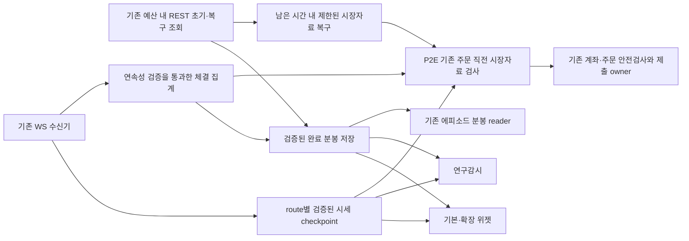

# 위젯·에피소드 공통 WS 시세 수집 개선안

> 2026-09-21 사용자 승인 갱신: 현재 수준의 누락은 허용하고 검증된 관측 구간을 WS 분봉으로 채택한다. 세션 전체 prefix·무결손 연속성·사전3x15분은 전환 선행조건에서 제외한다. 종목/당일/AL 식별, 유효 완료봉, 판단별 실제 최소 입력, 주문 직전 hard guard만 필수다. 기존 엄격 조건을 설명한 아래 기록보다 이 승인이 우선하며 [전환 구현·검증 기록](../audit-reports/2026-09-21-widget-ws-completed-bars-implementation-review.md#operator-approved-observed-history-cutover)이 운영 설정·롤백·현재 증거를 소유한다.
> 전환 검증 완료(19:02:59 KST): 코드 `f6e7bf2a5`·630 PASS·수집기4 배포. 활성 삼성/006800/010140/080220이 실제 WS 완료봉을 선택하고 해당 분봉 읽기 REST0·최종 source-quality PASS를 기록했다. 메인 PID367246 유지. 두산/한화와 종료 에피소드는 운영시간 밖이며, 실제 다음 자연 실행은 별도 관찰한다.

- 최신 원천 분석·P3 연결 확정: 프리·애프터 quiet는 장애/반복갱신 사유가 아니다.16:36 명시적1006 이후 확장3종목 이전epoch 및삼성age-only를 구분했다. 원인 귀속/멱등 복구→기존writer 분봉투영→공통reader→현재cohort→episode 순서를 §3.3.1에 확정했다. 이는 구현/배포 완료가 아니다. [분석 증거](../audit-reports/2026-09-21-widget-source-block-and-p3-connection-review.md). 현재 메인5e3f48bd9/PID297783이므로 아래285831은이전이력이다.
- 상태: **P0/P1 비교·P2E 주문 직전 WS 연결에 이어 기본3종목 P2 실제 입력 전환을 배포, 자연 수용 검증 진행 중**. 현재 사용자 실행 승인은 기존 consumer의 입력 전환과 시한 수리를 포함한다. 확장 관측58종목 중3종목 추가 전환을 배포했으며 나머지 확대와 P3 완료 분봉 공유는 미완료다.
- 최신 인계: P2 producer `4c5dc8a06`(메인 PID285831), 기본/관측 consumer `d8bb46367`로 기본3종목 WS 가격·호가·당일 저가와 삼성 등락률/최근체결 입력을 선택한다. 기존 P2E·메인 수리를 보존하고 regular episode 만료를 REST/예약 전에 차단했다. P1의14:00–14:45는 raw/집계 분모 결손으로 미통과였으며, 이번 제한 적용을 이전 통계 PASS로 바꾸지 않는다. 새 producer/consumer 이후 자연 소비와 완전한 세션 내3창·submit-path는 별도 검증한다. [코드·배포·검증 기록](../audit-reports/2026-09-21-widget-p2-source-and-episode-deadline-review.md).
- 이전 관측15:27: 최초15:19에는3종목 WS 필수 입력 PASS. 이후15:20부터 체결0B가 멈추고 호가0D만 갱신되어 현재는 원20초 신선도 차단이다. 입력 전환 배포 완료와 현재 입력 준비·연속 창·자연 제출 검증을 구분한다. [시각별 증거](../audit-reports/2026-09-21-widget-p2-source-and-episode-deadline-review.md#latest-source-observation--1527-kst).
- 후속 구현: 확장 위젯/연구 수집기2개 WS 입력 연결·원 시각 재검증·종목별 census·raw/compact 출처 보존을 구현, 초기 후보 `2bef246e1`을 거쳐 관측 수집기는 후속 리뷰 `d8bb46367`(PID299905)에 적용했다. 연구 수집기는 코드 준비 상태이며 운영 전환하지 않았다. 현 후보 집합355종목의 통합등록은22종목이며 전체 합집합378 item은 로컬 cap56을 초과한다. P3 기존 canonical stream과 공식 KRX27봉 대조는 OHLC27/27, OHLCV23/27로 거래량4건이 미해결이다. [후속 검토·실제 원천 대조](../audit-reports/2026-09-21-widget-p2-source-and-episode-deadline-review.md#continued-work-after-the-operators-1520-close-clarification). 15:20은 사용자 지정 정규 운영 종료 경계이며15:40 기본3수집기는 모두closed다.
- 사용자 원천 기준 최종 정정: 유효한 동일 종목 `_AL` WS를 통합시장 원천으로 신뢰한다. KRX/NXT 개별 REST 수치 일치는 전환 조건이 아니며 확장 consumer의 시장 범위 불일치 차단도 제거했다. quote/bar 각각의 원 출처는 보존한다. 위4건은KRX 표기 원장↔KRX REST 진단 이력으로 남기고AL 채택을 막지 않는다. 기존 연속 원장에 원본item/FID13·15를 보존해AL 내부 누락/시각/세대를 검증한다. 기존58종목 관측 catalog 중006800·010140·080220만 WS로 선택하는 제한 cohort이며 새 구독/한도/정책 변경은 없다. [최종 수정·성능 검증](../audit-reports/2026-09-21-widget-p2-source-and-episode-deadline-review.md#operator-correction-integrated-al-ws-is-the-authoritative-source).
- 이전 자연 소비16:16:48: 메인 `4c5dc8a06`/PID285831, 관측 consumer `2b1a76a48`/PID291143에서006800·010140·080220 모두 `_AL` WS 입력 선택 확인. 앞2종목 payload는ok, 080220은 WS 선택 후 분봉 REST `request_budget_deferred`가 남는다. 원장 bounded tail2,362건에 원본AL item/FID13·15 저장 확인. 완료 분봉 공유·연속3창·자연 주문/비용 후 성과는 미완료다. [자연 소비·시각 수리](../audit-reports/2026-09-21-widget-p2-source-and-episode-deadline-review.md#live-observation-clock-and-observer-activation).
- 최신 재리뷰·배포16:33: 기본3수집기 및 관측 수집기를 `d8bb46367`로 재기동했다(PID299807/299806/299798/299905). 기본 consumer 시각 오판·최종 세션 검증·receipt 필수시각 누락·실패 census 창 귀속을 수정, 배포본370 PASS. 삼성 장후AL 입력/source_quality PASS, 두산·한화는 정규 전용closed. 확장3종목 AL 선택 후 분봉 REST 예산 대기는 남는다. [리뷰·수정·재검증·실제 소비](../audit-reports/2026-09-21-widget-p2-source-and-episode-deadline-review.md#approved-second-review-and-collector-deployment).
- 결정: 현재가·체결·호가를 기존 WS 수신기에서 공유하고 REST는 초기 이력·정적 정보·제한된 누락 복구에 사용한다. **P2 시세 전환에 더해 P2E 주문 직전 시장자료 검사 연결을 추가**한다. P3 완료 분봉 공유와 별도로 진행하며, 관측198종목 확대나 P3 완료를 기다려 제출 병목 수리를 미루지 않는다.
- 이번 실행 범위: 9/21 미제출9건의 WS→순차 REST 병목과 삼성 오전 `WAIT` 조기 종결 수리. 유효 WS의 해당 시장자료 REST 호출은0이며, 전체 소요 시간을 보장할 수 없는 REST 복구는 시작하지 않고 결손으로 차단한다. 기존 위험/계좌/주문/수량/시한 guard와 P4/P5 경계를 유지한다.
- 사용자 정정 반영: 모든 종목에서 같은 종목의 유효한 `_AL` 체결·호가 수신을 WS 전환의 원천 검증에 인정한다. `005930` 별도 등록 부재나 KRX REST와의 값 차이만으로 `005930_AL`을 탈락시키지 않는다. [공통 reader 보완·실제 자료 확인](../audit-reports/2026-09-21-widget-shared-ws-transport-review.md#integrated-symbol-source-acceptance-correction).
- 현재 실행·자연 acceptance owner: [9/21 checklist](../checklists/2026-09-21-stage2-todo-checklist.md)의 `KiwoomCommonHealthOpportunityCostAcceptance0917`. 이 문서는 단계별 설계이며 별도 OPEN owner를 중복 생성하지 않는다.
- 상위 계약: [Plan Rebase §1–§8](../plan-korStockScanPerformanceOptimization.rebase.md), [Kiwoom API 공식 참조 gate](../kiwoom-api-data-contract.md#official-kiwoom-reference-gate). [기존 위젯 source/consumer 성능 계획](widget-postclose-performance-and-source-closure-implementation-plan-2026-09-16.md)의 원천 역할·중복 제거 원칙을 이어가며 완료된 장후 계산 개선을 다시 수행하지 않는다.

## 1. 확정된 문제와 범위

[10:30:17 KST 점검 사본](../../tmp/widget-episode-runtime-review-20260921.json)의 상태다. 아래 숫자는 해당 시각의 최신 저장 관측이며 하루 전체 실패율이나 구현 이후 결과가 아니다.

| 영역 | 관측 | 해석 |
| --- | --- | --- |
| 기본 위젯 3종목 | 삼성·두산·한화 프로세스 가동, 최신 입력 `DATA_WAIT` | `shared_read_rate_wait_budget_exhausted`로 시세 확보 지연; 시각에 따라 정상 입력과 대기가 반복됨 |
| 확장 위젯 | 58종목 중 `ok` 4, `data_wait` 54 | 대기 사유 52개는 `request_budget_deferred`, 나머지는 분봉 stale·source error |
| 연구감시 | 당일 저장 관측 198개 중 PASS63, SOURCE_ERROR125, SOURCE_QUALITY_BLOCKED10; 5분 내 갱신23개 | SOURCE_ERROR125개의 사유는 공통 읽기 예산 대기. 프로세스 가동만으로 관측 coverage를 보장하지 못함 |
| 저가주 에피소드 | 4개 분봉 평가 중, 24개 NO_TRADE, 당일 주문0 | 기존 분봉 평가 경로는 동작. 모든 미진입을 데이터 장애로 분류하지 않음 |
| 위젯 매매/보유 | 삼성1종목 정책 허용, 신규 주문0, 삼성 이월25 | 수집 개선이 정책·보유 owner·청산 권한을 변경하지 않음 |
| 오류 탐지 | process/artifact 등 전체 pass | 프로세스 생존과 실제 유효 입력 coverage가 다른 문제임 |

현재 `widget_symbol_runtime_collector`는 현재가 `ka10001`·호가 `ka10004`를 각각 30초 bucket으로, 분봉 `ka10080`을 1분 bucket으로 조회한다. `widget_research_watch_collector`는 일부 quote/BBO를 재사용하지만 미충족 시 REST로 조회하고 분봉도 요청한다. 저가주 gateway도 종목별 `_AL` 완료 분봉을 REST로 읽는다.

58종목 모두에 현재가2회+호가2회+분봉1회/분을 요구하면 **290회/분**이다. 이는 실제 요청 횟수가 아닌 캐시 주기 기반 수요 계산이며, 재사용·local pacing·미시도는 별도로 계수한다. 현행 공통 read admission의 `source_only` 상한은 코드상 초당4회, 전체 read는 초당5회이고 연구감시 local budget은 분당18회다. 이 값은 **현재 로컬 안전 설정**이며 공식 WS 한도나 변경 제안이 아니다. 58과198은 중첩하므로 구독 수를 단순 합산하지 않는다.

### 1.1 주문 직전 병목의 추가 증거

[14:18 읽기 전용 대사](../../tmp/widget-episode-nine-block-causal-check-20260921.json)는 14:06 집계의 `SOURCE_UNAVAILABLE`5건·`SKIP_DEADLINE`4건을 대상으로 한다. 분할 leg와 재시도가 포함된 미제출9건이며, 9종목/독립 기회9개 또는 당일 최종 분모가 아니다. 모두 broker 주문번호가 없고, 직접 거절 사유는 매도 압력 검출이 아니다.

| 대상 | 확인된 사실 | 후속 수리/미확정 경계 |
| --- | --- | --- |
| 삼성 오전 | 최초 검증 통과 뒤 원천 부족1·시한 초과1. 첫 leg는 guard가 `WAIT`인데 상위 machine이 `NO_FILL`로 종결 | 비종결 대기 상태를 유지하는 §3.5 수리. 과거 신호 재실행 금지 |
| 삼성E&A 늦은 오전 | 최초 통과 뒤 제출 직전 호가·체결 자료 노후화로 원천 부족2 | stale 차단 유지. 실제 무체결과 수집/발행 지연은 당시 증거만으로 모두 구분되지 않음 |
| 삼성E&A 점심 | t0+5초 검증 통과 후 REST 호가·체결 조회 완료가 각각 +7.014초/+7.491초, 두 leg 시한 초과 | §3.4에서 6.5초 예산 안의 WS 소비 연결·순차 조회 제거 검증 |
| 한국전력 점심 | 원천 부족2 후 한 leg 재시도 통과. REST 완료 +7.073초/+7.768초로 시한 초과1 | §3.4 적용. API 예산 대기·응답·로컬 처리·leg 순차 지연을 분리 |

현재 경로는 WS adverse-flow 검증 뒤 `ka10004` 유동성과 `ka10003` 체결속도를 순차 조회한다. 따라서 P2 수집기 REST 절감은 간접 개선이고, P2E가 주문 직전 병목의 직접 수리다. 6.5초 전체를 API rate-limit 대기라고 단정하지 않는다. 당시 release의 guard/owner/regular machine/gateway와 작업본의 해당 파일 해시 일치를 확인했으며, 구현 시 실제 선택 release를 다시 확인한다.

## 2. 재사용할 구성과 소유 경계

| 기존 코드 | 계획된 역할 |
| --- | --- |
| [kiwoom_websocket.py](../../src/engine/kiwoom_websocket.py) | 기존 0B/0D 수신·정규화·route 상태·연결 세대·구독 관리 재사용. 수신 callback에서 REST/큰 파일 쓰기를 실행하지 않음 |
| [기존 WS snapshot writer](../../src/engine/bd_fbuy_accum_pre_scanner.py) `write_ws_snapshot` | 기존 비동기 atomic checkpoint를 우선 재사용. 파일 이름이 속한 과거 외국인집계 전략을 재활성화하지 않음 |
| [market_data_cache.py](../../src/trading/market/market_data_cache.py), [quote_consistency.py](../../src/trading/market/quote_consistency.py) | 시세 저장·신선도·정확한 route 선택 검증. 현재 메모리 cache를 프로세스 간 공유 완료로 간주하지 않음 |
| [samsung_widget_advisory.py](../../src/engine/monitoring/samsung_widget_advisory.py)의 read client 및 삼성·두산·한화 advisory owner | 필드별 WS 우선 읽기와 제한된 REST 보충. 기존 출력 schema·신호 kernel 유지 |
| [widget_symbol_runtime_collector.py](../../src/engine/monitoring/widget_symbol_runtime_collector.py), [widget_research_watch_collector.py](../../src/engine/monitoring/widget_research_watch_collector.py) | 같은 symbol/route/session 시세를 재사용; 관측·실행 catalog를 분리하고 원천/소비 census 보존 |
| [kiwoom_read_request_control.py](../../src/utils/kiwoom_read_request_control.py) | 기존 예산·우선순위·cooldown 유지. 필요 시 시장자료에만 중복 복구 요청 합류 기능 보완 |
| [low_price_two_leg/gateway.py](../../src/trading/low_price_two_leg/gateway.py), [widget gateway](../../src/trading/widget_auto_trade/gateway.py) 및 기존 삼성 episode gateway | P2E에서 주문 직전 유동성·체결속도의 WS 입력 adapter 연결. P3에서 동일 route 완료 분봉 재사용. 주문 transport·계좌/잔고/미체결 대사 권한은 기존 owner 유지 |
| [entry_liquidity_guard.py](../../src/trading/order/entry_liquidity_guard.py), [entry_adverse_guard.py](../../src/trading/order/entry_adverse_guard.py), [entry_adverse_owners.py](../../src/trading/order/entry_adverse_owners.py) | 기존 검사·원 시각·최종 제출 검증 재사용. REST 전용 provenance와 WS provenance를 명시적으로 구분하고 자료·시간·수량 기준은 보존 |
| [삼성 오전 machine](../../src/trading/samsung_morning_one_share/machine.py), [regular_two_leg_machine.py](../../src/trading/order/regular_two_leg_machine.py) | 동일 identity의 `WAIT` 재검증과 terminal 상태를 정합화. registry 거절/새 예약, crash 복구와 중복 전송 방지 유지 |
| 기존 `process_health`·`artifact_freshness` detector | 프로세스 생존과 consumer별 데이터 신선도·coverage를 별도 판정. 별 daemon/스케줄러를 추가하지 않음 |

`data/runtime/kiwoom_ws_snapshot/latest.json`에는 이미 `machine_entry_confirmation_ws_snapshot_v1` 입력 계약과 route별 자료가 있다. 삼성 화면의 가격 비교 reader는 별도 `widget_ws_price_comparison_only` 용도다. 화면용 값이나 micro-reversion 구독 영수증을 위젯 매매용 검증으로 전용하지 않는다. 기존 snapshot의 필요한 필드/계약이 충족되면 그대로 읽고, 부족한 항목만 호환 가능한 section으로 보완한다. 최신 시세 checkpoint와 연속 체결 원장은 별개다.

새 collector daemon·DB·CLI·독립 정책 엔진은 기본안에 없다. 공통 reader가 기존 파일에 맞지 않을 때만 `src/trading/market` 아래 최소 모듈의 필요성과 테스트 위치를 구현 gate에서 기록한다. `src/engine` root에는 새 모듈을 만들지 않는다.

## 3. 목표 데이터 흐름과 필수 계약

### 3.1 같은 값으로 대체할 수 있는 필드만 전환

- P0에서 각 consumer가 실제 사용하는 `ka10001/ka10003/ka10004/ka10080` 필드를 목록화하고 공식 WS FID와 단위·부호·시각·route를 대조한다. 현재가가 같다는 이유로 기본정보 전체를 WS로 대체하지 않는다. WS에 없는 정적 필드는 REST 저빈도 cache로 유지한다.
- key는 최소 `(trade_date, symbol, item/request_code, market_data_route, session, realtime_type)`이다. KRX·NXT·통합 `_AL` 값을 섞지 않고 통합 관측으로 실제 체결 거래소를 추정하지 않는다.
- 위젯 전환 원천은 동일 종목 `_AL`이 등록되어 있으면 통합 원천을 선택하고, 없으면 기존 요청 item을 검사한다. `request_code`와 `ws_request_code`를 따로 보존하고 선택한 원천 내부의0B/0D item·route·epoch 일치는 필수다. 통합 원천이 미완성/stale이면 결손을 기록하며 다른 원천으로 숨기지 않는다. KRX/NXT REST와 통합 WS는 `different_market_data_scope`로 기록하고 WS 유효 수신에 포함한다. 거래장소가 다른 값의 완전 일치는 전환 조건이 아니며, 실제 주문장소별 유동성 검사나 완료 분봉 계약을 이 규칙으로 바꾸지 않는다.
- 가격·최우선호가·잔량·체결마다 원 수신시각, 제공된 거래시각과 정밀도, 연결 epoch, source hash/참조, producer PID/commit, consumer 선택/거부 사유를 남긴다. snapshot 생성·읽기시각을 가격 수신시각으로 바꾸지 않는다.
- `0B`의 가격 갱신을 `0D` 잔량 갱신으로 취급하지 않는다. 같은 route여도 각 필드의 신선도와 허용 시각 차이를 기존 consumer 계약으로 검사한다. 오래된 값 혼합, 미래 시각, bid/ask 충돌은 차단한다.
- 재접속·거래일/세션 전환 시 이전 세대 cache를 무효화한다. REG 수신 응답, 요청 scope와 실제 데이터 첫 수신을 구분한다. 로컬 sequence는 내부 유실 탐지용이며 broker가 제공하지 않은 무손실 sequence 증거를 합성하지 않는다.
- 프리·애프터마켓의 저빈도 체결과 연결 단절을 구별한다. 사용자 지시대로 명시적 단절/전송 실패 증거 없이 field age만으로 REG/REMOVE·재접속·REST 갱신을 반복하지 않는다. 마지막 체결 보관·연결 health·현재 주문 준비는 별도 상태다. quiet tape로 주문 freshness를 면제하거나 무거래 봉을 임의 생성하지 않는다.

### 3.2 구독과 프로세스 간 공유

- 기존 WS owner가 consumer별 필요 item/type을 합쳐 구독한다. 같은 symbol이라도 route/type이 다르면 별 항목이고, 동일 item/type은 중복 등록하지 않는다. consumer가 끝날 때 다른 owner가 쓰는 구독을 REMOVE하지 않는다.
- 기존 메인·보유/청산 구독을 보호하고, 당일 실행 가능 위젯/도래 episode와 관측 전용 catalog를 구분한다. 관측198개를 넣기 위해 메인 감시를 축소하지 않는다.
- 실제 등록 한도·연결 정책·처리 용량은 P0에서 공식 근거와 설치 설정을 확인한다. 전 종목 수용 가능을 가정하지 않는다. 미수용 scope는 `capacity_deferred` 등 명시적 이유·기대 cadence를 남기고 관측 분모에서 삭제하지 않는다.
- checkpoint는 단일 writer가 일관된 세대를 atomic publish하고 다중 reader가 읽는다. receiver lock 보유시간·serialization·파일 크기를 계측하며, consumer별 실패가 WS 수신을 막지 않게 한다. 기존 약1초 snapshot 발행은 모든 주문 검사에 충분하다고 가정하지 않는다.
- WS 의존성이 생긴 consumer에는 producer 재시작/정지 감지와 fail-closed 동작을 명시한다. 메인 WS가 없을 때 각 consumer가 새 연결·토큰 갱신을 무제한 시작하지 않는다.

### 3.3 REST 복구와 분봉

- WS 데이터가 consumer 계약을 충족하면 해당 시세 REST 요청을 생략한다. 누락/미구독/불완전은 기존 read budget 내 단일 복구 요청으로 제한한다. 시장자료만 exact scope로 합류시키며 계좌·주문 호출에는 적용하지 않는다.
- 현재 single-flight는 프로세스 내부 thread 단위다. 여러 service의 동시 복구를 막는 공유 조정이 필요한지 검증하고, 기존 budget/state lock을 우선 재사용한다. 198개 reader의 동시 timeout이 REST 폭주를 만들면 rollout을 중단한다.
- 분봉 초기 lookback은 기존 `ka10080` 경로로 적재한다. P1/P2에서는 분봉 출처를 그대로 유지하므로 분봉/API 병목까지 해소됐다고 판정하지 않는다.
- P3에서 실제 연속 체결 원천이 보존된 구간만 완료 분봉을 집계한다. 최신 checkpoint의 제한된 체결 tail만으로 전체 분봉을 복원하지 않는다. epoch 경계, 수신 유실, 중복/역순, late tick, 수정주가, 거래량 단위, 무거래 구간, 세션 경계를 검증한다.
- 사용자 지시대로 유효한 `_AL` 연속 WS가 통합 완료 분봉 원천의 기준이다. KRX/NXT REST와의 가격·거래량 차이는 원천별 진단으로 남기며 그 차이만으로 AL을 차단하거나 REST 수치로 덮어쓰지 않는다. 같은 AL 원천 내부의 누적거래량/개별체결·시각/세대·유실 계약 실패가 확인된 구간은 격리한다. bounded 복구도 원 scope와 소비 가능시각을 보존하며 과거 분봉 복구로 당시 BBO·실행가능성을 만들지 않는다. consumer의 bar revision/hash와 수신 가능시각을 보존한다.

### 3.3.1 P3 연결 확정: 원천 상태분리와 단일 완료 분봉 발행

[16:40 원천 차단 분석](../audit-reports/2026-09-21-widget-source-block-and-p3-connection-review.md)을 선행 근거로 고정한다. 최신 실제 메인은5e3f48bd9/PID297783이며16:36 명시적1006 이후epoch2다. 현16회 표본에서 확장3종목은 이전epoch+age, 삼성은age만 차단됐다. 후자는 저활동일 수 있으므로 추가 재구독의 근거가 아니다. P3를 붙이기 위해 신선도나 연결 세대를 속이지 않는다.

**확정 경로:** 기존0B 수신 → `micro_reversion.forward_collector` 원본AL/13/15 envelope → `path_capture.to_market_stream_point` → `path_journal` durable canonical writer → 완료 분봉 projection → `trading.market.shared_ws_snapshot`의 공통 분봉 reader → 기존 widget/episode 자료형·signal kernel. 수신 callback과 별도 tick collector를 추가하지 않는다.

| 순서 | 구현 owner와 작업 | 종료 조건 |
| --- | --- | --- |
| P3-A 원천·귀속 | 기존 `shared_ws_snapshot`, 확장2collector의 실패 context; `kiwoom_websocket`의 reconnect receipt/observation demotion 멱등성 | quiet만으로 복구0, 명시적 단절 후 현재epoch 구독복원1회와 first-data 별도 기록, 같은 desired state REMOVE/REG 반복0, 다른symbol REST 영수증 혼입0 |
| P3-B 완료 분봉 producer | 기존 `path_journal` worker가 durable append 성공한 batch만 집계. 순수 집계 helper는 `src/engine/scalping/micro_reversion/completed_bars.py`에 소유(신규 필요 시 여기1개); root engine module 금지. 별도service/연결 없이 기존 writer lifecycle 사용 | receiver hot path 파일쓰기0, 정상raw 저장에 투영 실패가 전파되지 않음, bounded 집계 상태·원장cursor·restart 일관성, immutable 소스·raw→bar 근거 |
| P3-C 공통 reader | 기존 `src/trading/market/shared_ws_snapshot.py`에 quote와 독립된 completed-bar reader. 단일 writer가 `data/runtime/shared_ws_completed_bars/<date>/<item>/<session>.json` atomic 발행 | writerPID/observer epoch와transport epoch binding, source scope·bar 상태·revision·hash·causal available_at 검증. quote20초 guard를 과거완료봉 age에 적용하지 않음 |
| P3-D 현재 cohort 연결 | `widget_symbol_runtime_collector._bars`의006800/010140/080220, 삼성 `_minute_cache` 채움 경로부터 공통 reader 선택. `widget_research_watch_collector` ka10080 경로도 같은 reader 준비 | 필요한AL lookback 충족 정상구간에서 반복ka10080 전송0; 분봉 대기·quiet·명시적gap 분리. 연구 universe/구독 범위 자동 확대 금지 |
| P3-E 기본 위젯·episode | 두산/한화 minute cache, 삼성 오전·점심·오후 및저가주 gateway `completed_sor_minute_bars` 네 owner. 기존 `MinuteBarsSnapshot`/`MinuteBar`로 변환 | 같은 frozen AL 봉·동일policy의 signal/episode 판정 차이0. 원source/hashes를gateway와regular machine evidence까지전달. 끝난episode재실행0, 계좌·주문/P2E guard불변 |
| P3-F 자연 수용 | 현재 단일 checklist owner에서 consumer별receipt·완전한동일세대3창과실제submit-path를구분 | 등록/수신/봉발행/소비 각각확인. 조용한분·비대상창을사전규칙으로분류하되 source gaps와대기를분모에서숨기지않음. 비용후EV는별도 |

**집계·복구 계약**

- key=`trade_date,item=_AL,market_data_route,session,observer_sequence_epoch,source_generation`; producerPID/commit·transport epoch는 원장 세대와 별도 binding receipt로 연결한다. `sequence_epoch`와WS transport epoch를 같은 숫자로 가정하지 않는다. session 경계는 기존 공통session contract를 재사용하며 사용자 지정15:20 연속 정규매매 종료/이후closing 구간과 프리·애프터를 섞지 않는다. 일괄 end-time 변경은 하지 않는다.
- accepted raw event의 제공시각으로 분을 분류하고 제공시각·원수신시각·persisted cursor·first/last sequence·개수·FID13 양끝/FID15합·rejection delta·연결상태를 보존한다. 단순 local gap0은 enqueue 전 제외나 broker coalescing 무손실 증거가 아니다. 알 수 없는 값은null/gap이며0으로 대체하지 않는다.
- writer는 source_time watermark와 기존 허용역순 계약을 사용한다. 완료시각이 지났다는 local clock만으로 ingestion backlog/단절 구간을 닫지 않는다. 유효 watermark가분말을통과하고 해당epoch/구간의결손없음이확인되면발행한다. 미확정은pending_watermark이며 조용하다는 이유로재연결하지않는다. late tick은미소비봉revision 증가, 이미소비봉은수정이력/영향봉격리로 처리하고과거signal을재발행하지않는다.
- 빈분은 `no_print_observed`로표시하고 no-trade완전성과구별한다. 기존검증된계약없이는전종가/0거래량봉을만들지않는다. 이미정상완료된 과거봉은 quote age로폐기하지않는다. 현재주문의가격/호가/체결속도 freshness는기존P2E가검사한다.
- FID13과FID15의차이는AL내부진단이다. 공식semantics를확인하고설명되지않는volume/OHLC coverage 구간만격리한다. 개별KRX/NXT REST와의OHLCV 동일성을 gate로되살리지않는다. 원자료가없는과거/재접속중간/시작중간분은복원했다고표시하지않는다.
- warm start는검증된동일scope 완료봉cache 우선, 부족한초기lookback/명시적확인gap만기존ka10080 budget에서복구한다. 여러consumer가동일 `(date,item,session,adjustment,missing_interval)`의 filesystem lease/result를공유하고승자1개만기존읽기client로요청한다. 프로세스내single-flight를프로세스간보장이라고표시하지않는다. lease PID/만료/원요청/결과hash·수신시각을검증하고 consumer는결과를읽거나대기한다. quiet만으로복구요청금지, 만료된entry의복구시작금지, 기존attempt당예산/429cooldown불변.
- REST seed와WS bar의출처/adjustment를명시한다. 당일rawWS와adjusted_1 REST의기업행사·가격기준이확인되지않으면해당경계를합치지않는다. overlap은source epoch/cutover와revision으로선택하고개별시장수치를복사하지않는다.
- `attach_bar_delta`의현재namespace는 `date:route:session:adjusted_1`로고정돼있다. P3에서는실제bar item/route/adjustment/source contract·revision을namespace/hash에반영하고 raw/compact/research reader를함께검증한다. `regular_two_leg_machine`의hardcoded `kiwoom_ka10080_*` provenance도실제bar receipt로대체하며WS를REST로표시하지않는다.
- writer 집계/발행은 bounded state로구독된허용cohort만대상이며원장쓰기실패/queue loss/pre-enqueue rejection의범위를필요한봉에전파한다. 현재64개rejection tail로과거1,693건의정확한제외구간이모두입증됐다고주장하지않는다. 신규P3 세대부터cursor와손실구간영수증을보존한다. 재시작은checkpoint+bounded durable replay만허용하고누락구간/일전체를반복스캔하지않는다.

**검증·배포:** 정상·quiet프리/애프터·명시적단절·재접속first-data대기·연속role demotion·stale packet·중복/역순/late·봉말경계·writer실패·단일seed lease경합·consumer재시작·namespace혼합을기존테스트와신규helper가필요한경우동일역할테스트로검증한다. 키움요청/REG/파서/복구수정전공식reference gate를다시닫는다. callback 기존1ms/2ms guard와20초주문입력기준은불변이다. 먼저A/B/C를검토·수정·재검증하고현재D cohort에P4인계,이후E의도래세션을검증한다. 새consumer전환실패는해당consumer만이전검증경로로rollback하며원본원장·holdings·policy·종료episode를되돌리지않는다. 수신지연/IO경합이확인된상태에서분봉전환을성공으로선언하지않는다.

**9/21 구현 인계:** [P3 구현·반복 리뷰·운영 설정/rollback](../audit-reports/2026-09-21-widget-ws-completed-bars-implementation-review.md). 기존 writer 뒤 완료 분봉 투영, 독립 reader, 5개 widget/4개 episode 연결과 프로세스 간 seed/식별된 gap lease를 구현한다. 수정주가 경계는 합치지 않고 기존 최소 history 이후 homogeneous WS로 전환한다. publisher는 기존 AL 6종목만 명시하며 consumer bar source는 별도 `rest` 기본값/allowlist로 단계 적용한다. callback 기준·20초 quote guard·정책·수량은 불변이다. 구현 검증과 자연3창/실제 소비는 구분한다. exact release/PID는 위 인계 기록이 소유한다. 실제 publisher49e4448ac/PID329859와 최종 reader c2ea0d267/수집기4개를 배포했다(최종1,129 PASS). 17:43에6종목 완료 봉과 원장OHLCV 일치를 확인했으나 **bar consumer는REST 유지**다. 세션VWAP/시초범위 및 `anchor_mode=session`에는재기동후suffix를넘기지않는추가guard를구현했다. 동일가격기준의초기세션seed 연결과rolling lookback이완료되어야실제전환가능하며P3전체종결은아니다.

### 3.4 P2E — 주문 직전 시장자료 검사의 WS 우선 소비

목표는 검증된 WS 자료가 있는데도 주문 직전 REST를 다시 기다리는 경로를 제거하는 것이다. 기존 전략·guard evaluator를 재사용하고, source adapter와 시간 예산 연결만 수리한다. 적용표는 위젯·삼성 오전/점심/오후·저가주 episode의 실제 consumer별로 작성하며 OFF/제외 profile을 활성화하지 않는다.

1. **필드 동등성:** 유동성은 동일 item/route의 0D 최우선 양방향 가격·잔량, 체결속도는 0B 최근10개 체결의 시각·수량·합산 거래량을 검증한다. 기존 잔량/요청수량 배수·최소 거래량, 호가 age2초·최신 체결 age5초·10개 체결 span20초, 별도 adverse-flow age1.5초·deadline6.5초를 각각 유지한다. 더 긴 유효기간으로 다른 검사를 대체하지 않는다. 구현 시 현행 consumer 상수/승인 pin을 대조한다.
2. **원천 계약:** SOR용 `_AL`을 유효 통합 원천으로 인정한다. 기존 `entry_liquidity_request_code`는 regular KRX 위젯을 실제 SOR 제출에 맞춰 `_AL`로 매핑하므로 이 alias를 보존한다. 별도 KRX 전용 입력이나 NXT `_NX`를 임의 대체하지 않는다. 원 수신시각·제공 거래시각의 정밀도·단위·route·연결 epoch·publisher 세대·source hash를 저장한다. WS를 REST 응답인 것처럼 표기하지 않는다. 연결 직후 부족한10개 체결, 중복/역순, reconnect 공백, coalescing 유실은 source gap이며 로컬 sequence만으로 거래소 전체 체결 무손실을 주장하지 않는다. 제한된 snapshot tail이 필요한 최근10개를 보존하는지 producer부터 검증한다.
3. **소비와 복구:** 각 검사에 충분한 유효 WS 자료가 있으면 해당 `ka10004`/`ka10003` 요청0회. fresh 자료가 잔량/속도 기준에 미달하면 기존 위험 차단을 유지하고 REST로 유리한 값을 다시 찾지 않는다. 미구독/결손/stale일 때만 같은 identity·필요 API별 최대1회 복구를 허용하며 기존 공유 예산과 남은 시한에 종속한다. timeout/예산 대기를 남은 시간 안에 제한할 수 없으면 제출 경로에서 복구를 시작하지 않는다. 늦게 완료된 응답은 폐기하고 과거 신호를 되살리지 않는다.
4. **시간 예산:** t0·checkpoint·고정 deadline을 재시도/leg/REST 응답 때 새로 시작하지 않는다. 준비·유동성·체결속도·registry 저장·gateway 최종 검사·실제 transport 직전 시간을 같은 시도에 결속한다. 각 blocking I/O와 저장 뒤 실제 현재시각으로 재검증하고, 앞 leg가 소진한 시간을 뒤 leg가 공유하는 경우도 검사한다. WS 사용 자체는 주문 허용이 아니며 원래 계좌·주문·가격·수량·cooldown·시장 약세·operator veto·adverse-flow 최종 검사를 그대로 통과해야 한다.
5. **발행 지연:** WS→publisher→파일→reader의 원 자료 age와 처리 지연을 함께 계측한다. 약1초 발행 또는 반복 전체 JSON 읽기가 1.5초 freshness/6.5초 예산을 소진하면 기존 writer/reader에서 필요한 부분만 수리한다. [메인 제출 병목 계획 S3](main-submit-bottleneck-causal-repair-plan-2026-09-21.md)의 공유 producer 변경은 동일 diff/receipt를 재사용하고 중복 구현·동시 writer 변경을 피한다. 이 계획의 주문 consumer 수리는 main 판정/threshold 변경으로 확대하지 않는다.

계좌 가용자금·보유·미체결·정정/취소·주문 전송과 실제 체결 대사는 시장시세 WS 전환 대상이 아니다. 과거 REST 완료 이력/분봉의 초기 적재·복구 역할도 유지한다. 호가 자료는 REST와 WS 어느 쪽도 실제 주문 체결을 보장하지 않는다.

### 3.5 삼성 오전기의 비종결 재검증 상태 수리

- `EntryNotSent`는 transport 전 미전송임이 확인된 경우만 처리한다. registry의 해당 예약을 안전하게 거절/해제한 뒤 guard가 `WAIT`이면 같은 signal identity/t0/deadline/checkpoint를 보존한 `PLANNED` 상태로 다음 기존 loop에서 재검증한다. regular two-leg의 비종결 분기를 기준으로 affected owner를 대조한다.
- terminal `SKIP_*`, 원래 owner 차단, policy/route/epoch 변경, 제출 시한 만료는 종결한다. `TRANSPORT_STARTED`·접수 여부 불명·이미 전송된 주문은 대기 복구 분기로 보내지 않는다. 새 예약은 기존 attempt ordinal/registry 중복 차단을 따라야 한다.
- 저장/재기동 roundtrip에서도 terminal identity가 부활하지 않아야 한다. 과거9건의 registry와 `NO_FILL` 이력을 소급 수정하거나 재주문하지 않는다. 수리는 이후 자연 신호의 상태 전이만 검증한다.

## 4. 단계·산출물·완료 조건

아래 단계는 실행 권한과 각 gate가 충족된 이후의 작업 단위다. **P4는 매 운영 인계에 선행하는 공통 release gate**다. 첫 인계는 `P0→P1 구현/격리검증→P4 소범위 배포→P5 자연 비교·소비 확인`이고, 이후 P2/P2E에 같은 P4/P5를 적용한다. P2E는 기존 reader와 해당 consumer의 필드·시각·체결 이력 계약을 먼저 닫고 소범위 적용한다. 기본3종목 P1 PASS를 삼성E&A/한국전력 등 다른 cohort나 주문 consumer의 PASS로 전용하지 않는다. P2 전체 관측 확대·P3 분봉 완료는 P2E의 선행조건이 아니며 §3.5 상태 수리도 원천 전환과 독립 검증한다. 미래 자연 실행을 앞당기는 일정이 아니다.

| 단계 | 작업 및 산출물 | 종료 조건 |
| --- | --- | --- |
| P0 계약·용량 확인 | 필드/FID 대조표, 활성 consumer×route×type 구독 합집합, REST owner/API별 시도·예산 대기·실제 전송량, 현재 설치 PID/설정과 원천 기준선 | 미확인 wire/한도/필드 의미 명시; 첫3종목의 필요한 데이터와 main 보호 용량 확인. 미확인 범위를 자동 등록하지 않음 |
| P1 공통 reader·3종목 병행 검증 | 기존 publisher 재사용, 삼성·두산·한화 reader의 WS/REST 데이터 비교 구현; 기존 주문판단 입력은 검증 완료 전 유지 | 정상·quiet·재접속·stale·route mismatch fixture PASS. P4를 거친 자연 수신의 필수값/신선도 검증. 같은 원천·관측시점에서 설명되지 않은 필수값 불일치0; KRX/NXT와_AL의 원천 차이는 유효 수신으로 분류. 기존 가격/신선도 검사 불변 |
| P2 시세 전환·관측 확장 | P1 소범위 인계를 확인한 뒤 유효 catalog의58종목/연구198종목 합집합으로 확대 준비. 각 cohort는 P4를 통과해 등록·수신·소비/거부 영수증 확보 | 구독 중복/메인 구독 손실0, scope 미분류0. 미수용·미수신은 명시적 source gap. quote/BBO 요청 및 대기가 줄었는지 동일 분모로 확인 |
| P2E 주문 직전 WS 연결·상태 수리 | §3.4의 유동성/체결속도 source adapter·시간 예산 연결, §3.5 비종결 WAIT 보존. consumer×필드 매핑과 실제 release receipt | 유효 WS 시 해당 시장자료 REST0회, guard 동등성·중복 전송0·시한/원 시각 보존. 미전송 WAIT 재검증·terminal 불변. 독립 P4/P5 검증 |
| P3 분봉 공유·에피소드 연결 | 초기 REST+증명된 WS 집계+누락 복구, 동일 route 완료 분봉의 기존 episode reader 인계 | 기존 bar와 신호 kernel 동등성, mismatch 격리, 중단·재시작 후 초기화 검증. 주문 직전 검사는 별도 P2E가 소유하며 P3가 변경하지 않음 |
| P4 검토·immutable 배포 | implementation→self review→fix→re-review→targeted tests, 별도 worktree/immutable release, 서비스별 source pin·rollback 기록 | 관련 producer/consumer/cache/recovery 모든 경로 finding0; 권한 있는 대상만 배포·재기동. 실제 PID/코드/source hash와 새 자연 소비 확인 |
| P5 자연 수집·장후 연결 | consumer별 신선도/유효 관측, raw→advisory→postclose reader, exact-date policy/PID 연결 | 미래 자연 자료로 검증. P2E는 해당 주문 consumer의 자연 경로 receipt까지 별도 확인. 생성 파일이나 health PASS만으로 종료하지 않으며 source 변경 전후 모집단·경제성은 구분 |

병행 검증은 **같은 데이터 필드의 전송 경로 검증**이며 새 alpha/정책 shadow 축이 아니다. 기존 정책·선택값·수량을 튜닝하지 않는다. 상세 캡처는 필요한 표본/짧은 window로 제한하고 성장 중 JSONL은 stat 후 bounded tail/index로 확인한다.

## 5. 수치 검증과 감시

계측 계약: `metric_role=market_data_transport_quality`, `decision_authority=source_quality_only`, `window_policy=consumer_session_windows_with_explicit_ws_source_items`, `sample_floor=three_consecutive_15_minute_windows_for_each_rollout_cohort`, `primary_decision_metric=consumer_valid_market_data_ratio`, `source_quality_gate=exact_route_original_timestamps_epoch_required_fields`, `forbidden_uses=[order_authority,threshold_relaxation,profit_claim,retired_strategy_activation]`.

| 항목 | 검증 기준 |
| --- | --- |
| 관측 분모 | expected consumer evaluations = valid WS + valid REST recovery + classified not applicable + explicit source gap; unclassified0. 별도로 registered→first received→consumed 수와 실패 사유 대사 |
| 시세 REST 절감 | WS 적용 대상의 같은 종목/route/활성시간으로 정규화한 `ka10001/ka10004` 반복 전송량 **80% 이상 감소를 초기 설계 목표**로 둠. 미시도/탈락시켜 만든 감소는 인정하지 않음 |
| 데이터 가용성 | 실행 cohort에서 기존 freshness 기준을 만족한 평가 비율 **99% 이상을 초기 운영 목표**로 두되 자연 비대상은 사전 계약으로만 제외. 충족 못 하면 원인·분모를 공개하고 해당 rollout 단계를 닫지 않음 |
| 지연/자원 | WS callback·snapshot publish·consumer read p95/p99, CPU/RSS, 파일량, main quote age/평가 지연을 P0 동일 조건과 비교. 기존 경고·stale 한도 초과나 재현 가능한 main 악화는 전환 중단 |
| P2E 제출 경로 | signal identity×leg×attempt 기준 WS eligibility·선택·원천 부족·정상 위험 차단·시한 만료·실제 transport를 구분. 유효 WS가 충족한 검사별 REST 요청0회. t0→준비/REST 대기·응답/로컬 처리/최종 검사 지연을 나누고 동일 frozen 입력·주입 지연에서 불필요 REST 제거와 시한 내 검증 도달을 재현 |
| P2E 자연 수용 | 해당 consumer/cohort별 연속3×15분 원천 창과 이후 자연 submit-path receipt를 별도 검증. 실제 시도가 없으면 source 검증만 통과, 제출 경로는 pending. 서로 다른 정책/원천 세대·기회/leg/재시도를 합산하지 않고 미시도로 지연을 개선한 것처럼 보고하지 않음 |
| 복구 | reconnect/producer restart/실패 snapshot/REST 예산 고갈에서 원 시각 보존, 이전 epoch 미채택, 무제한 retry0, 기존 main·holding 데이터 손실0 |
| 분봉/판정 | 같은 eligible 완료 분봉·동일 정책에서 신호/episode 판정 차이0. 새 원천 때문에 달라진 valid 집합은 정확한 행·시각·이유를 따로 기록; 기존 결함 결과를 복제하지 않음 |
| 감시 | unit liveness PASS와 source coverage 경고를 동시 표시. 등록 누락·필수 data wait·consumer 미소비를 기존 detector에 연결. 저활동 체결과 필수 quote 단절은 구별 |

80%·99%는 개선안을 검증할 **제안 목표**이며 현재 달성값·공식 API 보장·매매 threshold가 아니다. P0에서 재현 가능한 기준선이 없으면 성능 개선을 수치로 확정하지 않는다. 비교 REST 호출도 기존 source-only 예산에서만 수행한다. 자연 45분 관측은 전송 품질의 최소 확인이며 모든 session/전략 효과 검증을 대체하지 않는다. 이 수집 개선은 기존 WS freshness bonus/경제성 정책의 승격과 독립이며 새 점수·보너스 owner를 만들지 않는다.

## 6. 테스트·롤백·보존

- 기존 WS·quote consistency·widget collector·gateway·detector 테스트 파일을 확장한다. 단위검사 외에 writer→파일→독립 process reader→기존 신호 consumer를 연결한 통합 검증이 필요하다.
- 필수 실패 사례: 필드별 서로 다른 수신시각, 파일 재기록만 새로움, `_AL`/KRX/NXT 혼합, 부분 0D, 미래/역순 체결, 연결 세대 변경, 한 consumer 구독 해제, receiver 쓰기 실패, writer 교체 중 read, cache generation 불일치, 동시 fallback, producer 부재, 오래된 REST 복구, 분봉 late revision.
- P2E 회귀: 유효 WS에서 REST mock 호출0회, 같은 frozen 시장자료의 기존 evaluator 판정 동등성, fresh 잔량/속도 미달에서 복구 호출0회, 최근10개 부족/중복/coalescing/reconnect gap 차단, API별 bounded 복구·초과 응답 폐기. +5초 통과 뒤 REST +7초 완료·느린 저장·두 leg 순차 처리에서도 실제 전송0, 신선한 정상 입력과 시한 내 준비에서는 mock transport 도달을 확인한다. 실제 주문으로 테스트하지 않는다.
- 상태 회귀: `WAIT` 미전송→예약 거절/해제→같은 identity 재검증, 새 attempt의 정확한 예약, terminal/deadline/ambiguous/transport-started 재전송0, 저장·재시작 후 동일 결과. 기존 삼성 오전/regular machine 테스트를 재사용하며 다른 exit/holding 상태를 바꾸지 않는다.
- Python targeted pytest·compile·diff, wrapper 변경 시 bash/계약검사, 문서 변경 시 print-only parser를 실행한다. 키움 요청/파서/REG/복구를 건드리기 전에 최신 공식 참조 gate를 다시 닫는다.
- 코드 배포, WS 등록, 첫 수신, 실제 PID 소비, 자연 signal, 주문·체결, 비용 후 EV를 각각 기록한다. 정책 캐시의 예전 PASS만으로 새 source 소비를 인정하지 않는다.
- P1/P2 수집기 rollback은 새 reader 선택과 **추가 관측 구독만** 되돌리고 공유 main/holding 구독은 보존한다. REST 이전 경로도 정상 예산 내에서만 사용하고, 복구 불가 scope는 DATA_WAIT 유지한다. 구버전 schema를 소비하는 release로 전환할 때 호환성·fallback을 먼저 검증한다.
- P2E rollback은 consumer별 source adapter/해당 release를 되돌리되 제출 시한·신선도·중복 차단과 이미 기록된 주문 상태는 보존한다. 신규 상태와 구버전 loader의 호환성을 배포 전에 검사하며 `WAIT`/terminal identity를 초기화하거나 과거 시도를 재실행하지 않는다.
- 보유/주문 state·registry·operator closure receipt는 보존한다. §1의 삼성25주는10:30 과거 관측이며, [수동매도 원장 반영 receipt](../../data/runtime/manual_close_reconciliation/samsung_widget_sale_20260921_0027855/receipt.json)는 주문0027855 매도25주·원장/이월0주와 재기동 소비를 확인했다. 그 증거를 되돌려25주를 복원하지 않는다. 새로운 source 선택이 active position의 정책·target을 바꾸지 않는다. 두산·한화 연구 축적, CJ CGV/영원무역/SK텔레콤 profile 제외 및 retired auto episode는 유지한다.
- 수집 품질 개선은 수익 개선의 전제이며 수익 증명이 아니다. 후속 경제성은 기존 owner에서 실제 source/적용 버전·full/partial fill·비용 결속을 갖춘 COMPLETED 표본으로 평가한다.

## 7. 공식 근거와 구현 전 미확정 항목

- 계획 조사: `2026-09-21T10:34:58+09:00`에 공식 저장소 `main`을 조회했으며 SHA는 `953e5dbff123f437ab4d11a78a95191a685eb51f`다. 이전 작업의 SHA를 현재 공식 revision으로 재사용하지 않는다.
- 확인 경로: 공식 tree 및 `kiwoom/core/ws_client.py`, `kiwoom/realtime/packets.py`, `kiwoom/realtime/schemas.py`, `kiwoom/_data/kiwoom_api_spec.json`. 해당 tree에 `kiwoom_docs`는 없다. 계획 조사만으로 개별 FID/한도/모든 REST envelope 검증을 완료했다고 주장하지 않는다.
- [공식 실시간 packet helper](https://github.com/Kiwoom-Securities/Kiwoom-REST-API/blob/953e5dbff123f437ab4d11a78a95191a685eb51f/kiwoom/realtime/packets.py)의 REG/REMOVE와 refresh 의미를 기존 구현과 대조해야 한다. group 교체로 다른 owner 구독을 지우는 사고를 회귀로 막는다.
- [키움 공식 API 안내](https://openapi.kiwoom.com/m/guide/apiguide?jobTpCode=07)는 주식체결0B·주식호가잔량0D 및 분봉ka10080을 구분한다. 상세 FID/route·무거래/거래량 의미·등록 한도·real/demo 차이·continuation은 P0에서 `specs/core/realtime/Postman` 및 portal을 교차 확인한다. 공식 소스와 관측이 충돌하면 해당 source 계약을 gap으로 남긴다.
- **P0에서 닫아야 할 항목:** 현재 WS의 exact item/type 등록·실수신 합집합과 남은 용량, consumer 필드별 원천 동등성, 198종목 확대 시 main 영향, 연속 체결 원장의 분봉 집계 적합성. 이 항목이 미확정인 상태에서 전 종목 WS 전환이나 REST 제거를 약속하지 않는다.

## 8. 문서 검토 결과

계획 작성 당시 범위는 기존 수집/소비 경로 개선 설계로 제한했다. 도입 단계·구독 용량 미확정·공통 예산·교차 process 복구·분봉 연속성·기존 holding 보존·detector coverage·현재 checklist 단일 owner를 재검토했다. 당시 코드/런타임 변경과 외부 sync는 수행하지 않았다. 현재 명시 승인된 P0/P1 구현·인계는 위 연결된 별도 수리 기록이 소유하며, 후속 자연 검증·확대·분봉 gate는 유지한다.

9/21 후속 계획 보완은 §1.1의9건을 근거로 주문 직전 검사를 일괄 REST 유지하던 범위를 P2E로 확장했다. 입력 adapter·시간 예산·WAIT 수리·cohort별 검증·rollback을 검토하고 P3/메인 owner와 구분했다. 이번 변경은 계획/현재 checklist 연결만이며 코드·배포·재기동·주문·외부 sync를 수행하지 않는다. 단일 실행 owner는 상단 stable ID를 유지한다.

9/21 후속 코드리뷰: seed 재시도 대기를 결손구간별 파일에서 종목·세션 공통 admission으로 보완하고, 손상 캐시와 minimum-history 우회를 차단했다. 기존 단일 owner와 REST 선택은 유지하며 승인된 커밋·푸시·immutable 배포/PID 증거는 [구현 리뷰](../audit-reports/2026-09-21-widget-ws-completed-bars-implementation-review.md#follow-up-review-and-authorized-commitpush-rollout)에 기록한다.

후속 리뷰/배포 종결: 코드 `d6b26e455`·브랜치 `codex/widget-p3-review-20260921` 푸시, 1,138 PASS, 메인과 수집기4개 실제 PID 소비 확인. 현재 상세 증거는 구현 리뷰의 `Follow-up deployment receipt`가 소유한다. 초기 이력 계약/WS bar 소비 전환은 기존 OPEN으로 유지한다.

### P3 잔여 실행 보완: 동일 AL 원천의 세션 이력과 자동 선택

불명확한 수정주가 경계를 합치는 대신 native AL WS만으로 세션 시작 coverage를 입증한다. 첫 프리마켓 체결의 누적량=체결량 또는 동일 PID/epoch·원천 무결성의 직전 세션/경계 누적량 연속성을 요구한다. 최종 pending 봉의 원장은 stat 후 최대2MiB tail로만 확인하며 byte/hash/cursor를 남긴다. 개장 분 무체결은 결손으로 만들지 않고 봉도 합성하지 않는다. 세대 변경·누락·잘린 이력은 계속 차단한다.

`ws_when_ready`는 충분한 동일원천 history가 검증되면 기존 커널에 WS를 자동 전달하고, 준비 전에는 기존 REST·분 단위 캐시를 유지한다. 따라서 낮은 거래빈도를 이유로 REST/REG/재접속을 추가하지 않는다. WS cache는 매번 재검증하고 invalid live source는 차단한다. 현재 quote source·주문 freshness·15:20 진입 cutoff·기존 policy lookback은 변경하지 않는다. 설정/복구·review·PID 및 다음 자연 기동 경계는 [잔여 실행 리뷰](../audit-reports/2026-09-21-widget-ws-completed-bars-implementation-review.md#native-session-history-and-readiness-driven-consumption-follow-up)가 소유한다. 세션 중간 과거 결손 복원과 전체 REST0/자연3창을 완료로 간주하지 않는다.

잔여 구현·반복 리뷰·배포 결과: `fbe11c5f9`를 `codex/widget-p3-native-history-20260921`에 푸시했고1,241개 검증을 통과했다. 메인 PID361275와 수집기4개에 `ws_when_ready`를 반영했으며6종목 신규 원천/최근 완료봉을 확인했다. 에피소드5개 정의는 다음 정상 기동용으로 갱신했다. 18:35 현재 세션 이력·lookback 부족으로 실제 bar 원천은 REST를 유지한다. 실제 WS 선택·자연3창·REST0은 기존 OPEN이며 [최종 receipt](../audit-reports/2026-09-21-widget-ws-completed-bars-implementation-review.md#native-history-deployment-and-live-verification-receipt)가 상세 증거를 소유한다.
