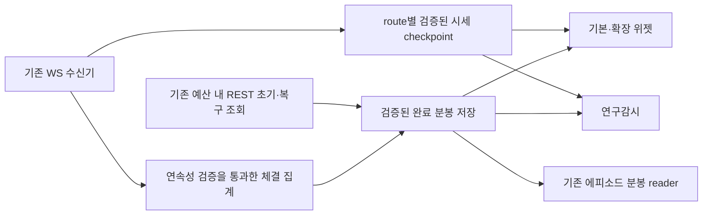

# 위젯·에피소드 공통 WS 시세 수집 개선안

- 상태: **사용자 구현·리뷰·커밋푸시·배포기동 승인 후 P0/P1 첫 인계 구현**. 기존 문서 작성 단계의 실행 금지는 과거 범위이며 이번 명시 승인을 대체하지 않는다. P1은 비교 전용이고 P2 전환/확대는 P5 자연 검증 후다. [코드·검증·배포 기록](../audit-reports/2026-09-21-widget-shared-ws-transport-review.md). 앞선 수리 완료를 WS 전환 완료로 확대하지 않는다.
- 결정: 현재가·체결·호가를 기존 WS 수신기에서 공유하고 REST는 초기 이력·정적 정보·제한된 누락 복구에 사용한다. **1차는 위젯 시세/BBO, 2차는 확장 관측, 3차는 검증된 분봉 재사용과 에피소드 연결**이다.
- 현재 실행·자연 acceptance owner: [9/21 checklist](../checklists/2026-09-21-stage2-todo-checklist.md)의 `KiwoomCommonHealthOpportunityCostAcceptance0917`. 이 문서는 단계별 설계이며 별도 OPEN owner를 중복 생성하지 않는다.
- 상위 계약: [Plan Rebase §1–§8](../plan-korStockScanPerformanceOptimization.rebase.md), [Kiwoom API 공식 참조 gate](../kiwoom-api-data-contract.md#official-kiwoom-reference-gate). [기존 위젯 source/consumer 성능 계획](widget-postclose-performance-and-source-closure-implementation-plan-2026-09-16.md)의 원천 역할·중복 제거 원칙을 이어가며 완료된 장후 계산 개선을 다시 수행하지 않는다.

## 1. 확정된 문제와 범위

[10:30:17 KST 점검 사본](../../tmp/widget-episode-runtime-review-20260921.json)의 상태다. 아래 숫자는 해당 시각의 최신 저장 관측이며 하루 전체 실패율이나 구현 이후 결과가 아니다.

| 영역 | 관측 | 해석 |
| --- | --- | --- |
| 기본 위젯 3종목 | 삼성·두산·한화 프로세스 가동, 최신 입력 `DATA_WAIT` | `shared_read_rate_wait_budget_exhausted`로 시세 확보 지연; 시각에 따라 정상 입력과 대기가 반복됨 |
| 확장 위젯 | 58종목 중 `ok` 4, `data_wait` 54 | 대기 사유 52개는 `request_budget_deferred`, 나머지는 분봉 stale·source error |
| 연구감시 | 당일 저장 관측 198개 중 PASS63, SOURCE_ERROR125, SOURCE_QUALITY_BLOCKED10; 5분 내 갱신23개 | SOURCE_ERROR125개의 사유는 공통 읽기 예산 대기. 프로세스 가동만으로 관측 coverage를 보장하지 못함 |
| 저가주 에피소드 | 4개 분봉 평가 중, 24개 NO_TRADE, 당일 주문0 | 기존 분봉 평가 경로는 동작. 모든 미진입을 데이터 장애로 분류하지 않음 |
| 위젯 매매/보유 | 삼성1종목 정책 허용, 신규 주문0, 삼성 이월25 | 수집 개선이 정책·보유 owner·청산 권한을 변경하지 않음 |
| 오류 탐지 | process/artifact 등 전체 pass | 프로세스 생존과 실제 유효 입력 coverage가 다른 문제임 |

현재 `widget_symbol_runtime_collector`는 현재가 `ka10001`·호가 `ka10004`를 각각 30초 bucket으로, 분봉 `ka10080`을 1분 bucket으로 조회한다. `widget_research_watch_collector`는 일부 quote/BBO를 재사용하지만 미충족 시 REST로 조회하고 분봉도 요청한다. 저가주 gateway도 종목별 `_AL` 완료 분봉을 REST로 읽는다.

58종목 모두에 현재가2회+호가2회+분봉1회/분을 요구하면 **290회/분**이다. 이는 실제 요청 횟수가 아닌 캐시 주기 기반 수요 계산이며, 재사용·local pacing·미시도는 별도로 계수한다. 현행 공통 read admission의 `source_only` 상한은 코드상 초당4회, 전체 read는 초당5회이고 연구감시 local budget은 분당18회다. 이 값은 **현재 로컬 안전 설정**이며 공식 WS 한도나 변경 제안이 아니다. 58과198은 중첩하므로 구독 수를 단순 합산하지 않는다.

## 2. 재사용할 구성과 소유 경계

| 기존 코드 | 계획된 역할 |
| --- | --- |
| [kiwoom_websocket.py](../../src/engine/kiwoom_websocket.py) | 기존 0B/0D 수신·정규화·route 상태·연결 세대·구독 관리 재사용. 수신 callback에서 REST/큰 파일 쓰기를 실행하지 않음 |
| [기존 WS snapshot writer](../../src/engine/bd_fbuy_accum_pre_scanner.py) `write_ws_snapshot` | 기존 비동기 atomic checkpoint를 우선 재사용. 파일 이름이 속한 과거 외국인집계 전략을 재활성화하지 않음 |
| [market_data_cache.py](../../src/trading/market/market_data_cache.py), [quote_consistency.py](../../src/trading/market/quote_consistency.py) | 시세 저장·신선도·정확한 route 선택 검증. 현재 메모리 cache를 프로세스 간 공유 완료로 간주하지 않음 |
| [samsung_widget_advisory.py](../../src/engine/monitoring/samsung_widget_advisory.py)의 read client 및 삼성·두산·한화 advisory owner | 필드별 WS 우선 읽기와 제한된 REST 보충. 기존 출력 schema·신호 kernel 유지 |
| [widget_symbol_runtime_collector.py](../../src/engine/monitoring/widget_symbol_runtime_collector.py), [widget_research_watch_collector.py](../../src/engine/monitoring/widget_research_watch_collector.py) | 같은 symbol/route/session 시세를 재사용; 관측·실행 catalog를 분리하고 원천/소비 census 보존 |
| [kiwoom_read_request_control.py](../../src/utils/kiwoom_read_request_control.py) | 기존 예산·우선순위·cooldown 유지. 필요 시 시장자료에만 중복 복구 요청 합류 기능 보완 |
| [low_price_two_leg/gateway.py](../../src/trading/low_price_two_leg/gateway.py) 및 기존 삼성 episode gateway | 후속 단계에서 검증된 동일 route 완료 분봉 재사용. 주문 직전 유동성·체결속도 검사와 주문 호출은 1차 변경 대상에서 제외 |
| 기존 `process_health`·`artifact_freshness` detector | 프로세스 생존과 consumer별 데이터 신선도·coverage를 별도 판정. 별 daemon/스케줄러를 추가하지 않음 |

`data/runtime/kiwoom_ws_snapshot/latest.json`에는 이미 `machine_entry_confirmation_ws_snapshot_v1` 입력 계약과 route별 자료가 있다. 삼성 화면의 가격 비교 reader는 별도 `widget_ws_price_comparison_only` 용도다. 화면용 값이나 micro-reversion 구독 영수증을 위젯 매매용 검증으로 전용하지 않는다. 기존 snapshot의 필요한 필드/계약이 충족되면 그대로 읽고, 부족한 항목만 호환 가능한 section으로 보완한다. 최신 시세 checkpoint와 연속 체결 원장은 별개다.

새 collector daemon·DB·CLI·독립 정책 엔진은 기본안에 없다. 공통 reader가 기존 파일에 맞지 않을 때만 `src/trading/market` 아래 최소 모듈의 필요성과 테스트 위치를 구현 gate에서 기록한다. `src/engine` root에는 새 모듈을 만들지 않는다.

## 3. 목표 데이터 흐름과 필수 계약

### 3.1 같은 값으로 대체할 수 있는 필드만 전환

- P0에서 각 consumer가 실제 사용하는 `ka10001/ka10004/ka10080` 필드를 목록화하고 공식 WS FID와 단위·부호·시각·route를 대조한다. 현재가가 같다는 이유로 기본정보 전체를 WS로 대체하지 않는다. WS에 없는 정적 필드는 REST 저빈도 cache로 유지한다.
- key는 최소 `(trade_date, symbol, item/request_code, market_data_route, session, realtime_type)`이다. KRX·NXT·통합 `_AL` 값을 섞지 않고 통합 관측으로 실제 체결 거래소를 추정하지 않는다.
- 가격·최우선호가·잔량·체결마다 원 수신시각, 제공된 거래시각과 정밀도, 연결 epoch, source hash/참조, producer PID/commit, consumer 선택/거부 사유를 남긴다. snapshot 생성·읽기시각을 가격 수신시각으로 바꾸지 않는다.
- `0B`의 가격 갱신을 `0D` 잔량 갱신으로 취급하지 않는다. 같은 route여도 각 필드의 신선도와 허용 시각 차이를 기존 consumer 계약으로 검사한다. 오래된 값 혼합, 미래 시각, bid/ask 충돌은 차단한다.
- 재접속·거래일/세션 전환 시 이전 세대 cache를 무효화한다. REG 수신 응답, 요청 scope와 실제 데이터 첫 수신을 구분한다. 로컬 sequence는 내부 유실 탐지용이며 broker가 제공하지 않은 무손실 sequence 증거를 합성하지 않는다.
- 체결이 없는 시간과 연결 단절을 구별한다. quiet tape를 freshness 면제로 사용하지 않으며 무거래 분봉 생성은 기존 공식/로컬 bar 계약으로 증명되는 경우에만 허용한다.

### 3.2 구독과 프로세스 간 공유

- 기존 WS owner가 consumer별 필요 item/type을 합쳐 구독한다. 같은 symbol이라도 route/type이 다르면 별 항목이고, 동일 item/type은 중복 등록하지 않는다. consumer가 끝날 때 다른 owner가 쓰는 구독을 REMOVE하지 않는다.
- 기존 메인·보유/청산 구독을 보호하고, 당일 실행 가능 위젯/도래 episode와 관측 전용 catalog를 구분한다. 관측198개를 넣기 위해 메인 감시를 축소하지 않는다.
- 실제 등록 한도·연결 정책·처리 용량은 P0에서 공식 근거와 설치 설정을 확인한다. 전 종목 수용 가능을 가정하지 않는다. 미수용 scope는 `capacity_deferred` 등 명시적 이유·기대 cadence를 남기고 관측 분모에서 삭제하지 않는다.
- checkpoint는 단일 writer가 일관된 세대를 atomic publish하고 다중 reader가 읽는다. receiver lock 보유시간·serialization·파일 크기를 계측하며, consumer별 실패가 WS 수신을 막지 않게 한다. 기존 약1초 snapshot 발행은 모든 주문 검사에 충분하다고 가정하지 않는다.
- WS 의존성이 생긴 consumer에는 producer 재시작/정지 감지와 fail-closed 동작을 명시한다. 메인 WS가 없을 때 각 consumer가 새 연결·토큰 갱신을 무제한 시작하지 않는다.

### 3.3 REST 복구와 분봉

- WS 데이터가 consumer 계약을 충족하면 해당 시세 REST 요청을 생략한다. 누락/미구독/불완전은 기존 read budget 내 단일 복구 요청으로 제한한다. 시장자료만 exact scope로 합류시키며 계좌·주문 호출에는 적용하지 않는다.
- 현재 single-flight는 프로세스 내부 thread 단위다. 여러 service의 동시 복구를 막는 공유 조정이 필요한지 검증하고, 기존 budget/state lock을 우선 재사용한다. 198개 reader의 동시 timeout이 REST 폭주를 만들면 rollout을 중단한다.
- 분봉 초기 lookback은 기존 `ka10080` 경로로 적재한다. P1/P2에서는 분봉 출처를 그대로 유지하므로 분봉/API 병목까지 해소됐다고 판정하지 않는다.
- P3에서 실제 연속 체결 원천이 보존된 구간만 완료 분봉을 집계한다. 최신 checkpoint의 제한된 체결 tail만으로 전체 분봉을 복원하지 않는다. epoch 경계, 수신 유실, 중복/역순, late tick, 수정주가, 거래량 단위, 무거래 구간, 세션 경계를 검증한다.
- WS 집계와 REST 공식 완료 분봉이 불일치하면 해당 구간을 격리하고 bounded REST로 복구한다. 과거 분봉 복구가 당시 BBO·판정시각·체결 가능성을 복구한 것은 아니다. consumer가 받아들인 bar revision/hash와 수신 가능시각을 보존하여 hindsight를 차단한다.

## 4. 단계·산출물·완료 조건

아래 단계는 실행 권한과 각 gate가 충족된 이후의 작업 단위다. **P4는 매 운영 인계에 선행하는 공통 release gate**다. 첫 인계는 `P0→P1 구현/격리검증→P4 소범위 배포→P5 자연 비교·소비 확인`이고, 이후 P2 확대에 같은 P4/P5를 반복한다. P3 분봉은 별도 후속 단계이므로 1차 시세 개선 배포를 기다리게 하지 않는다. 현재 시각에 강제 구독·재기동하거나 미래 자연 실행을 앞당기는 일정이 아니다.

| 단계 | 작업 및 산출물 | 종료 조건 |
| --- | --- | --- |
| P0 계약·용량 확인 | 필드/FID 대조표, 활성 consumer×route×type 구독 합집합, REST owner/API별 시도·예산 대기·실제 전송량, 현재 설치 PID/설정과 원천 기준선 | 미확인 wire/한도/필드 의미 명시; 첫3종목의 필요한 데이터와 main 보호 용량 확인. 미확인 범위를 자동 등록하지 않음 |
| P1 공통 reader·3종목 병행 검증 | 기존 publisher 재사용, 삼성·두산·한화 reader의 WS/REST 데이터 비교 구현; 기존 주문판단 입력은 검증 완료 전 유지 | 정상·quiet·재접속·stale·route mismatch fixture PASS. P4를 거친 자연 비교에서 같은 관측시점의 설명되지 않은 필수값 불일치0. 기존 가격/신선도 검사 불변 |
| P2 시세 전환·관측 확장 | P1 소범위 인계를 확인한 뒤 유효 catalog의58종목/연구198종목 합집합으로 확대 준비. 각 cohort는 P4를 통과해 등록·수신·소비/거부 영수증 확보 | 구독 중복/메인 구독 손실0, scope 미분류0. 미수용·미수신은 명시적 source gap. quote/BBO 요청 및 대기가 줄었는지 동일 분모로 확인 |
| P3 분봉 공유·에피소드 연결 | 초기 REST+증명된 WS 집계+누락 복구, 동일 route 완료 분봉의 기존 episode reader 인계 | 기존 bar와 신호 kernel 동등성, mismatch 격리, 중단·재시작 후 초기화 검증. 주문 직전 유동성·체결속도 검사는 기존 경로 유지 |
| P4 검토·immutable 배포 | implementation→self review→fix→re-review→targeted tests, 별도 worktree/immutable release, 서비스별 source pin·rollback 기록 | 관련 producer/consumer/cache/recovery 모든 경로 finding0; 권한 있는 대상만 배포·재기동. 실제 PID/코드/source hash와 새 자연 소비 확인 |
| P5 자연 수집·장후 연결 | consumer별 신선도/유효 관측, raw→advisory→postclose reader, exact-date policy/PID 연결 | 미래 자연 자료로 검증. 생성 파일이나 health PASS만으로 종료하지 않으며 source 변경 전후 모집단·경제성은 구분 |

병행 검증은 **같은 데이터 필드의 전송 경로 검증**이며 새 alpha/정책 shadow 축이 아니다. 기존 정책·선택값·수량을 튜닝하지 않는다. 상세 캡처는 필요한 표본/짧은 window로 제한하고 성장 중 JSONL은 stat 후 bounded tail/index로 확인한다.

## 5. 수치 검증과 감시

계측 계약: `metric_role=market_data_transport_quality`, `decision_authority=source_quality_only`, `window_policy=exact_consumer_route_session_matched_windows`, `sample_floor=three_consecutive_15_minute_windows_for_each_rollout_cohort`, `primary_decision_metric=consumer_valid_market_data_ratio`, `source_quality_gate=exact_route_original_timestamps_epoch_required_fields`, `forbidden_uses=[order_authority,threshold_relaxation,profit_claim,retired_strategy_activation]`.

| 항목 | 검증 기준 |
| --- | --- |
| 관측 분모 | expected consumer evaluations = valid WS + valid REST recovery + classified not applicable + explicit source gap; unclassified0. 별도로 registered→first received→consumed 수와 실패 사유 대사 |
| 시세 REST 절감 | WS 적용 대상의 같은 종목/route/활성시간으로 정규화한 `ka10001/ka10004` 반복 전송량 **80% 이상 감소를 초기 설계 목표**로 둠. 미시도/탈락시켜 만든 감소는 인정하지 않음 |
| 데이터 가용성 | 실행 cohort에서 기존 freshness 기준을 만족한 평가 비율 **99% 이상을 초기 운영 목표**로 두되 자연 비대상은 사전 계약으로만 제외. 충족 못 하면 원인·분모를 공개하고 해당 rollout 단계를 닫지 않음 |
| 지연/자원 | WS callback·snapshot publish·consumer read p95/p99, CPU/RSS, 파일량, main quote age/평가 지연을 P0 동일 조건과 비교. 기존 경고·stale 한도 초과나 재현 가능한 main 악화는 전환 중단 |
| 복구 | reconnect/producer restart/실패 snapshot/REST 예산 고갈에서 원 시각 보존, 이전 epoch 미채택, 무제한 retry0, 기존 main·holding 데이터 손실0 |
| 분봉/판정 | 같은 eligible 완료 분봉·동일 정책에서 신호/episode 판정 차이0. 새 원천 때문에 달라진 valid 집합은 정확한 행·시각·이유를 따로 기록; 기존 결함 결과를 복제하지 않음 |
| 감시 | unit liveness PASS와 source coverage 경고를 동시 표시. 등록 누락·필수 data wait·consumer 미소비를 기존 detector에 연결. 저활동 체결과 필수 quote 단절은 구별 |

80%·99%는 개선안을 검증할 **제안 목표**이며 현재 달성값·공식 API 보장·매매 threshold가 아니다. P0에서 재현 가능한 기준선이 없으면 성능 개선을 수치로 확정하지 않는다. 비교 REST 호출도 기존 source-only 예산에서만 수행한다. 자연 45분 관측은 전송 품질의 최소 확인이며 모든 session/전략 효과 검증을 대체하지 않는다. 이 수집 개선은 기존 WS freshness bonus/경제성 정책의 승격과 독립이며 새 점수·보너스 owner를 만들지 않는다.

## 6. 테스트·롤백·보존

- 기존 WS·quote consistency·widget collector·gateway·detector 테스트 파일을 확장한다. 단위검사 외에 writer→파일→독립 process reader→기존 신호 consumer를 연결한 통합 검증이 필요하다.
- 필수 실패 사례: 필드별 서로 다른 수신시각, 파일 재기록만 새로움, `_AL`/KRX/NXT 혼합, 부분 0D, 미래/역순 체결, 연결 세대 변경, 한 consumer 구독 해제, receiver 쓰기 실패, writer 교체 중 read, cache generation 불일치, 동시 fallback, producer 부재, 오래된 REST 복구, 분봉 late revision.
- Python targeted pytest·compile·diff, wrapper 변경 시 bash/계약검사, 문서 변경 시 print-only parser를 실행한다. 키움 요청/파서/REG/복구를 건드리기 전에 최신 공식 참조 gate를 다시 닫는다.
- 코드 배포, WS 등록, 첫 수신, 실제 PID 소비, 자연 signal, 주문·체결, 비용 후 EV를 각각 기록한다. 정책 캐시의 예전 PASS만으로 새 source 소비를 인정하지 않는다.
- rollback은 새 reader 선택과 **추가 관측 구독만** 되돌리고 공유 main/holding 구독은 보존한다. REST 이전 경로도 정상 예산 내에서만 사용하고, 복구 불가 scope는 DATA_WAIT 유지한다. 구버전 schema를 소비하는 release로 전환할 때 호환성·fallback을 먼저 검증한다.
- 보유/주문 state·registry·operator closure receipt·삼성25주는 그대로 보존한다. 새로운 데이터 source 선택이 active position의 정책·target을 바꾸지 않는다. 두산·한화 연구 축적, CJ CGV/영원무역/SK텔레콤 profile 제외 및 retired auto episode는 유지한다.
- 수집 품질 개선은 수익 개선의 전제이며 수익 증명이 아니다. 후속 경제성은 기존 owner에서 실제 source/적용 버전·full/partial fill·비용 결속을 갖춘 COMPLETED 표본으로 평가한다.

## 7. 공식 근거와 구현 전 미확정 항목

- 계획 조사: `2026-09-21T10:34:58+09:00`에 공식 저장소 `main`을 조회했으며 SHA는 `953e5dbff123f437ab4d11a78a95191a685eb51f`다. 이전 작업의 SHA를 현재 공식 revision으로 재사용하지 않는다.
- 확인 경로: 공식 tree 및 `kiwoom/core/ws_client.py`, `kiwoom/realtime/packets.py`, `kiwoom/realtime/schemas.py`, `kiwoom/_data/kiwoom_api_spec.json`. 해당 tree에 `kiwoom_docs`는 없다. 계획 조사만으로 개별 FID/한도/모든 REST envelope 검증을 완료했다고 주장하지 않는다.
- [공식 실시간 packet helper](https://github.com/Kiwoom-Securities/Kiwoom-REST-API/blob/953e5dbff123f437ab4d11a78a95191a685eb51f/kiwoom/realtime/packets.py)의 REG/REMOVE와 refresh 의미를 기존 구현과 대조해야 한다. group 교체로 다른 owner 구독을 지우는 사고를 회귀로 막는다.
- [키움 공식 API 안내](https://openapi.kiwoom.com/m/guide/apiguide?jobTpCode=07)는 주식체결0B·주식호가잔량0D 및 분봉ka10080을 구분한다. 상세 FID/route·무거래/거래량 의미·등록 한도·real/demo 차이·continuation은 P0에서 `specs/core/realtime/Postman` 및 portal을 교차 확인한다. 공식 소스와 관측이 충돌하면 해당 source 계약을 gap으로 남긴다.
- **P0에서 닫아야 할 항목:** 현재 WS의 exact item/type 등록·실수신 합집합과 남은 용량, consumer 필드별 원천 동등성, 198종목 확대 시 main 영향, 연속 체결 원장의 분봉 집계 적합성. 이 항목이 미확정인 상태에서 전 종목 WS 전환이나 REST 제거를 약속하지 않는다.

## 8. 문서 검토 결과

계획 작성 당시 범위는 기존 수집/소비 경로 개선 설계로 제한했다. 도입 단계·구독 용량 미확정·공통 예산·교차 process 복구·분봉 연속성·기존 holding 보존·detector coverage·현재 checklist 단일 owner를 재검토했다. 당시 코드/런타임 변경과 외부 sync는 수행하지 않았다. 현재 명시 승인된 P0/P1 구현·인계는 위 연결된 별도 수리 기록이 소유하며, 후속 자연 검증·확대·분봉 gate는 유지한다.
